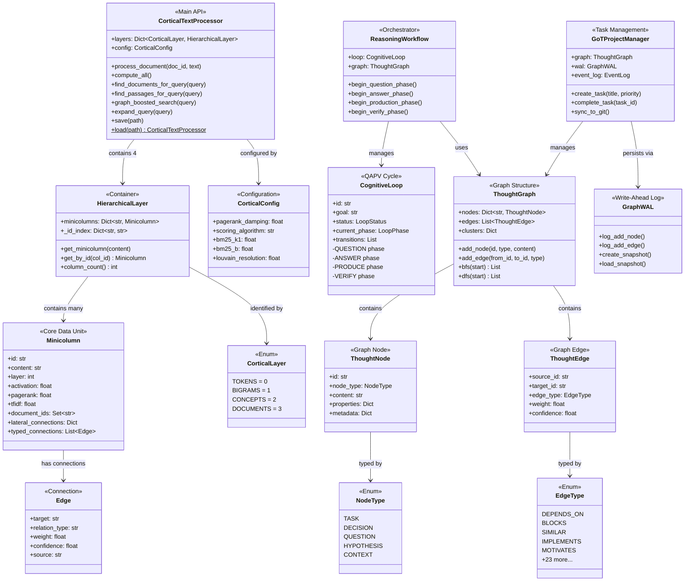
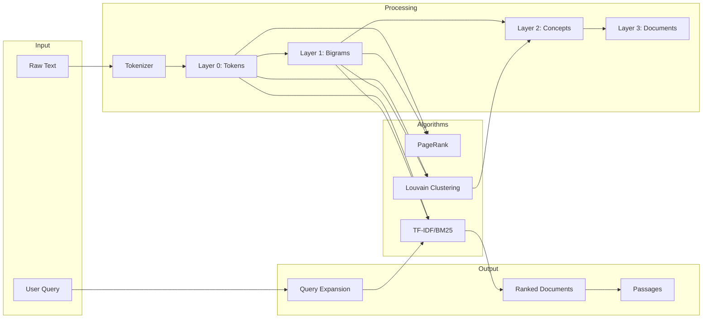

# Cortical Text Processor - System Architecture

## High-Level Class Diagram



## Data Flow



## Module Dependencies

```
cortical/
├── processor/          ←── Main API (uses all below)
│   ├── core.py         ←── Initialization, staleness
│   ├── documents.py    ←── Document processing
│   ├── compute.py      ←── PageRank, TF-IDF, clustering
│   ├── query_api.py    ←── Search methods
│   └── persistence_api.py
│
├── layers.py           ←── HierarchicalLayer container
├── minicolumn.py       ←── Core data structure
├── analysis.py         ←── Graph algorithms
├── semantics.py        ←── Relation extraction
├── tokenizer.py        ←── Text tokenization
│
└── reasoning/          ←── GoT Framework
    ├── thought_graph.py
    ├── cognitive_loop.py
    ├── workflow.py
    └── graph_persistence.py
```

## Key Metrics

| Component | Lines | Purpose |
|-----------|-------|---------|
| processor/ | ~2,200 | Main API |
| analysis.py | ~1,100 | Algorithms |
| reasoning/ | ~4,000 | GoT Framework |
| Total | ~11,100 | Core library |

---
*Generated: 2025-12-21*
