# Cortical Text Processor Architecture

This document describes both the **module architecture** (how code files interact) and the **layer architecture** (how data flows through hierarchical layers). The system is inspired by visual cortex organization, processing text at increasing levels of abstraction.

---

# Part 1: Module Architecture

This section maps the codebase structure, showing which modules depend on which, and how components interact.

## Module Dependency Overview

The codebase is organized into five architectural layers:

1. **Foundation Layer** - Data structures and utilities (no cortical dependencies)
2. **Algorithm Layer** - Domain logic for analysis, semantics, embeddings
3. **Query Layer** - Modular search and retrieval functions
4. **Persistence Layer** - Save/load and git-friendly chunk storage
5. **Orchestration Layer** - processor.py coordinates everything

### Complete Module Dependency Graph

```
┌─────────────────────────────────────────────────────────────────┐
│                       ORCHESTRATION LAYER                        │
│                                                                  │
│  ┌────────────────────────────────────────────────────────────┐ │
│  │              processor.py (Public API)                     │ │
│  │  - CorticalTextProcessor class                             │ │
│  │  - Coordinates all components                              │ │
│  │  - Staleness tracking                                      │ │
│  └───────┬──────────────────────────────────────────────────┬─┘ │
└──────────┼──────────────────────────────────────────────────┼───┘
           │                                                  │
           ▼                                                  ▼
┌──────────────────────────────────────────────┐   ┌─────────────────┐
│          ALGORITHM LAYER                     │   │ PERSISTENCE     │
│                                              │   │                 │
│  ┌──────────────┐  ┌──────────────┐         │   │ persistence.py  │
│  │ analysis.py  │  │ semantics.py │         │   │ chunk_index.py  │
│  │ - PageRank   │  │ - Relations  │         │   │                 │
│  │ - TF-IDF     │  │ - Patterns   │         │   └─────────────────┘
│  │ - Clustering │  │ - Retrofit   │         │
│  └──────────────┘  └──────────────┘         │
│                                              │
│  ┌──────────────┐  ┌──────────────┐         │
│  │embeddings.py │  │   gaps.py    │         │
│  │ - Random Walk│  │ - Isolation  │         │
│  │ - Adjacency  │  │ - Bridges    │         │
│  │ - Spectral   │  │ - Topics     │         │
│  └──────────────┘  └──────────────┘         │
│                                              │
│  ┌──────────────┐                            │
│  │fingerprint.py│                            │
│  │ - Similarity │                            │
│  │ - Comparison │                            │
│  └──────────────┘                            │
└──────────────┬───────────────────────────────┘
               │
               ▼
┌──────────────────────────────────────────────────────────────────┐
│                         QUERY LAYER                               │
│                                                                   │
│  query/ (Modular Package)                                        │
│  ┌──────────────┐  ┌──────────────┐  ┌──────────────┐           │
│  │expansion.py  │  │  search.py   │  │ passages.py  │           │
│  │ - Lateral    │  │ - Documents  │  │ - RAG chunks │           │
│  │ - Semantic   │  │ - Fast index │  │ - Batching   │           │
│  │ - Multihop   │  │ - Activation │  │              │           │
│  └──────────────┘  └──────────────┘  └──────────────┘           │
│                                                                   │
│  ┌──────────────┐  ┌──────────────┐  ┌──────────────┐           │
│  │ ranking.py   │  │ chunking.py  │  │  intent.py   │           │
│  │ - Multi-stage│  │ - Text split │  │ - Parsing    │           │
│  │ - Doc types  │  │ - Code aware │  │ - Intent map │           │
│  └──────────────┘  └──────────────┘  └──────────────┘           │
│                                                                   │
│  ┌──────────────┐  ┌──────────────┐                              │
│  │definitions.py│  │  analogy.py  │                              │
│  │ - Detection  │  │ - Relations  │                              │
│  │ - Boosting   │  │ - Completion │                              │
│  └──────────────┘  └──────────────┘                              │
└──────────────┬───────────────────────────────────────────────────┘
               │
               ▼
┌──────────────────────────────────────────────────────────────────┐
│                    FOUNDATION LAYER                               │
│                                                                   │
│  ┌─────────────────────────────────────────────────────────────┐ │
│  │  Data Structures                                            │ │
│  │  ┌──────────────┐  ┌──────────────┐  ┌──────────────┐     │ │
│  │  │minicolumn.py │  │  layers.py   │  │  config.py   │     │ │
│  │  │ - Minicolumn │  │ - CortLayer  │  │ - Settings   │     │ │
│  │  │ - Edge       │  │ - HierLayer  │  │ - Defaults   │     │ │
│  │  └──────────────┘  └──────────────┘  └──────────────┘     │ │
│  └─────────────────────────────────────────────────────────────┘ │
│                                                                   │
│  ┌─────────────────────────────────────────────────────────────┐ │
│  │  Utilities                                                  │ │
│  │  ┌──────────────┐  ┌──────────────┐                        │ │
│  │  │tokenizer.py  │  │code_concepts │                        │ │
│  │  │ - Stemming   │  │ - Synonyms   │                        │ │
│  │  │ - Stop words │  │ - Expansion  │                        │ │
│  │  └──────────────┘  └──────────────┘                        │ │
│  └─────────────────────────────────────────────────────────────┘ │
└───────────────────────────────────────────────────────────────────┘
```

## Component Responsibilities

### Orchestration Layer

**processor.py** (2,301 lines)
- **Role**: Main orchestrator and public API
- **Pattern**: Facade - delegates to specialized modules
- **Key Functions**:
  - `process_document()` - Add documents to corpus
  - `compute_all()` - Run all analysis phases
  - `find_documents_for_query()` - Search wrapper
  - `find_passages_for_query()` - RAG wrapper
  - Staleness tracking for incremental updates
- **Imports**: All other modules (analysis, semantics, embeddings, gaps, fingerprint, query, persistence)
- **Used By**: External users, scripts

### Algorithm Layer

**analysis.py** (1,123 lines)
- **Role**: Graph algorithms
- **Key Functions**:
  - `compute_pagerank()` - Importance scoring
  - `compute_tfidf()` - Term weighting
  - `build_concept_clusters()` - Louvain clustering
  - `compute_activation()` - Spreading activation
- **Imports**: layers, minicolumn, constants
- **Used By**: processor, gaps

**semantics.py** (915 lines)
- **Role**: Semantic relation extraction
- **Key Functions**:
  - `extract_relations_from_text()` - Pattern matching
  - `extract_corpus_semantics()` - Corpus-wide extraction
  - `retrofit_connections()` - Adjust weights using relations
- **Imports**: layers, minicolumn, constants
- **Used By**: processor

**embeddings.py** (209 lines)
- **Role**: Graph-based embeddings
- **Key Functions**:
  - `compute_graph_embeddings()` - Main entry point
  - `adjacency_embeddings()` - Landmark-based
  - `random_walk_embeddings()` - DeepWalk-style
- **Imports**: layers
- **Used By**: processor

**gaps.py** (245 lines)
- **Role**: Knowledge gap detection
- **Key Functions**:
  - `detect_isolated_documents()` - Outlier detection
  - `detect_weak_topics()` - Undercovered areas
  - `find_bridge_opportunities()` - Connection suggestions
- **Imports**: layers, analysis
- **Used By**: processor

**fingerprint.py** (315 lines)
- **Role**: Semantic fingerprinting
- **Key Functions**:
  - `compute_fingerprint()` - Extract semantic signature
  - `compare_fingerprints()` - Similarity scoring
  - `explain_similarity()` - Human-readable comparison
- **Imports**: layers, tokenizer, code_concepts
- **Used By**: processor

### Query Layer (Modular Package)

The query layer is split into focused submodules, all re-exported from `query/__init__.py`:

**query/expansion.py**
- **Role**: Query term expansion
- **Imports**: layers, tokenizer, code_concepts
- **Used By**: processor, query/search, query/passages, query/ranking

**query/search.py**
- **Role**: Document retrieval
- **Imports**: layers, tokenizer, code_concepts, expansion
- **Used By**: processor, query/passages, query/ranking

**query/passages.py**
- **Role**: Passage retrieval for RAG
- **Imports**: layers, tokenizer, search, expansion, ranking, chunking, definitions
- **Used By**: processor

**query/ranking.py**
- **Role**: Multi-stage ranking
- **Imports**: layers, tokenizer, constants, expansion, search
- **Used By**: processor, query/passages

**query/chunking.py**
- **Role**: Text chunking
- **Imports**: layers, tokenizer
- **Used By**: query/passages

**query/intent.py**
- **Role**: Intent parsing
- **Imports**: layers, code_concepts
- **Used By**: processor

**query/definitions.py**
- **Role**: Definition search
- **Imports**: None (standalone)
- **Used By**: processor, query/passages

**query/analogy.py**
- **Role**: Analogy completion
- **Imports**: layers
- **Used By**: processor

### Persistence Layer

**persistence.py** (606 lines)
- **Role**: Save/load processor state
- **Key Functions**:
  - `save_processor()` - Pickle serialization
  - `load_processor()` - Restore state
  - `export_to_json()` - Graph export
- **Imports**: layers, minicolumn
- **Used By**: processor

**chunk_index.py** (574 lines)
- **Role**: Git-compatible chunk storage
- **Key Functions**:
  - `ChunkIndex.save_chunk()` - Append-only chunks
  - `ChunkIndex.load_chunks()` - Replay operations
  - `compact_chunks()` - Consolidate history
- **Imports**: layers, minicolumn
- **Used By**: processor, scripts/index_codebase.py

### Foundation Layer

**minicolumn.py** (357 lines)
- **Role**: Core data structure
- **Classes**: `Minicolumn`, `Edge`
- **Imports**: None (pure data structure)
- **Used By**: layers, processor, all algorithm modules

**layers.py** (294 lines)
- **Role**: Layer container and management
- **Classes**: `CorticalLayer` (enum), `HierarchicalLayer`
- **Key Methods**: `get_by_id()` (O(1) lookups), `get_or_create_minicolumn()`
- **Imports**: minicolumn
- **Used By**: All modules that work with layers

**config.py** (352 lines)
- **Role**: Configuration management
- **Classes**: `CorticalConfig` (dataclass)
- **Imports**: None (pure configuration)
- **Used By**: processor, passed to algorithm modules

**tokenizer.py** (398 lines)
- **Role**: Text preprocessing
- **Key Functions**: `tokenize()`, `extract_bigrams()`, `split_camelcase()`
- **Imports**: None (standalone)
- **Used By**: processor, query modules, fingerprint

**code_concepts.py** (249 lines)
- **Role**: Programming concept synonyms
- **Key Data**: `CODE_CONCEPT_GROUPS` - Synonym mappings
- **Imports**: None (data structure)
- **Used By**: query/expansion, query/search, fingerprint

## Data Flow Diagrams

### Document Processing Flow

```
                    Input Document
                         │
                         ▼
                  ┌─────────────┐
                  │ tokenizer.py│
                  │  Tokenize   │
                  │  + Stem     │
                  │  + Filter   │
                  └──────┬──────┘
                         │
                         ▼
        ┌────────────────────────────────────┐
        │       processor.py                 │
        │    process_document()              │
        └────────────────┬───────────────────┘
                         │
         ┌───────────────┼───────────────┐
         │               │               │
         ▼               ▼               ▼
    ┌────────┐     ┌─────────┐     ┌─────────┐
    │Layer 0 │     │ Layer 1 │     │ Layer 3 │
    │ TOKENS │────▶│ BIGRAMS │     │   DOC   │
    └────────┘     └─────────┘     └─────────┘
         │
         │ Lateral connections (co-occurrence)
         ▼
    ┌────────────────────────────────────────┐
    │      Compute Phase (compute_all)       │
    ├────────────────────────────────────────┤
    │  1. analysis.compute_tfidf()           │
    │  2. processor.compute_bigram_conns()   │
    │  3. analysis.compute_pagerank()        │
    │  4. analysis.build_concept_clusters()  │──▶ Layer 2 (CONCEPTS)
    │  5. semantics.extract_relations()      │
    │  6. embeddings.compute_embeddings()    │
    └────────────────────────────────────────┘
                         │
                         ▼
                  ┌─────────────┐
                  │ persistence │
                  │   .save()   │
                  └─────────────┘
```

### Query Processing Flow

```
                    User Query
                         │
                         ▼
                  ┌─────────────┐
                  │ tokenizer.py│
                  │  Tokenize   │
                  └──────┬──────┘
                         │
                         ▼
        ┌────────────────────────────────────┐
        │    query/expansion.py              │
        │    - Lateral connections           │
        │    - Semantic relations            │
        │    - Multihop expansion            │
        └────────────────┬───────────────────┘
                         │
                    Expanded terms
                         │
         ┌───────────────┼───────────────┐
         │               │               │
         ▼               ▼               ▼
    ┌─────────┐    ┌──────────┐    ┌──────────┐
    │search.py│    │ranking.py│    │passages  │
    │ TF-IDF  │    │Multi-stage│   │ Chunking │
    │ scoring │    │  boost    │   │  + score │
    └─────────┘    └──────────┘    └──────────┘
         │               │               │
         └───────────────┼───────────────┘
                         │
                    Ranked Results
                         │
                         ▼
                   Return to User
```

## Interaction Patterns

### Pattern 1: Orchestrator Pattern

processor.py acts as a facade, delegating to specialized modules:

```python
# processor.py delegates to analysis.py
def compute_importance(self):
    pagerank_scores = analysis.compute_pagerank(
        self.layers[CorticalLayer.TOKENS],
        damping=self.config.pagerank_damping
    )
    # Update minicolumns with scores
```

**Benefits**: Clean public API, focused modules, easy testing

### Pattern 2: Layered Processing

All algorithm modules operate on the same layer abstraction:

```python
# Common pattern across analysis, semantics, embeddings, gaps
def some_algorithm(
    layers: Dict[CorticalLayer, HierarchicalLayer],
    **kwargs
) -> Dict[str, Any]:
    layer0 = layers[CorticalLayer.TOKENS]
    # Process using O(1) lookups
    for col in layer0.minicolumns.values():
        target_col = layer0.get_by_id(target_id)  # O(1)
```

**Benefits**: Consistent interface, reusable logic, O(1) lookups

### Pattern 3: Modular Query Package

Query package splits concerns into focused submodules:

```
query/__init__.py     ← Re-exports all public symbols
├── expansion.py      ← Expansion logic
├── search.py         ← Document retrieval
├── passages.py       ← RAG chunks
├── ranking.py        ← Multi-stage ranking
├── chunking.py       ← Text splitting
├── intent.py         ← Intent parsing
├── definitions.py    ← Definition-specific
└── analogy.py        ← Analogy completion
```

**Benefits**: Files stay under 400 lines, clear boundaries, easy to extend

### Pattern 4: Staleness Tracking

processor.py tracks which computations need recomputation:

```python
# Mark all stale when documents change
def process_document(self, doc_id, content):
    # ... process ...
    self._mark_all_stale()

# compute_all() only recomputes stale components
def compute_all(self):
    if self.is_stale(self.COMP_TFIDF):
        self.compute_tfidf()
    if self.is_stale(self.COMP_PAGERANK):
        self.compute_importance()
```

**Benefits**: Avoids redundant computation, supports incremental updates

## Mermaid Diagrams

### Module Dependency Graph

```mermaid
graph TD
    %% Foundation Layer
    minicolumn[minicolumn.py<br/>Minicolumn + Edge]
    layers[layers.py<br/>HierarchicalLayer]
    config[config.py<br/>CorticalConfig]
    tokenizer[tokenizer.py<br/>Text processing]
    code_concepts[code_concepts.py<br/>Synonyms]
    constants[constants.py<br/>Constants]

    %% Algorithm Layer
    analysis[analysis.py<br/>PageRank + TF-IDF]
    semantics[semantics.py<br/>Relations]
    embeddings[embeddings.py<br/>Graph embeddings]
    gaps[gaps.py<br/>Gap detection]
    fingerprint[fingerprint.py<br/>Fingerprinting]

    %% Query Layer
    query_expansion[query/expansion.py<br/>Query expansion]
    query_search[query/search.py<br/>Document search]
    query_passages[query/passages.py<br/>RAG passages]
    query_ranking[query/ranking.py<br/>Multi-stage rank]
    query_chunking[query/chunking.py<br/>Text chunking]
    query_intent[query/intent.py<br/>Intent parsing]
    query_analogy[query/analogy.py<br/>Analogies]

    %% Persistence Layer
    persistence[persistence.py<br/>Save/load]
    chunk_index[chunk_index.py<br/>Chunk storage]

    %% Orchestration
    processor[processor.py<br/>CorticalTextProcessor]

    %% Dependencies
    layers --> minicolumn

    analysis --> layers
    analysis --> minicolumn
    analysis --> constants

    semantics --> layers
    semantics --> minicolumn
    semantics --> constants

    embeddings --> layers

    gaps --> layers
    gaps --> analysis

    fingerprint --> layers
    fingerprint --> tokenizer
    fingerprint --> code_concepts

    query_expansion --> layers
    query_expansion --> tokenizer
    query_expansion --> code_concepts

    query_search --> layers
    query_search --> tokenizer
    query_search --> code_concepts
    query_search --> query_expansion

    query_passages --> layers
    query_passages --> tokenizer
    query_passages --> query_search
    query_passages --> query_expansion
    query_passages --> query_ranking
    query_passages --> query_chunking

    query_ranking --> layers
    query_ranking --> tokenizer
    query_ranking --> constants
    query_ranking --> query_expansion
    query_ranking --> query_search

    query_chunking --> layers
    query_chunking --> tokenizer

    query_intent --> layers
    query_intent --> code_concepts

    query_analogy --> layers

    persistence --> layers
    persistence --> minicolumn

    chunk_index --> layers
    chunk_index --> minicolumn

    processor --> tokenizer
    processor --> minicolumn
    processor --> layers
    processor --> config
    processor --> analysis
    processor --> semantics
    processor --> embeddings
    processor --> gaps
    processor --> fingerprint
    processor --> query_expansion
    processor --> query_search
    processor --> query_passages
    processor --> query_ranking
    processor --> query_intent
    processor --> query_analogy
    processor --> persistence
    processor --> chunk_index

    %% Styling
    classDef foundation fill:#e1f5ff,stroke:#333,stroke-width:2px
    classDef algorithm fill:#fff4e1,stroke:#333,stroke-width:2px
    classDef query fill:#f0e1ff,stroke:#333,stroke-width:2px
    classDef persist fill:#e1ffe1,stroke:#333,stroke-width:2px
    classDef orchestrate fill:#ffe1e1,stroke:#333,stroke-width:2px

    class minicolumn,layers,config,tokenizer,code_concepts,constants foundation
    class analysis,semantics,embeddings,gaps,fingerprint algorithm
    class query_expansion,query_search,query_passages,query_ranking,query_chunking,query_intent,query_analogy query
    class persistence,chunk_index persist
    class processor orchestrate
```



---

# Part 2: Layer Hierarchy Architecture

This section describes the 4-layer hierarchical architecture of the Cortical Text Processor. The design is inspired by visual cortex organization, processing text at increasing levels of abstraction.

## Layer Overview

```
Layer 3 (DOCUMENTS)  ← Full documents        [IT analogy: objects]
    ↑↓
Layer 2 (CONCEPTS)   ← Semantic clusters     [V4 analogy: shapes]
    ↑↓
Layer 1 (BIGRAMS)    ← Word pairs            [V2 analogy: patterns]
    ↑↓
Layer 0 (TOKENS)     ← Individual words      [V1 analogy: edges]
```

Information flows both upward (abstraction) and downward (grounding) through feedforward and feedback connections.

---

## Core Data Structures

### CorticalLayer Enum

**Location:** `layers.py:21-56`

```python
class CorticalLayer(Enum):
    TOKENS = 0      # Individual words
    BIGRAMS = 1     # Word pairs
    CONCEPTS = 2    # Semantic clusters
    DOCUMENTS = 3   # Full documents
```

### HierarchicalLayer

**Location:** `layers.py:59-273`

Container for minicolumns at each layer:

```python
class HierarchicalLayer:
    layer_type: CorticalLayer
    minicolumns: Dict[str, Minicolumn]  # content → minicolumn
    _id_index: Dict[str, str]           # id → content (O(1) lookup)
```

**Key Methods:**
- `get_or_create_minicolumn(content)` - Create or retrieve minicolumn
- `get_minicolumn(content)` - Retrieve by content
- `get_by_id(col_id)` - O(1) lookup by ID (critical for performance)
- `column_count()` - Number of minicolumns

### Minicolumn

**Location:** `minicolumn.py:56-357`

The fundamental unit of representation:

```python
class Minicolumn:
    # Identity
    id: str              # "L0_neural", "L1_neural networks"
    content: str         # "neural", "neural networks"
    layer: int           # 0, 1, 2, or 3

    # Statistics
    activation: float           # Neural activation level
    occurrence_count: int       # Total occurrences in corpus
    pagerank: float            # Importance score
    tfidf: float               # Global TF-IDF weight
    tfidf_per_doc: Dict[str, float]  # Per-document TF-IDF

    # Document association
    document_ids: Set[str]     # Which documents contain this
    doc_occurrence_counts: Dict[str, int]  # Occurrences per document

    # Connections (see Connection Types below)
    lateral_connections: Dict[str, float]
    typed_connections: Dict[str, Edge]
    feedforward_connections: Dict[str, float]
    feedback_connections: Dict[str, float]

    # Clustering
    cluster_id: Optional[int]  # For Layer 0 tokens
```

**ID Pattern:** `f"L{layer}_{content}"`
- Token: `"L0_neural"`
- Bigram: `"L1_neural networks"`
- Concept: `"L2_neural/networks/learning"`
- Document: `"L3_doc_001"`

### Edge

**Location:** `minicolumn.py:16-53`

Typed connection with metadata (ConceptNet-style):

```python
@dataclass
class Edge:
    target_id: str                      # "L0_network"
    weight: float = 1.0                 # Connection strength
    relation_type: str = 'co_occurrence'  # 'IsA', 'PartOf', etc.
    confidence: float = 1.0             # [0.0, 1.0]
    source: str = 'corpus'              # 'corpus', 'semantic', 'inferred'
```

---

## Connection Types

### 1. Lateral Connections

**Within-layer** associations from co-occurrence.

```python
minicolumn.lateral_connections: Dict[str, float]
# {"L0_networks": 0.8, "L0_learning": 0.5}
```

- **Layer 0:** Tokens appearing near each other in text
- **Layer 1:** Bigrams sharing components or co-occurring
- **Layer 2:** Concepts with overlapping documents or semantics
- **Layer 3:** Documents sharing vocabulary

### 2. Typed Connections

**Within-layer** with semantic metadata.

```python
minicolumn.typed_connections: Dict[str, Edge]
# {"L0_animal": Edge(weight=0.9, relation_type='IsA', confidence=0.95)}
```

Used for ConceptNet-style reasoning with relation types.

### 3. Feedforward Connections

**Downward** links to components (higher → lower layer).

```python
minicolumn.feedforward_connections: Dict[str, float]
```

- Bigram → component tokens: `"neural networks" → ["neural", "networks"]`
- Concept → member tokens: `"neural/networks/learning" → [member tokens]`
- Document → contained tokens: `"doc1" → [all tokens in doc1]`

### 4. Feedback Connections

**Upward** links to containers (lower → higher layer).

```python
minicolumn.feedback_connections: Dict[str, float]
```

- Token → containing bigrams: `"neural" → ["neural networks", "neural processing"]`
- Token → containing concepts: `"neural" → ["neural/networks/learning"]`
- Token → containing documents: `"neural" → ["doc1", "doc2"]`

---

## Data Flow

### Document Processing

**Location:** `processor.py:54-137`

When a document is processed:

```
INPUT: "Neural networks process data."

1. TOKENIZATION
   → ["neural", "networks", "process", "data"]
   → Create Layer 0 minicolumns

2. DOCUMENT-TOKEN CONNECTIONS
   → doc.feedforward_connections["L0_neural"] = 1.0
   → token.feedback_connections["L3_doc1"] = 1.0

3. LATERAL TOKEN CONNECTIONS
   → "neural" ↔ "networks" (co-occurrence)
   → "networks" ↔ "process" (co-occurrence)

4. BIGRAM EXTRACTION
   → ["neural networks", "networks process", "process data"]
   → Create Layer 1 minicolumns

5. BIGRAM-TOKEN CONNECTIONS
   → bigram.feedforward_connections["L0_neural"] = 1.0
   → token.feedback_connections["L1_neural networks"] = 1.0
```

**Important:** Bigrams use SPACE separators: `"neural networks"`, not `"neural_networks"`.

### Network Computation

**Location:** `processor.py:452-596` (`compute_all()`)

After processing documents, compute the full network:

```
1. ACTIVATION PROPAGATION
   → Spread activation through connections
   → Simulates information flow

2. PAGERANK
   → Compute importance for Layer 0 and Layer 1
   → Options: standard, semantic, hierarchical

3. TF-IDF
   → Compute term weights for Layer 0
   → Both global and per-document variants

4. DOCUMENT CONNECTIONS
   → Connect Layer 3 documents by shared vocabulary
   → Weight by sum of shared term TF-IDF scores

5. BIGRAM CONNECTIONS
   → Connect Layer 1 bigrams by:
     - Shared components ("neural networks" ↔ "neural processing")
     - Chain patterns ("machine learning" ↔ "learning algorithms")
     - Document co-occurrence

6. CONCEPT CLUSTERING
   → Run label propagation on Layer 0
   → Create Layer 2 concepts from clusters
   → Connect concepts to member tokens

7. CONCEPT CONNECTIONS
   → Connect Layer 2 concepts by:
     - Document overlap (Jaccard similarity)
     - Semantic relations between members
     - Embedding similarity (optional)
```

### Query Flow

**Location:** `query.py`

When a query is executed:

```
INPUT: "neural networks"

1. TOKENIZE QUERY
   → ["neural", "networks"]

2. EXPAND QUERY
   → Add related terms from lateral connections
   → Add terms from concept clusters
   → Result: {"neural": 1.0, "networks": 1.0, "learning": 0.5, ...}

3. SCORE DOCUMENTS
   → For each document, sum term scores:
     score = Σ(term_weight × token.tfidf_per_doc[doc_id])

4. RANK AND RETURN
   → Sort documents by score
   → Return top_n results
```

---

## Layer Details

### Layer 0: Tokens

**Purpose:** Represent individual words after tokenization.

**Content:** Lowercase stemmed words (stop words removed).

**Connections:**
- Lateral: Co-occurring tokens within window
- Feedback: Containing bigrams, concepts, documents
- Feedforward: None (lowest layer)

**Key Fields:**
- `occurrence_count`: Total times seen in corpus
- `document_ids`: Set of documents containing token
- `pagerank`: Importance score
- `tfidf`: Global TF-IDF weight
- `cluster_id`: Assigned concept cluster

### Layer 1: Bigrams

**Purpose:** Represent word pairs for phrase-level patterns.

**Content:** Space-separated word pairs: `"neural networks"`.

**Connections:**
- Lateral: Bigrams sharing components or co-occurring
- Feedforward: Component tokens
- Feedback: None typically (no Layer 2 → Layer 1 direct)

**Key Fields:**
- Same as Layer 0
- Bigrams inherit properties from component tokens

### Layer 2: Concepts

**Purpose:** Represent semantic topic clusters.

**Content:** Named by top members: `"neural/networks/learning"`.

**Connections:**
- Lateral: Concepts with overlapping documents or semantics
- Feedforward: Member tokens
- Feedback: None typically

**Creation:** Built by `build_concept_clusters()` using label propagation on Layer 0 tokens.

### Layer 3: Documents

**Purpose:** Represent full documents in the corpus.

**Content:** Document ID string.

**Connections:**
- Lateral: Documents sharing vocabulary
- Feedforward: All tokens in document
- Feedback: None (highest layer)

**Key Fields:**
- `document_ids`: Contains only self
- `occurrence_count`: 1 (single document)

---

## Performance Patterns

### O(1) ID Lookups

**Critical:** Always use `layer.get_by_id(col_id)` instead of iterating:

```python
# WRONG - O(n):
for col in layer.minicolumns.values():
    if col.id == target_id:
        neighbor = col

# RIGHT - O(1):
neighbor = layer.get_by_id(target_id)
```

Used throughout `analysis.py` and `query.py`.

### Staleness Tracking

**Location:** `processor.py:49`

```python
self._stale_computations: set
```

Tracks which computations need rerunning after corpus changes:
- `COMP_TFIDF`
- `COMP_PAGERANK`
- `COMP_ACTIVATION`
- `COMP_DOC_CONNECTIONS`
- `COMP_BIGRAM_CONNECTIONS`
- `COMP_CONCEPTS`

### Query Caching

**Location:** `processor.py:51-52`

```python
self._query_expansion_cache: Dict[str, Dict[str, float]]
self._query_cache_max_size: int = 100
```

LRU cache for query expansion results. Cleared after `compute_all()`.

---

## File Reference

| Component | File | Lines |
|-----------|------|-------|
| CorticalLayer enum | `layers.py` | 21-56 |
| HierarchicalLayer | `layers.py` | 59-273 |
| Minicolumn | `minicolumn.py` | 56-357 |
| Edge | `minicolumn.py` | 16-53 |
| process_document() | `processor.py` | 54-137 |
| compute_all() | `processor.py` | 452-596 |
| Tokenizer | `tokenizer.py` | Full file |

---

## Visual Summary

```
┌─────────────────────────────────────────────────────────────┐
│                    Layer 3: DOCUMENTS                        │
│  ┌─────────┐    ┌─────────┐                                 │
│  │  doc1   │←──→│  doc2   │  (lateral: shared vocab)        │
│  └────┬────┘    └────┬────┘                                 │
│       │              │      (feedforward: contained tokens) │
└───────┼──────────────┼──────────────────────────────────────┘
        ↓              ↓
┌───────┼──────────────┼──────────────────────────────────────┐
│       │   Layer 2: CONCEPTS                                 │
│  ┌────┴────┐    ┌────┴────┐                                │
│  │ concept1│←──→│ concept2│  (lateral: doc overlap)        │
│  └────┬────┘    └────┬────┘                                │
│       │              │      (feedforward: member tokens)    │
└───────┼──────────────┼──────────────────────────────────────┘
        ↓              ↓
┌───────┼──────────────┼──────────────────────────────────────┐
│       │   Layer 1: BIGRAMS                                  │
│  ┌────┴──────┐  ┌────┴──────┐                              │
│  │neural     │←→│networks   │  (lateral: shared component) │
│  │networks   │  │process    │                              │
│  └────┬──────┘  └────┬──────┘                              │
│       │              │      (feedforward: component tokens) │
└───────┼──────────────┼──────────────────────────────────────┘
        ↓              ↓
┌───────┼──────────────┼──────────────────────────────────────┐
│       │   Layer 0: TOKENS                                   │
│  ┌────┴────┐ ┌──────┐ ┌────┴────┐ ┌────────┐              │
│  │ neural  │←→│networks│←→│ process │←→│  data  │           │
│  └─────────┘ └──────┘ └─────────┘ └────────┘              │
│              (lateral: co-occurrence within window)         │
└─────────────────────────────────────────────────────────────┘
```
