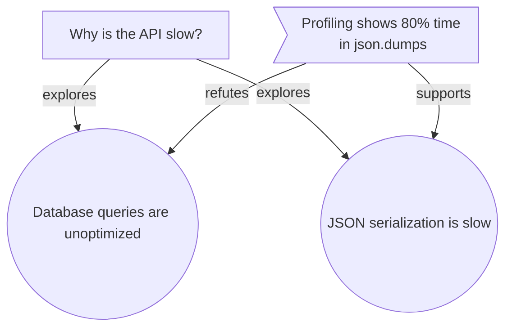

# Graph of Thought: Network-Based Reasoning for Software Development

<!--
  AUTHOR'S NOTE:

  This document explains how to use Graph of Thought (GoT) for complex reasoning
  tasks in software development. GoT extends Chain of Thought by representing
  reasoning as a network rather than a linear sequence.

  Read this when you need to:
  - Model complex problems with multiple hypotheses
  - Track dependencies between decisions
  - Explore multiple solution paths simultaneously
  - Visualize reasoning structures
  - Debug your own thought process
-->

## Table of Contents

1. [What is Graph of Thought?](#what-is-graph-of-thought)
2. [When to Use GoT vs CoT](#when-to-use-got-vs-cot)
3. [Core Concepts](#core-concepts)
4. [Node Types Reference](#node-types-reference)
5. [Edge Types Reference](#edge-types-reference)
6. [Basic Usage](#basic-usage)
7. [Pattern Factories](#pattern-factories)
8. [Complex Examples](#complex-examples)
9. [Visualization](#visualization)
10. [Integration with CognitiveLoop](#integration-with-cognitiveloop)
11. [Advanced Operations](#advanced-operations)
12. [Best Practices](#best-practices)

---

## What is Graph of Thought?

**Graph of Thought (GoT)** is a reasoning framework that represents thoughts and their relationships as a directed graph. Unlike Chain of Thought (linear sequence), GoT captures:

- **Multiple hypotheses** being explored in parallel
- **Dependencies** between ideas and decisions
- **Contradictions** and conflicts between options
- **Emergent clusters** of related concepts
- **Feedback loops** in reasoning

### The Core Metaphor

```
Chain of Thought:          Graph of Thought:
A → B → C → D             A ──┬──► B ──► E
                          │   │    │
                          │   └──► C ──► F
                          │        │
                          └──────► D ──► G
```

Real reasoning isn't linear - it branches, merges, loops back, and forms clusters. GoT makes this explicit.

---

## When to Use GoT vs CoT

### Use Chain of Thought (CoT) when:
- ✅ Problem has a clear, linear solution path
- ✅ One hypothesis at a time
- ✅ Simple cause-effect relationships
- ✅ Quick, straightforward tasks

**Example:** "Implement a function to validate email addresses"

### Use Graph of Thought (GoT) when:
- ✅ Multiple competing hypotheses
- ✅ Complex dependencies between decisions
- ✅ Need to explore trade-offs
- ✅ Debugging with many possible causes
- ✅ Feature design with multiple options
- ✅ Reasoning needs to be visualized or shared

**Example:** "Why is the API slow?" (many possible causes, complex dependencies)

---

## Core Concepts

### 1. Nodes: Units of Thought

Each node represents a discrete piece of reasoning:

```python
from cortical.reasoning.graph_of_thought import ThoughtNode, NodeType

node = ThoughtNode(
    id="Q1",
    node_type=NodeType.QUESTION,
    content="Why is the API slow?",
    properties={
        'context': 'Production environment',
        'urgency': 'high'
    },
    metadata={
        'created': '2025-12-20',
        'tags': ['performance', 'api']
    }
)
```

### 2. Edges: Relationships Between Thoughts

Edges represent HOW thoughts relate:

```python
from cortical.reasoning.graph_of_thought import ThoughtEdge, EdgeType

edge = ThoughtEdge(
    source_id="Q1",
    target_id="H1",
    edge_type=EdgeType.EXPLORES,
    weight=0.8,  # Strength of relationship
    confidence=0.9  # How confident we are in this relationship
)
```

### 3. Clusters: Groups of Related Thoughts

Clusters emerge when nodes are densely connected:

```python
from cortical.reasoning.graph_of_thought import ThoughtCluster

cluster = ThoughtCluster(
    id="CL1",
    name="Authentication Issues",
    node_ids={"Q1", "H1", "H2", "E1"},
    properties={
        'internal_edges': 8,
        'coherence': 0.85
    }
)
```

---

## Node Types Reference

### Core Types

#### CONCEPT
**What:** An idea, pattern, or abstraction

**When to use:** Representing architectural patterns, design principles, or abstract ideas

**Example:**
```python
graph.add_node(
    node_id="C1",
    node_type=NodeType.CONCEPT,
    content="Dependency Injection",
    properties={
        'definition': 'Pattern for providing dependencies externally',
        'examples': ['FastAPI dependencies', 'Spring DI']
    }
)
```

#### QUESTION
**What:** Something unknown or uncertain

**When to use:** Starting investigations, identifying gaps in knowledge

**Example:**
```python
graph.add_node(
    node_id="Q1",
    node_type=NodeType.QUESTION,
    content="How should we handle authentication?",
    properties={
        'context': 'Multi-tenant SaaS application',
        'urgency': 'blocking development'
    }
)
```

#### DECISION
**What:** A choice point with multiple options

**When to use:** Architectural decisions, technology choices, design trade-offs

**Example:**
```python
graph.add_node(
    node_id="D1",
    node_type=NodeType.DECISION,
    content="Choose authentication method",
    properties={
        'options': ['OAuth 2.0', 'JWT', 'Session-based'],
        'decision_maker': 'Tech lead',
        'status': 'pending'
    }
)
```

#### FACT
**What:** Verified, objective information

**When to use:** Recording measurements, test results, proven constraints

**Example:**
```python
graph.add_node(
    node_id="F1",
    node_type=NodeType.FACT,
    content="API response time is 2.3 seconds",
    properties={
        'measurement': 2.3,
        'unit': 'seconds',
        'evidence': 'Performance test run #42',
        'confidence': 1.0
    }
)
```

#### TASK
**What:** Work to be done

**When to use:** Tracking implementation steps, creating work breakdown

**Example:**
```python
graph.add_node(
    node_id="T1",
    node_type=NodeType.TASK,
    content="Implement caching layer",
    properties={
        'status': 'in_progress',
        'assignee': 'agent-3',
        'estimated_hours': 4
    }
)
```

#### ARTIFACT
**What:** Something created (code, docs, tests)

**When to use:** Tracking deliverables, linking code to reasoning

**Example:**
```python
graph.add_node(
    node_id="A1",
    node_type=NodeType.ARTIFACT,
    content="auth.py module",
    properties={
        'path': 'src/auth.py',
        'type': 'code',
        'version': 'v1.0',
        'lines': 234
    }
)
```

#### INSIGHT
**What:** A learning or realization discovered during work

**When to use:** Capturing "aha!" moments, documenting learnings

**Example:**
```python
graph.add_node(
    node_id="I1",
    node_type=NodeType.INSIGHT,
    content="The bottleneck is JSON serialization, not database queries",
    properties={
        'how_discovered': 'Profiling revealed 80% time in json.dumps',
        'implications': ['Should use orjson', 'Cache serialized responses']
    }
)
```

### Extended Types (for Reasoning Patterns)

#### HYPOTHESIS
**What:** A proposed explanation to be tested

**When to use:** Bug investigation, performance debugging, root cause analysis

**Example:**
```python
graph.add_node(
    node_id="H1",
    node_type=NodeType.HYPOTHESIS,
    content="Auth fails because tokens expire too quickly",
    properties={
        'testable': True,
        'test_method': 'Check token TTL in logs',
        'status': 'testing'
    }
)
```

#### OPTION
**What:** A specific choice within a decision

**When to use:** As children of DECISION nodes, representing alternatives

**Example:**
```python
graph.add_node(
    node_id="OPT1",
    node_type=NodeType.OPTION,
    content="Use OAuth 2.0 with Auth0",
    properties={
        'pros': ['Industry standard', 'Managed service', 'MFA support'],
        'cons': ['Monthly cost', 'Vendor lock-in', 'Learning curve'],
        'estimated_effort': '2 weeks'
    }
)
```

#### EVIDENCE
**What:** Data supporting or refuting something

**When to use:** Backing up hypotheses, supporting decisions with data

**Example:**
```python
graph.add_node(
    node_id="E1",
    node_type=NodeType.EVIDENCE,
    content="Logs show 401 errors every 15 minutes",
    properties={
        'valence': 'supports',  # or 'refutes'
        'source': 'production-logs-2025-12-20.txt',
        'confidence': 0.95
    }
)
```

#### OBSERVATION
**What:** Something noticed during investigation

**When to use:** Recording symptoms, documenting behavior

**Example:**
```python
graph.add_node(
    node_id="OBS1",
    node_type=NodeType.OBSERVATION,
    content="Response times spike every day at 3 PM",
    properties={
        'frequency': 'daily',
        'magnitude': '10x normal latency',
        'reproducible': True
    }
)
```

#### GOAL
**What:** A desired outcome or objective

**When to use:** Feature planning, sprint goals, user needs

**Example:**
```python
graph.add_node(
    node_id="G1",
    node_type=NodeType.GOAL,
    content="Reduce API latency to under 100ms",
    properties={
        'current_state': '2.3 seconds',
        'target_state': '<100ms',
        'success_metric': 'p95 latency'
    }
)
```

#### CONTEXT
**What:** Background information or situational details

**When to use:** User stories, environmental constraints, background

**Example:**
```python
graph.add_node(
    node_id="CTX1",
    node_type=NodeType.CONTEXT,
    content="User story: As a developer, I want API docs...",
    properties={
        'stakeholder': 'External developers',
        'priority': 'high',
        'deadline': '2025-Q1'
    }
)
```

#### CONSTRAINT
**What:** A limitation or requirement that must be satisfied

**When to use:** Technical limits, business rules, compliance requirements

**Example:**
```python
graph.add_node(
    node_id="CON1",
    node_type=NodeType.CONSTRAINT,
    content="Must support IE11 for enterprise customers",
    properties={
        'type': 'technical',
        'source': 'customer contract',
        'negotiable': False
    }
)
```

#### ACTION
**What:** A concrete step to take

**When to use:** Implementation steps, next steps, remediation actions

**Example:**
```python
graph.add_node(
    node_id="ACT1",
    node_type=NodeType.ACTION,
    content="Add Redis caching layer to endpoints",
    properties={
        'difficulty': 'medium',
        'estimated_time': '4 hours',
        'blocks': ['T2', 'T3']
    }
)
```

---

## Edge Types Reference

### Semantic Edges (Meaning Relationships)

#### REQUIRES
```python
# A requires B to exist/function
graph.add_edge("T1", "T2", EdgeType.REQUIRES)
# "Implement auth" REQUIRES "Set up database"
```

#### ENABLES
```python
# A makes B possible
graph.add_edge("A1", "T1", EdgeType.ENABLES)
# "Caching module" ENABLES "Performance optimization task"
```

#### CONFLICTS
```python
# A and B cannot both be true/chosen
graph.add_edge("OPT1", "OPT2", EdgeType.CONFLICTS, bidirectional=True)
# "Use MySQL" CONFLICTS with "Use PostgreSQL"
```

#### SUPPORTS
```python
# A provides evidence for B
graph.add_edge("E1", "H1", EdgeType.SUPPORTS)
# "Logs show token expiry" SUPPORTS "Auth fails due to token TTL"
```

#### REFUTES
```python
# A provides evidence against B
graph.add_edge("E2", "H1", EdgeType.REFUTES)
# "Tokens valid for 24h" REFUTES "Tokens expire too quickly"
```

#### SIMILAR
```python
# A and B share significant properties
graph.add_edge("C1", "C2", EdgeType.SIMILAR, bidirectional=True)
# "Factory Pattern" SIMILAR to "Builder Pattern"
```

#### CONTAINS
```python
# A includes B as a component
graph.add_edge("CL1", "T1", EdgeType.CONTAINS)
# "Authentication cluster" CONTAINS "JWT validation task"
```

#### CONTRADICTS
```python
# A contradicts B (stronger than REFUTES)
graph.add_edge("F1", "H1", EdgeType.CONTRADICTS)
# "Database is fast" CONTRADICTS "Database is the bottleneck"
```

### Temporal Edges (Time Relationships)

#### PRECEDES
```python
# A must happen before B
graph.add_edge("T1", "T2", EdgeType.PRECEDES)
# "Design schema" PRECEDES "Implement migrations"
```

#### TRIGGERS
```python
# A causes B to happen
graph.add_edge("E1", "T1", EdgeType.TRIGGERS)
# "Bug found" TRIGGERS "Create fix task"
```

#### BLOCKS
```python
# A prevents B until resolved
graph.add_edge("CON1", "T1", EdgeType.BLOCKS)
# "Missing API key" BLOCKS "Integration testing"
```

### Epistemic Edges (Knowledge Relationships)

#### ANSWERS
```python
# A answers question B
graph.add_edge("H1", "Q1", EdgeType.ANSWERS)
# "Use OAuth" ANSWERS "How to handle auth?"
```

#### RAISES
```python
# A raises question B
graph.add_edge("OBS1", "Q1", EdgeType.RAISES)
# "3pm spike" RAISES "Why does traffic spike?"
```

#### EXPLORES
```python
# A explores/investigates B
graph.add_edge("H1", "Q1", EdgeType.EXPLORES)
# "Test token TTL" EXPLORES "Why auth fails?"
```

#### OBSERVES
```python
# A observes/notices B
graph.add_edge("T1", "OBS1", EdgeType.OBSERVES)
# "Performance test" OBSERVES "Latency spike"
```

#### SUGGESTS
```python
# A suggests B as a possibility
graph.add_edge("OBS1", "H1", EdgeType.SUGGESTS)
# "401 errors" SUGGESTS "Token expiry issue"
```

### Practical Edges (Work Relationships)

#### IMPLEMENTS
```python
# A implements concept/decision B
graph.add_edge("A1", "D1", EdgeType.IMPLEMENTS)
# "auth.py" IMPLEMENTS "OAuth decision"
```

#### TESTS
```python
# A tests/verifies B
graph.add_edge("A2", "A1", EdgeType.TESTS)
# "test_auth.py" TESTS "auth.py"
```

#### DEPENDS_ON
```python
# A needs B to be complete first
graph.add_edge("T2", "T1", EdgeType.DEPENDS_ON)
# "API endpoints" DEPENDS_ON "Auth middleware"
```

#### REFINES
```python
# A refines/details B
graph.add_edge("T1", "G1", EdgeType.REFINES)
# "Specific implementation task" REFINES "High-level goal"
```

#### MOTIVATES
```python
# A motivates/justifies B
graph.add_edge("G1", "D1", EdgeType.MOTIVATES)
# "Need speed" MOTIVATES "Caching decision"
```

### Structural Edges (Organization Relationships)

#### HAS_OPTION
```python
# A (decision) has B as an option
graph.add_edge("D1", "OPT1", EdgeType.HAS_OPTION)
# "Auth method decision" HAS_OPTION "OAuth"
```

#### HAS_ASPECT
```python
# A has B as an aspect/dimension
graph.add_edge("C1", "C2", EdgeType.HAS_ASPECT)
# "API Design" HAS_ASPECT "Error handling"
```

---

## Basic Usage

### Creating a Simple Graph

```python
from cortical.reasoning.thought_graph import ThoughtGraph
from cortical.reasoning.graph_of_thought import NodeType, EdgeType

# Create empty graph
graph = ThoughtGraph()

# Add nodes
q1 = graph.add_node(
    node_id="Q1",
    node_type=NodeType.QUESTION,
    content="Why is the API slow?"
)

h1 = graph.add_node(
    node_id="H1",
    node_type=NodeType.HYPOTHESIS,
    content="Database queries are unoptimized"
)

h2 = graph.add_node(
    node_id="H2",
    node_type=NodeType.HYPOTHESIS,
    content="JSON serialization is slow"
)

# Add relationships
graph.add_edge("Q1", "H1", EdgeType.EXPLORES, weight=0.6)
graph.add_edge("Q1", "H2", EdgeType.EXPLORES, weight=0.8)

# Query the graph
hypotheses = graph.nodes_of_type(NodeType.HYPOTHESIS)
print(f"Found {len(hypotheses)} hypotheses to investigate")

# Traverse from question
path = graph.bfs("Q1")
print(f"BFS traversal: {path}")
```

### Adding Evidence

```python
# Add evidence for hypothesis
e1 = graph.add_node(
    node_id="E1",
    node_type=NodeType.EVIDENCE,
    content="Profiling shows 80% time in json.dumps",
    properties={'confidence': 0.95}
)

# Link evidence to hypothesis
graph.add_edge("E1", "H2", EdgeType.SUPPORTS, weight=0.9)

# This evidence refutes the other hypothesis
graph.add_edge("E1", "H1", EdgeType.REFUTES, weight=0.7)
```

### Making Decisions Based on Evidence

```python
# Create decision node
d1 = graph.add_node(
    node_id="D1",
    node_type=NodeType.DECISION,
    content="Choose JSON serialization library",
    properties={'status': 'decided', 'chosen': 'orjson'}
)

# Evidence motivates the decision
graph.add_edge("E1", "D1", EdgeType.MOTIVATES)

# Create options
opt1 = graph.add_node(
    node_id="OPT1",
    node_type=NodeType.OPTION,
    content="Use orjson (5x faster)",
    properties={'chosen': True}
)

graph.add_edge("D1", "OPT1", EdgeType.HAS_OPTION)
```

---

## Pattern Factories

Pre-structured graphs for common reasoning workflows.

### Investigation Pattern

**Use when:** Exploring a question with multiple hypotheses

```python
from cortical.reasoning.thought_patterns import create_investigation_graph

graph = create_investigation_graph(
    question="Why are users getting logged out randomly?",
    initial_hypotheses=[
        "Session timeout is too short",
        "Redis connection issues",
        "Cookie domain mismatch"
    ]
)

# Graph structure:
# Question (root)
# ├── Hypothesis 1
# ├── Hypothesis 2
# └── Hypothesis 3

# Add evidence to test hypotheses
graph.add_node("E1", NodeType.EVIDENCE, "Session TTL is 24 hours")
graph.add_edge("E1", list(graph.nodes.keys())[1], EdgeType.REFUTES)

# Visualize
print(graph.to_ascii())
```

### Decision Pattern

**Use when:** Making a decision with multiple options

```python
from cortical.reasoning.thought_patterns import create_decision_graph

graph = create_decision_graph(
    decision="Choose database for new microservice",
    options=["PostgreSQL", "MongoDB", "DynamoDB"]
)

# Graph structure:
# Decision (root)
# ├── Option 1
# │   ├── Pro (placeholder)
# │   └── Con (placeholder)
# ├── Option 2
# │   ├── Pro (placeholder)
# │   └── Con (placeholder)
# └── Option 3
#     ├── Pro (placeholder)
#     └── Con (placeholder)

# Replace placeholders with real evidence
nodes = list(graph.nodes.values())
for node in nodes:
    if node.metadata.get('placeholder'):
        # Update with real data
        if 'PostgreSQL' in node.content:
            if node.metadata.get('valence') == 'positive':
                node.content = "ACID compliant, proven at scale"
            else:
                node.content = "Harder to scale horizontally"
```

### Debug Pattern

**Use when:** Debugging a problem with unknown cause

```python
from cortical.reasoning.thought_patterns import create_debug_graph

graph = create_debug_graph(
    symptom="Application crashes on startup in production"
)

# Graph structure:
# Symptom (root)
# ├── Observation 1 (placeholder)
# ├── Observation 2 (placeholder)
# └── Observation 3 (placeholder)
#     ├── Possible cause 1 (placeholder)
#     ├── Possible cause 2 (placeholder)
#     └── Possible cause 3 (placeholder)

# Fill in observations
obs_nodes = graph.nodes_of_type(NodeType.OBSERVATION)
for obs in obs_nodes:
    if obs.metadata.get('placeholder'):
        # Update based on investigation
        pass
```

### Feature Planning Pattern

**Use when:** Planning a new feature from goal to tasks

```python
from cortical.reasoning.thought_patterns import create_feature_graph

graph = create_feature_graph(
    goal="Add real-time notifications to dashboard",
    user_story="As a user, I want to see updates without refreshing"
)

# Graph structure:
# Goal (root)
# └── User story
#     ├── Task 1 (placeholder)
#     ├── Task 2 (placeholder)
#     └── Task 3 (placeholder)

# Replace task placeholders
task_nodes = graph.nodes_of_type(NodeType.ACTION)
tasks = [
    "Set up WebSocket server",
    "Implement client-side listener",
    "Add notification UI component"
]
for task_node, task_content in zip(task_nodes, tasks):
    task_node.content = task_content
    task_node.metadata['placeholder'] = False
```

### Requirements Analysis Pattern

**Use when:** Breaking down user needs into requirements

```python
from cortical.reasoning.thought_patterns import create_requirements_graph

graph = create_requirements_graph(
    user_need="Users need to export data in multiple formats"
)

# Graph structure:
# User need (root)
# ├── Requirement 1 (placeholder)
# │   └── Specification 1 (placeholder)
# │       └── Design 1 (placeholder)
# ├── Requirement 2 (placeholder)
# │   └── Specification 2 (placeholder)
# │       └── Design 2 (placeholder)
# └── Requirement 3 (placeholder)
#     └── Specification 3 (placeholder)
#         └── Design 3 (placeholder)
```

### Analysis Pattern

**Use when:** Analyzing a topic from multiple angles

```python
from cortical.reasoning.thought_patterns import create_analysis_graph

graph = create_analysis_graph(
    topic="API Performance Bottlenecks",
    aspects=["Database", "Network", "Serialization", "Caching"]
)

# Graph structure:
# Topic (root)
# ├── Aspect 1
# │   ├── Finding 1 (placeholder)
# │   └── Finding 2 (placeholder)
# ├── Aspect 2
# │   ├── Finding 1 (placeholder)
# │   └── Finding 2 (placeholder)
# └── ...
```

### Dynamic Pattern Selection

```python
from cortical.reasoning.thought_patterns import create_pattern_graph

# Automatically choose pattern by name
graph = create_pattern_graph(
    "investigation",
    question="Why is deployment failing?"
)

# Or for decision-making
graph = create_pattern_graph(
    "decision",
    decision="Choose CI/CD platform",
    options=["GitHub Actions", "GitLab CI", "Jenkins"]
)
```

---

## Complex Examples

### Example 1: Multi-Step Bug Investigation

**Scenario:** Users report intermittent 500 errors in production.

```python
from cortical.reasoning.thought_graph import ThoughtGraph
from cortical.reasoning.graph_of_thought import NodeType, EdgeType

graph = ThoughtGraph()

# 1. Start with the symptom
symptom = graph.add_node(
    "SYM1",
    NodeType.OBSERVATION,
    "Users get 500 errors intermittently",
    properties={'frequency': '~5% of requests', 'reproducible': False}
)

# 2. Initial observations from logs
obs1 = graph.add_node(
    "OBS1",
    NodeType.OBSERVATION,
    "Errors occur during peak traffic (2-4 PM)",
    properties={'pattern': 'time-based'}
)

obs2 = graph.add_node(
    "OBS2",
    NodeType.OBSERVATION,
    "Database connection pool shows exhaustion warnings",
    properties={'log_source': 'app.log'}
)

graph.add_edge("SYM1", "OBS1", EdgeType.OBSERVES)
graph.add_edge("SYM1", "OBS2", EdgeType.OBSERVES)

# 3. Form hypotheses based on observations
h1 = graph.add_node(
    "H1",
    NodeType.HYPOTHESIS,
    "Connection pool size is too small for peak load"
)

h2 = graph.add_node(
    "H2",
    NodeType.HYPOTHESIS,
    "Connections are leaking (not being returned)"
)

graph.add_edge("OBS2", "H1", EdgeType.SUGGESTS, weight=0.8)
graph.add_edge("OBS2", "H2", EdgeType.SUGGESTS, weight=0.7)

# 4. Gather evidence
e1 = graph.add_node(
    "E1",
    NodeType.EVIDENCE,
    "Pool size is 10, peak concurrency is 50",
    properties={'confidence': 1.0}
)

e2 = graph.add_node(
    "E2",
    NodeType.EVIDENCE,
    "Code review shows missing connection.close() in error handler",
    properties={'confidence': 1.0}
)

graph.add_edge("E1", "H1", EdgeType.SUPPORTS, weight=0.9)
graph.add_edge("E2", "H2", EdgeType.SUPPORTS, weight=1.0)

# 5. Realize BOTH hypotheses are true (not mutually exclusive)
insight = graph.add_node(
    "I1",
    NodeType.INSIGHT,
    "Two separate issues: pool too small AND connection leaks",
    properties={'implications': ['Need to fix both', 'Pool size masks leak']}
)

graph.add_edge("H1", "I1", EdgeType.SUPPORTS)
graph.add_edge("H2", "I1", EdgeType.SUPPORTS)

# 6. Create action items
action1 = graph.add_node(
    "ACT1",
    NodeType.ACTION,
    "Increase pool size to 100",
    properties={'priority': 'high', 'estimated_time': '5 min'}
)

action2 = graph.add_node(
    "ACT2",
    NodeType.ACTION,
    "Add connection.close() to all error handlers",
    properties={'priority': 'critical', 'estimated_time': '2 hours'}
)

graph.add_edge("I1", "ACT1", EdgeType.MOTIVATES)
graph.add_edge("I1", "ACT2", EdgeType.MOTIVATES)

# Actions have a dependency relationship
graph.add_edge("ACT1", "ACT2", EdgeType.PRECEDES, weight=0.5)

# 7. Visualize the reasoning
print(graph.to_ascii("SYM1"))
print("\n" + "="*70 + "\n")
print(graph.to_mermaid())
```

**Output (ASCII):**
```
[OBSERVATION] Users get 500 errors intermittently
├── [OBSERVATION] Errors occur during peak traffic (2-4 PM) (observes)
└── [OBSERVATION] Database connection pool shows exhaustion... (observes)
    ├── [HYPOTHESIS] Connection pool size is too small... (suggests) [0.80]
    │   └── [EVIDENCE] Pool size is 10, peak concurrency is 50 (supports) [0.90]
    │       └── [INSIGHT] Two separate issues: pool too small AND... (supports)
    │           ├── [ACTION] Increase pool size to 100 (motivates)
    │           └── [ACTION] Add connection.close() to all error... (motivates)
    └── [HYPOTHESIS] Connections are leaking (not being returned) (suggests) [0.70]
        └── [EVIDENCE] Code review shows missing connection.close()... (supports) [1.00]
```

### Example 2: Feature Design with Trade-offs

**Scenario:** Designing a caching strategy with competing concerns.

```python
graph = ThoughtGraph()

# Goal
goal = graph.add_node(
    "G1",
    NodeType.GOAL,
    "Reduce API latency by 80%",
    properties={'current': '2.5s', 'target': '500ms'}
)

# Decision point
decision = graph.add_node(
    "D1",
    NodeType.DECISION,
    "Choose caching strategy"
)

graph.add_edge("G1", "D1", EdgeType.MOTIVATES)

# Option 1: Client-side caching
opt1 = graph.add_node(
    "OPT1",
    NodeType.OPTION,
    "Client-side caching (browser cache)"
)
graph.add_edge("D1", "OPT1", EdgeType.HAS_OPTION)

pro1a = graph.add_node(
    "PRO1A",
    NodeType.EVIDENCE,
    "Zero server load",
    metadata={'valence': 'positive'}
)
pro1b = graph.add_node(
    "PRO1B",
    NodeType.EVIDENCE,
    "Instant for repeat requests",
    metadata={'valence': 'positive'}
)
con1a = graph.add_node(
    "CON1A",
    NodeType.EVIDENCE,
    "Stale data risk if not invalidated",
    metadata={'valence': 'negative'}
)
con1b = graph.add_node(
    "CON1B",
    NodeType.EVIDENCE,
    "No benefit for new users",
    metadata={'valence': 'negative'}
)

graph.add_edge("PRO1A", "OPT1", EdgeType.SUPPORTS)
graph.add_edge("PRO1B", "OPT1", EdgeType.SUPPORTS)
graph.add_edge("CON1A", "OPT1", EdgeType.CONTRADICTS)
graph.add_edge("CON1B", "OPT1", EdgeType.CONTRADICTS)

# Option 2: Server-side caching (Redis)
opt2 = graph.add_node(
    "OPT2",
    NodeType.OPTION,
    "Server-side Redis cache"
)
graph.add_edge("D1", "OPT2", EdgeType.HAS_OPTION)

pro2a = graph.add_node(
    "PRO2A",
    NodeType.EVIDENCE,
    "Shared across all users",
    metadata={'valence': 'positive'}
)
pro2b = graph.add_node(
    "PRO2B",
    NodeType.EVIDENCE,
    "Fine-grained TTL control",
    metadata={'valence': 'positive'}
)
con2a = graph.add_node(
    "CON2A",
    NodeType.EVIDENCE,
    "Operational complexity (Redis cluster)",
    metadata={'valence': 'negative'}
)
con2b = graph.add_node(
    "CON2B",
    NodeType.EVIDENCE,
    "Cache invalidation is hard",
    metadata={'valence': 'negative'}
)

graph.add_edge("PRO2A", "OPT2", EdgeType.SUPPORTS)
graph.add_edge("PRO2B", "OPT2", EdgeType.SUPPORTS)
graph.add_edge("CON2A", "OPT2", EdgeType.CONTRADICTS)
graph.add_edge("CON2B", "OPT2", EdgeType.CONTRADICTS)

# Option 3: Hybrid approach
opt3 = graph.add_node(
    "OPT3",
    NodeType.OPTION,
    "Hybrid: Redis + CDN for static assets"
)
graph.add_edge("D1", "OPT3", EdgeType.HAS_OPTION)

# Hybrid combines aspects of both
graph.add_edge("OPT3", "OPT1", EdgeType.CONTAINS)
graph.add_edge("OPT3", "OPT2", EdgeType.CONTAINS)

# Constraints influence the decision
constraint1 = graph.add_node(
    "CON1",
    NodeType.CONSTRAINT,
    "Budget: Max $500/month for infrastructure",
    properties={'type': 'financial', 'hard_limit': True}
)

constraint2 = graph.add_node(
    "CON2",
    NodeType.CONSTRAINT,
    "Must support offline mode for mobile app",
    properties={'type': 'functional', 'hard_limit': True}
)

graph.add_edge("CON1", "OPT2", EdgeType.BLOCKS)
graph.add_edge("CON2", "OPT1", EdgeType.REQUIRES)

# Make the decision
decision.properties['chosen'] = 'OPT3'
decision.properties['rationale'] = 'Hybrid satisfies both constraints'

# Implementation tasks
task1 = graph.add_node(
    "T1",
    NodeType.TASK,
    "Set up CloudFront CDN for static assets",
    properties={'priority': 'high'}
)
task2 = graph.add_node(
    "T2",
    NodeType.TASK,
    "Implement Redis caching for API responses",
    properties={'priority': 'high'}
)
task3 = graph.add_node(
    "T3",
    NodeType.TASK,
    "Add cache-control headers to browser",
    properties={'priority': 'medium'}
)

graph.add_edge("OPT3", "T1", EdgeType.REQUIRES)
graph.add_edge("OPT3", "T2", EdgeType.REQUIRES)
graph.add_edge("OPT3", "T3", EdgeType.REQUIRES)

# Visualize decision tree
print(graph.to_mermaid())
```

### Example 3: Knowledge Gap Analysis

**Scenario:** Identifying what we don't know before starting work.

```python
graph = ThoughtGraph()

# The task
task = graph.add_node(
    "T1",
    NodeType.TASK,
    "Migrate from REST to GraphQL"
)

# Questions we need to answer first
q1 = graph.add_node(
    "Q1",
    NodeType.QUESTION,
    "What are our query patterns?",
    properties={'status': 'unanswered', 'blocking': True}
)

q2 = graph.add_node(
    "Q2",
    NodeType.QUESTION,
    "How will this affect mobile app?",
    properties={'status': 'unanswered', 'blocking': True}
)

q3 = graph.add_node(
    "Q3",
    NodeType.QUESTION,
    "Do we have GraphQL expertise on the team?",
    properties={'status': 'unanswered', 'blocking': False}
)

graph.add_edge("Q1", "T1", EdgeType.BLOCKS)
graph.add_edge("Q2", "T1", EdgeType.BLOCKS)
graph.add_edge("Q3", "T1", EdgeType.RAISES)

# Actions to answer questions
a1 = graph.add_node(
    "A1",
    NodeType.ACTION,
    "Analyze API access logs for common query patterns"
)
a2 = graph.add_node(
    "A2",
    NodeType.ACTION,
    "Spike: Build GraphQL prototype with mobile client"
)
a3 = graph.add_node(
    "A3",
    NodeType.ACTION,
    "Survey team GraphQL experience"
)

graph.add_edge("A1", "Q1", EdgeType.ANSWERS)
graph.add_edge("A2", "Q2", EdgeType.ANSWERS)
graph.add_edge("A3", "Q3", EdgeType.ANSWERS)

# Find all blocking questions
blocking_questions = [
    node for node in graph.nodes.values()
    if node.node_type == NodeType.QUESTION
    and node.properties.get('blocking')
]

print(f"Must answer {len(blocking_questions)} questions before starting:")
for q in blocking_questions:
    print(f"  - {q.content}")
```

---

## Visualization

### Mermaid Diagrams (Markdown-Compatible)

Perfect for GitHub README, PR descriptions, documentation.

```python
mermaid = graph.to_mermaid()
print(mermaid)
```

**Output:**


**Rendered in GitHub:**
- QUESTIONs are boxes `[text]`
- HYPOTHESESs are double circles `((text))`
- EVIDENCE nodes are asymmetric `>text]`
- DECISIONs are diamonds `{text}`
- Edges show relationship types

### DOT Format (Graphviz)

For high-quality diagrams with more control.

```python
dot = graph.to_dot()

# Save to file
with open('reasoning.dot', 'w') as f:
    f.write(dot)

# Render with Graphviz
# dot -Tpng reasoning.dot -o reasoning.png
# dot -Tsvg reasoning.dot -o reasoning.svg
```

**Features:**
- Color-coded by node type
- Different shapes for different types
- Dashed lines for low-confidence edges
- Bidirectional arrows for symmetric relations

### ASCII Tree (Terminal)

For quick visualization in CLI or logs.

```python
# Auto-detect root
ascii_tree = graph.to_ascii()
print(ascii_tree)

# Or specify root
ascii_tree = graph.to_ascii(root_id="Q1", max_depth=5)
print(ascii_tree)
```

**Output:**
```
[QUESTION] Why is the API slow?
├── [HYPOTHESIS] Database queries are unoptimized (explores)
│   └── [EVIDENCE] Profiling shows 20% DB time (refutes) [0.70]
└── [HYPOTHESIS] JSON serialization is slow (explores)
    └── [EVIDENCE] Profiling shows 80% time in json.dumps (supports) [0.90]
        └── [DECISION] Choose orjson for serialization

[2 node(s) not shown: D1, ACT1...]
```

### Exporting for External Tools

```python
# Export to JSON for custom visualization
import json

graph_data = {
    'nodes': [
        {
            'id': node.id,
            'type': node.node_type.value,
            'content': node.content,
            'properties': node.properties,
            'metadata': node.metadata
        }
        for node in graph.nodes.values()
    ],
    'edges': [
        {
            'source': edge.source_id,
            'target': edge.target_id,
            'type': edge.edge_type.value,
            'weight': edge.weight,
            'confidence': edge.confidence,
            'bidirectional': edge.bidirectional
        }
        for edge in graph.edges
    ]
}

with open('graph.json', 'w') as f:
    json.dump(graph_data, f, indent=2)
```

---

## Integration with CognitiveLoop

Graph of Thought integrates naturally with the QAPV (Question-Answer-Produce-Verify) loop from `docs/complex-reasoning-workflow.md`.

### Mapping QAPV to Graph Nodes

```python
# QUESTION phase → QUESTION nodes
question_node = graph.add_node(
    "Q1",
    NodeType.QUESTION,
    "What's the root cause?"
)

# ANSWER phase → HYPOTHESIS + EVIDENCE nodes
hypothesis_node = graph.add_node(
    "H1",
    NodeType.HYPOTHESIS,
    "Database is the bottleneck"
)

evidence_node = graph.add_node(
    "E1",
    NodeType.EVIDENCE,
    "Profiling confirms DB time is 80%"
)

graph.add_edge("Q1", "H1", EdgeType.EXPLORES)
graph.add_edge("E1", "H1", EdgeType.SUPPORTS)

# PRODUCE phase → TASK + ARTIFACT nodes
task_node = graph.add_node(
    "T1",
    NodeType.TASK,
    "Optimize slow queries"
)

artifact_node = graph.add_node(
    "A1",
    NodeType.ARTIFACT,
    "queries.py with query optimizations",
    properties={'path': 'src/queries.py'}
)

graph.add_edge("H1", "T1", EdgeType.MOTIVATES)
graph.add_edge("T1", "A1", EdgeType.IMPLEMENTS)

# VERIFY phase → TEST artifacts + OBSERVATION nodes
test_node = graph.add_node(
    "A2",
    NodeType.ARTIFACT,
    "test_queries.py",
    properties={'path': 'tests/test_queries.py'}
)

observation_node = graph.add_node(
    "OBS1",
    NodeType.OBSERVATION,
    "Response time reduced to 200ms"
)

graph.add_edge("A2", "A1", EdgeType.TESTS)
graph.add_edge("A2", "OBS1", EdgeType.OBSERVES)

# INSIGHT from the loop
insight_node = graph.add_node(
    "I1",
    NodeType.INSIGHT,
    "N+1 query pattern was the issue, fixed with eager loading"
)

graph.add_edge("OBS1", "I1", EdgeType.SUGGESTS)
```

### Tracking Multiple Loop Iterations

```python
# First iteration: Initial hypothesis
h1_v1 = graph.add_node(
    "H1_v1",
    NodeType.HYPOTHESIS,
    "Slow because of large payloads",
    metadata={'iteration': 1}
)

e1 = graph.add_node(
    "E1",
    NodeType.EVIDENCE,
    "Payload size is only 2KB"
)

graph.add_edge("E1", "H1_v1", EdgeType.REFUTES)

# Second iteration: Revised hypothesis
h1_v2 = graph.add_node(
    "H1_v2",
    NodeType.HYPOTHESIS,
    "Slow because of blocking I/O",
    metadata={'iteration': 2}
)

graph.add_edge("H1_v1", "H1_v2", EdgeType.REFINES)

e2 = graph.add_node(
    "E2",
    NodeType.EVIDENCE,
    "Profiling shows thread blocking on file I/O"
)

graph.add_edge("E2", "H1_v2", EdgeType.SUPPORTS)

# This captures the learning process!
```

### Branching and Pruning

The workflow document discusses branching (exploring multiple options) and pruning (abandoning paths). GoT makes this explicit:

```python
# Explore multiple branches
for i, approach in enumerate(["Approach A", "Approach B", "Approach C"]):
    option = graph.add_node(
        f"OPT{i+1}",
        NodeType.OPTION,
        approach,
        properties={'status': 'exploring'}
    )
    graph.add_edge("D1", option, EdgeType.HAS_OPTION)

# Prune a branch (document WHY)
opt_a = graph.get_node("OPT1")
opt_a.properties['status'] = 'pruned'
opt_a.properties['pruned_reason'] = 'Requires skills not available'
opt_a.metadata['pruned_date'] = '2025-12-20'

# Choose the winning branch
opt_b = graph.get_node("OPT2")
opt_b.properties['status'] = 'chosen'
```

### Crisis Management Integration

Part 13 of the workflow covers crisis management. GoT can represent crisis states:

```python
# Crisis: Repeated verification failure
crisis = graph.add_node(
    "CRISIS1",
    NodeType.OBSERVATION,
    "Tests failing after 4 fix attempts",
    properties={'severity': 'level_3', 'action': 'escalate'}
)

# Document what was tried
for i, attempt in enumerate([
    "Fixed null check",
    "Added error handling",
    "Reverted to previous version",
    "Tried alternative approach"
]):
    attempt_node = graph.add_node(
        f"ATTEMPT{i+1}",
        NodeType.ACTION,
        attempt,
        properties={'result': 'failed'}
    )
    graph.add_edge("CRISIS1", attempt_node, EdgeType.TRIGGERS)

# Create escalation artifact
escalation = graph.add_node(
    "ESC1",
    NodeType.ARTIFACT,
    "Escalation document with all attempts",
    properties={'type': 'escalation', 'status': 'sent_to_human'}
)

graph.add_edge("CRISIS1", escalation, EdgeType.MOTIVATES)
```

---

## Advanced Operations

### Graph Traversal

```python
# Depth-first search from a question
path = graph.dfs("Q1")
print(f"DFS order: {path}")

# Breadth-first search (finds shortest path)
path = graph.bfs("Q1")
print(f"BFS order: {path}")

# Find shortest path between two nodes
path = graph.shortest_path("Q1", "I1")
if path:
    print(f"Reasoning chain: {' → '.join(path)}")
```

### Graph Analysis

```python
# Find cycles (feedback loops in reasoning)
cycles = graph.find_cycles()
if cycles:
    print("Warning: Circular reasoning detected:")
    for cycle in cycles:
        print(f"  {' → '.join(cycle)}")

# Find orphan nodes (disconnected ideas)
orphans = graph.find_orphans()
if orphans:
    print("Disconnected thoughts (should these be linked?):")
    for orphan_id in orphans:
        node = graph.get_node(orphan_id)
        print(f"  {node.content}")

# Find hub nodes (central concepts)
hubs = graph.find_hubs(top_n=5)
print("Most connected concepts:")
for node_id, degree in hubs:
    node = graph.get_node(node_id)
    print(f"  {node.content} ({degree} connections)")

# Find bridge nodes (critical to reasoning)
bridges = graph.find_bridges()
print("Critical nodes (removal would disconnect graph):")
for bridge_id in bridges:
    node = graph.get_node(bridge_id)
    print(f"  {node.content}")
```

### Node Merging

Useful when you realize two nodes are actually the same:

```python
# Duplicate hypotheses discovered
h1 = graph.get_node("H1")  # "Token TTL is too short"
h2 = graph.get_node("H2")  # "Tokens expire too quickly"

# Merge them
merged = graph.merge_nodes("H1", "H2", merged_id="H_MERGED")

# All edges from H1 and H2 now point to H_MERGED
```

### Node Splitting

When you realize a node is actually two distinct ideas:

```python
# Complex hypothesis that's actually two separate issues
h1 = graph.get_node("H1")  # "Database AND serialization are slow"

# Split into two focused hypotheses
h1a, h1b = graph.split_node(
    "H1",
    split_id1="H1A",
    split_id2="H1B",
    content1="Database queries are slow",
    content2="JSON serialization is slow"
)

# Edges are duplicated to both (then prune as needed)
```

### Clustering

Group related nodes for better organization:

```python
# Create a cluster for authentication-related nodes
auth_cluster = graph.add_cluster(
    cluster_id="CL_AUTH",
    name="Authentication Issues",
    node_ids={"Q1", "H1", "H2", "E1", "E2"}
)

# Check which cluster a node belongs to
cluster = graph.get_cluster("Q1")
print(f"Node Q1 is in cluster: {cluster.name}")

# Collapse cluster to simplify view
representative = graph.collapse_cluster("CL_AUTH")
print(f"Cluster collapsed to: {representative.content}")

# Later, expand it back
restored_nodes = graph.expand_cluster("CL_AUTH")
```

### Filtering by Type

```python
# Get all questions that need answering
questions = graph.nodes_of_type(NodeType.QUESTION)
unanswered = [
    q for q in questions
    if q.properties.get('status') != 'answered'
]

print(f"{len(unanswered)} questions still need answers")

# Get all tasks
tasks = graph.nodes_of_type(NodeType.TASK)
pending_tasks = [
    t for t in tasks
    if t.properties.get('status') in ['pending', 'in_progress']
]

print(f"{len(pending_tasks)} tasks remaining")
```

### Edge Queries

```python
# Find all evidence supporting a hypothesis
h1 = graph.get_node("H1")
supporting_edges = [
    e for e in graph.get_edges_to("H1")
    if e.edge_type == EdgeType.SUPPORTS
]

print(f"Found {len(supporting_edges)} pieces of supporting evidence")

# Find contradictory evidence
refuting_edges = [
    e for e in graph.get_edges_to("H1")
    if e.edge_type in [EdgeType.REFUTES, EdgeType.CONTRADICTS]
]

print(f"Found {len(refuting_edges)} pieces of contradicting evidence")

# Calculate confidence score
support_weight = sum(e.weight for e in supporting_edges)
refute_weight = sum(e.weight for e in refuting_edges)
confidence = support_weight / (support_weight + refute_weight) if support_weight + refute_weight > 0 else 0.5

print(f"Hypothesis confidence: {confidence:.2f}")
```

---

## Best Practices

### 1. Start Simple, Grow Organically

```python
# DON'T create the entire graph upfront
# DO add nodes as you discover them

# Start with question
graph.add_node("Q1", NodeType.QUESTION, "Why is X slow?")

# Add hypotheses as you think of them
graph.add_node("H1", NodeType.HYPOTHESIS, "Database is slow")
graph.add_edge("Q1", "H1", EdgeType.EXPLORES)

# Add evidence as you gather it
graph.add_node("E1", NodeType.EVIDENCE, "Profiling shows DB time")
graph.add_edge("E1", "H1", EdgeType.SUPPORTS)
```

### 2. Use Properties for Structured Data

```python
# GOOD: Properties for machine-readable data
graph.add_node(
    "T1",
    NodeType.TASK,
    "Optimize query",
    properties={
        'status': 'in_progress',
        'priority': 'high',
        'estimated_hours': 4,
        'assignee': 'agent-2'
    }
)

# Content for human-readable description
# Properties for structured metadata
```

### 3. Set Edge Weights Meaningfully

```python
# Weight represents strength of relationship
graph.add_edge("E1", "H1", EdgeType.SUPPORTS, weight=0.9)  # Strong support
graph.add_edge("E2", "H1", EdgeType.SUPPORTS, weight=0.3)  # Weak support

# Confidence represents certainty in the relationship
graph.add_edge("E3", "H2", EdgeType.SUPPORTS,
               weight=0.8,      # Strong support
               confidence=0.5)  # But we're not sure if E3 is reliable
```

### 4. Document Pruned Branches

```python
# When you abandon a path, document WHY
option_a = graph.get_node("OPT_A")
option_a.properties['status'] = 'pruned'
option_a.properties['pruned_reason'] = 'Requires 3rd party API with monthly fees'
option_a.properties['pruned_date'] = '2025-12-20'
option_a.properties['reconsider_if'] = 'Budget increases or free alternative found'
```

### 5. Use Visualization Early and Often

```python
# After adding significant nodes, visualize to check structure
print(graph.to_ascii())

# Check for disconnected nodes
orphans = graph.find_orphans()
if orphans:
    print(f"Warning: {len(orphans)} disconnected nodes")

# Check for unexpected cycles
cycles = graph.find_cycles()
if cycles:
    print("Circular dependencies found!")
```

### 6. Link Artifacts to Reasoning

```python
# GOOD: Connect code to the reasoning that created it
decision = graph.add_node("D1", NodeType.DECISION, "Use Redis for caching")
task = graph.add_node("T1", NodeType.TASK, "Implement Redis cache")
artifact = graph.add_node(
    "A1",
    NodeType.ARTIFACT,
    "cache.py Redis implementation",
    properties={'path': 'src/cache.py', 'lines': 156}
)

graph.add_edge("D1", "T1", EdgeType.MOTIVATES)
graph.add_edge("T1", "A1", EdgeType.IMPLEMENTS)

# Now you can trace: Why does cache.py exist? → Follow edges back to decision
```

### 7. Regular Graph Health Checks

```python
def health_check(graph: ThoughtGraph):
    """Check graph for common issues."""
    issues = []

    # Check for orphans
    orphans = graph.find_orphans()
    if orphans:
        issues.append(f"{len(orphans)} disconnected nodes")

    # Check for unanswered questions
    questions = graph.nodes_of_type(NodeType.QUESTION)
    unanswered = [
        q for q in questions
        if not any(
            e.edge_type == EdgeType.ANSWERS
            for e in graph.get_edges_to(q.id)
        )
    ]
    if unanswered:
        issues.append(f"{len(unanswered)} unanswered questions")

    # Check for decisions without chosen option
    decisions = graph.nodes_of_type(NodeType.DECISION)
    pending = [
        d for d in decisions
        if not d.properties.get('chosen')
    ]
    if pending:
        issues.append(f"{len(pending)} undecided decisions")

    # Check for tasks without artifacts
    tasks = graph.nodes_of_type(NodeType.TASK)
    completed = [
        t for t in tasks
        if t.properties.get('status') == 'completed'
    ]
    without_artifacts = [
        t for t in completed
        if not any(
            e.edge_type == EdgeType.IMPLEMENTS
            for e in graph.get_edges_from(t.id)
        )
    ]
    if without_artifacts:
        issues.append(f"{len(without_artifacts)} completed tasks without artifacts")

    return issues

# Run periodically
issues = health_check(graph)
if issues:
    print("Graph health issues:")
    for issue in issues:
        print(f"  ⚠️  {issue}")
```

### 8. Export for Knowledge Transfer

```python
# When handing off work, export the reasoning graph
import json

def export_for_handoff(graph: ThoughtGraph, filename: str):
    """Export graph with all context for next developer."""
    data = {
        'metadata': {
            'created': '2025-12-20',
            'purpose': 'Performance debugging session',
            'status': 'in_progress'
        },
        'summary': {
            'nodes': graph.node_count(),
            'edges': graph.edge_count(),
            'questions': len(graph.nodes_of_type(NodeType.QUESTION)),
            'decisions': len(graph.nodes_of_type(NodeType.DECISION)),
            'insights': len(graph.nodes_of_type(NodeType.INSIGHT))
        },
        'mermaid': graph.to_mermaid(),
        'graph': {
            'nodes': [
                {
                    'id': n.id,
                    'type': n.node_type.value,
                    'content': n.content,
                    'properties': n.properties,
                    'metadata': n.metadata
                }
                for n in graph.nodes.values()
            ],
            'edges': [
                {
                    'from': e.source_id,
                    'to': e.target_id,
                    'type': e.edge_type.value,
                    'weight': e.weight,
                    'confidence': e.confidence
                }
                for e in graph.edges
            ]
        }
    }

    with open(filename, 'w') as f:
        json.dump(data, f, indent=2)

export_for_handoff(graph, 'reasoning_handoff.json')
```

---

## Summary

**Graph of Thought is powerful when:**
- You need to track multiple hypotheses
- Dependencies between ideas matter
- Reasoning needs to be shared or visualized
- Problems are complex with many moving parts

**Key principles:**
1. Nodes = discrete units of thought (questions, hypotheses, evidence, etc.)
2. Edges = relationships (supports, refutes, depends on, etc.)
3. Visualize early, visualize often
4. Document pruned paths (save future effort)
5. Link code artifacts to reasoning (traceability)
6. Use graph analysis to spot patterns (cycles, orphans, hubs)

**When NOT to use GoT:**
- Simple, linear problems → Use Chain of Thought
- Quick tasks with obvious solutions → Just do it
- When visualization overhead > benefit → Keep it simple

**Integration with existing workflow:**
- Maps naturally to QAPV loop (Question → Answer → Produce → Verify)
- Supports crisis management (track failed attempts)
- Enables knowledge transfer (export reasoning for next developer)
- Complements task system (nodes can reference task IDs)

---

**Next steps:**
1. Try the examples in this document
2. Create your first investigation graph
3. Visualize with `to_mermaid()` or `to_ascii()`
4. Integrate with CognitiveLoop for complex tasks
5. Export and share reasoning with team

**Related documentation:**
- `docs/complex-reasoning-workflow.md` - Full QAPV loop architecture
- `cortical/reasoning/graph_of_thought.py` - Data structure source
- `cortical/reasoning/thought_graph.py` - Graph operations
- `cortical/reasoning/thought_patterns.py` - Pattern factories

---

*Created: 2025-12-20*
*Version: 2.0*
*Status: Complete - ready for use*
