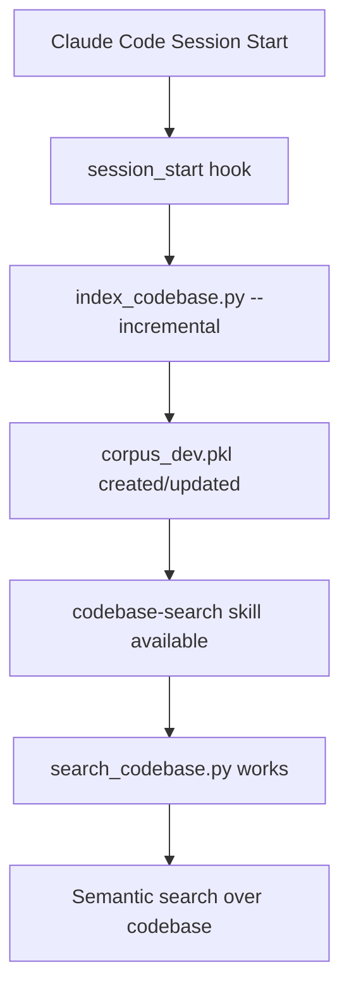

# Claude Code Hooks

Hooks are scripts that run automatically at specific points in the Claude Code lifecycle. They enable automation and ensure your development environment is always ready for coding.

## Overview

**What are hooks?**

Hooks are executable scripts that Claude Code runs at specific lifecycle events. They automate setup tasks, enforce policies, and integrate with your project's workflows.

**Why use hooks?**

- **Zero-friction developer experience**: Auto-index corpus on session start
- **Always-ready tools**: Ensure codebase search works immediately
- **Consistent environment**: Same setup across all developers and branches
- **Integration points**: Connect Claude Code to your project's tooling

**When do hooks run?**

| Hook | Trigger | Use Cases |
|------|---------|-----------|
| `session_start` | When Claude Code starts a new session | Index corpus, check dependencies, display status |
| `pre_commit` (future) | Before creating a git commit | Re-index after code changes, run linters, update docs |
| `post_checkout` (future) | After switching branches | Rebuild index for new branch content |

---

## Available Hook Types

### session_start

**Runs:** When Claude Code initializes a new session (web or CLI)

**Purpose:** Prepare the development environment for immediate productivity

**Common uses:**
- Index codebase for semantic search
- Generate AI metadata
- Validate dependencies
- Display project status

**Exit code behavior:**
- `0` (success): Session starts normally
- Non-zero: Warning displayed, but session continues

**Example use case:**

```bash
# Auto-index corpus so codebase-search skill works immediately
python scripts/index_codebase.py --incremental --quiet
```

### pre_commit (Future)

**Runs:** Before `git commit` is finalized

**Purpose:** Ensure code quality and update generated files

**Common uses:**
- Re-index codebase after changes
- Run linters or formatters
- Update documentation
- Validate tests pass

**Exit code behavior:**
- `0`: Commit proceeds
- Non-zero: Commit is aborted

### post_checkout (Future)

**Runs:** After switching git branches

**Purpose:** Rebuild state for the new branch

**Common uses:**
- Rebuild corpus index for new branch content
- Update generated files
- Clear stale caches

---

## Project-Specific Hooks

### session_start: Auto-Index Corpus

**Location:** `.claude/hooks/session_start`

**Purpose:**

Automatically indexes the Cortical Text Processor codebase when a Claude Code session starts. This ensures the `codebase-search` skill works immediately without manual intervention.

**What it does:**

1. Runs `scripts/index_codebase.py --incremental`
2. Only re-indexes changed files (fast startup)
3. Creates/updates `corpus_dev.pkl` for semantic search
4. Silently succeeds if already up-to-date

**Why it's needed:**

The `codebase-search` skill (`.claude/skills/codebase-search/`) relies on an indexed corpus. Without this hook, developers must manually run:

```bash
python scripts/index_codebase.py
```

...before using semantic search. The hook eliminates this friction.

**Performance:**

- **First run:** ~2-5 seconds (indexes all files)
- **Subsequent runs:** ~0.1-0.5 seconds (only changed files)
- **Up-to-date:** ~0.05 seconds (validates and exits)

**Integration with skills:**

```
.claude/
├── hooks/
│   └── session_start          # Auto-indexes corpus
└── skills/
    ├── codebase-search/       # Uses corpus_dev.pkl
    ├── corpus-indexer/        # Manual re-indexing
    └── ai-metadata/           # Uses generated metadata
```

The `session_start` hook ensures `codebase-search` always has fresh data.

---

## Creating Custom Hooks

### Directory Structure

```
.claude/
└── hooks/
    ├── session_start          # Session initialization
    ├── pre_commit             # Before git commit (future)
    └── post_checkout          # After branch switch (future)
```

### Basic Hook Template

```bash
#!/bin/bash
# .claude/hooks/session_start

set -e  # Exit on error

# Your setup commands here
python scripts/index_codebase.py --incremental --quiet

# Optional: Display status
echo "✓ Codebase indexed and ready for search"

exit 0
```

### Making Hooks Executable

```bash
# Create hook directory
mkdir -p .claude/hooks

# Create hook file
cat > .claude/hooks/session_start << 'EOF'
#!/bin/bash
set -e
python scripts/index_codebase.py --incremental --quiet
exit 0
EOF

# Make executable
chmod +x .claude/hooks/session_start
```

### Naming Conventions

- **Hook names:** Lowercase, underscore-separated (e.g., `session_start`, `pre_commit`)
- **No file extension:** Just `session_start`, not `session_start.sh`
- **Executable bit:** Must be set (`chmod +x`)

### Error Handling Best Practices

**DO:**

```bash
#!/bin/bash
set -e  # Exit on first error

# Try indexing, fallback gracefully
if ! python scripts/index_codebase.py --incremental --quiet 2>/dev/null; then
    echo "Warning: Could not update corpus index" >&2
    # Still exit 0 to allow session to start
    exit 0
fi

exit 0
```

**DON'T:**

```bash
#!/bin/bash
# No error handling - failures are silent
python scripts/index_codebase.py --incremental
# Missing exit code - undefined behavior
```

**Key principles:**

1. **Always set `set -e`** to catch errors early
2. **Always exit explicitly** with `exit 0` or `exit 1`
3. **Graceful degradation** - warn but don't block sessions
4. **Redirect errors** to stderr with `>&2`
5. **Test hooks manually** before committing

### Testing Hooks

```bash
# Test manually
./.claude/hooks/session_start
echo "Exit code: $?"

# Test with timeout
timeout 10s ./.claude/hooks/session_start

# Test error handling
chmod -x ./.claude/hooks/session_start  # Remove execute bit
# (Claude Code should handle gracefully)
chmod +x ./.claude/hooks/session_start  # Restore
```

---

## Examples

### Example 1: Session-Start Hook for Corpus Indexing

**File:** `.claude/hooks/session_start`

```bash
#!/bin/bash
# Auto-index codebase for semantic search

set -e

# Change to project root
cd "$(dirname "$0")/../.."

# Index incrementally (fast)
if python scripts/index_codebase.py --incremental --quiet 2>/dev/null; then
    # Silent success
    exit 0
else
    # Warn but don't block session
    echo "⚠ Warning: Corpus indexing failed" >&2
    echo "  Run manually: python scripts/index_codebase.py" >&2
    exit 0  # Still allow session to start
fi
```

**Key features:**
- Fast incremental indexing
- Silent when successful
- Graceful failure (warns but doesn't block)
- Works from any directory

### Example 2: Pre-Commit Hook for Re-Indexing (Future)

**File:** `.claude/hooks/pre_commit`

```bash
#!/bin/bash
# Re-index codebase before committing code changes

set -e

# Check if any Python or doc files changed
if git diff --cached --name-only | grep -E '\.(py|md)$' > /dev/null; then
    echo "Re-indexing codebase (code files changed)..."

    # Force re-index of changed files
    python scripts/index_codebase.py --incremental

    # Stage updated corpus chunks
    git add corpus_chunks/*.json 2>/dev/null || true

    echo "✓ Corpus updated"
fi

exit 0
```

**Key features:**
- Only runs if Python/docs changed
- Updates corpus chunks for git
- Auto-stages generated files
- Non-blocking (always exits 0)

### Example 3: Comprehensive Session Start with Status

**File:** `.claude/hooks/session_start`

```bash
#!/bin/bash
# Comprehensive session initialization

set -e

PROJECT_ROOT="$(dirname "$0")/../.."
cd "$PROJECT_ROOT"

echo "🚀 Initializing Cortical Text Processor session..."

# 1. Index codebase
echo "  → Indexing codebase..."
if python scripts/index_codebase.py --incremental --quiet; then
    echo "    ✓ Corpus indexed"
else
    echo "    ⚠ Indexing failed (search may be stale)" >&2
fi

# 2. Generate AI metadata
echo "  → Generating AI metadata..."
if python scripts/generate_ai_metadata.py --incremental --quiet 2>/dev/null; then
    echo "    ✓ Metadata generated"
else
    echo "    ⚠ Metadata generation failed" >&2
fi

# 3. Display status
echo ""
echo "📊 Project Status:"
echo "  • Corpus: corpus_dev.pkl"
echo "  • Documents: $(python -c 'from cortical import CorticalTextProcessor; p = CorticalTextProcessor.load("corpus_dev.pkl"); print(len(p.get_all_documents()))' 2>/dev/null || echo 'unknown')"
echo "  • Skills: codebase-search, corpus-indexer, ai-metadata"
echo ""
echo "✨ Ready for development!"

exit 0
```

**Key features:**
- Multiple initialization steps
- Progress feedback
- Status summary
- Never blocks session (errors are warnings)

### Example 4: Minimal Fast Hook

**File:** `.claude/hooks/session_start`

```bash
#!/bin/bash
# Minimal fast session start
set -e
cd "$(dirname "$0")/../.."
python scripts/index_codebase.py --incremental --quiet 2>/dev/null || true
exit 0
```

**Key features:**
- 5 lines total
- ~50ms overhead when up-to-date
- Silent operation
- Never fails

---

## Integration with Codebase Search

### How Hooks Enable Dog-Fooding

The Cortical Text Processor uses itself to search its own codebase. This "dog-fooding" workflow requires:

1. **Indexed corpus** - `corpus_dev.pkl` with all source files
2. **Search script** - `scripts/search_codebase.py`
3. **Claude skill** - `.claude/skills/codebase-search/`

The `session_start` hook ensures step 1 is always current.

### Workflow Without Hooks

```bash
# Manual workflow (error-prone)
git pull origin main
# Forgot to re-index! Search returns stale results.
python scripts/search_codebase.py "PageRank algorithm"
# Results don't include recent changes
```

### Workflow With Hooks

```bash
# Automated workflow
git pull origin main
# session_start hook auto-indexes changed files
python scripts/search_codebase.py "PageRank algorithm"
# Results include all recent changes ✓
```

### Connection to Skills



### Skill Integration Points

| Component | Role | Hook Dependency |
|-----------|------|-----------------|
| `session_start` hook | Auto-indexes corpus | None |
| `corpus_dev.pkl` | Indexed codebase | Created by hook |
| `codebase-search` skill | Provides search capability | Requires `corpus_dev.pkl` |
| `corpus-indexer` skill | Manual re-indexing | Independent (manual trigger) |
| `ai-metadata` skill | View module metadata | Independent (reads `.ai_meta` files) |

### When to Use Each Component

**Use `session_start` hook when:**
- Starting a new Claude Code session (automatic)

**Use `codebase-search` skill when:**
- Finding code implementations
- Understanding architecture
- Exploring related concepts

**Use `corpus-indexer` skill when:**
- Hook failed and corpus is stale
- Force full rebuild needed
- Debugging indexing issues

**Use `ai-metadata` skill when:**
- Quick module overview needed
- Understanding function relationships
- Exploring module structure without reading full source

---

## Troubleshooting

### Hook Not Running

**Symptom:** Session starts but hook doesn't execute

**Solutions:**

1. **Check executable bit:**
   ```bash
   ls -la .claude/hooks/session_start
   # Should show: -rwxr-xr-x (x = executable)
   chmod +x .claude/hooks/session_start
   ```

2. **Check shebang line:**
   ```bash
   head -1 .claude/hooks/session_start
   # Should show: #!/bin/bash
   ```

3. **Test manually:**
   ```bash
   ./.claude/hooks/session_start
   echo "Exit code: $?"
   ```

### Hook Fails Silently

**Symptom:** Hook runs but errors aren't visible

**Solutions:**

1. **Add error output:**
   ```bash
   #!/bin/bash
   set -e
   set -x  # Print commands as they execute

   python scripts/index_codebase.py --incremental --quiet 2>&1 | tee /tmp/hook.log
   ```

2. **Check logs:**
   ```bash
   cat /tmp/hook.log
   ```

3. **Test with verbose mode:**
   ```bash
   bash -x ./.claude/hooks/session_start
   ```

### Hook Times Out

**Symptom:** Session start is slow or hangs

**Solutions:**

1. **Add timeout:**
   ```bash
   #!/bin/bash
   set -e

   # Timeout after 10 seconds
   timeout 10s python scripts/index_codebase.py --incremental --quiet || {
       echo "⚠ Indexing timed out (corpus may be stale)" >&2
       exit 0
   }
   ```

2. **Profile the hook:**
   ```bash
   time ./.claude/hooks/session_start
   ```

3. **Optimize indexing:**
   ```bash
   # Use --fast mode if available
   python scripts/index_codebase.py --incremental --fast
   ```

### Corpus Search Returns No Results

**Symptom:** `codebase-search` skill finds nothing

**Solutions:**

1. **Check corpus exists:**
   ```bash
   ls -lh corpus_dev.pkl
   ```

2. **Verify corpus has content:**
   ```python
   from cortical import CorticalTextProcessor
   p = CorticalTextProcessor.load("corpus_dev.pkl")
   print(f"Documents: {len(p.get_all_documents())}")
   ```

3. **Force full rebuild:**
   ```bash
   rm corpus_dev.pkl
   python scripts/index_codebase.py --force
   ```

4. **Check hook ran successfully:**
   ```bash
   # Add logging to hook
   echo "Hook completed at $(date)" >> /tmp/hook_runs.log
   ```

---

## Best Practices

### Performance

- **Use incremental indexing** - Only re-index changed files
- **Fail fast** - Set timeouts to avoid blocking sessions
- **Background processing** - For long-running tasks (future feature)

### Reliability

- **Always exit explicitly** - `exit 0` or `exit 1`
- **Handle errors gracefully** - Warn but don't block sessions
- **Test hooks manually** - Before committing to repo
- **Use `set -e`** - Exit on first error for predictability

### Maintainability

- **Keep hooks simple** - Delegate complex logic to scripts
- **Document what hooks do** - Add comments explaining purpose
- **Version hooks with code** - Track in git like any other code
- **Test across environments** - Verify on different systems/shells

### Security

- **Validate inputs** - If hooks accept parameters (future)
- **Use absolute paths** - Or `cd` to known location first
- **Avoid secrets in hooks** - Don't hardcode credentials
- **Review before running** - Especially for hooks from external sources

---

## Future Enhancements

### Planned Hook Types

- **pre_commit**: Validate code quality before commits
- **post_checkout**: Rebuild state after branch switches
- **pre_push**: Ensure all tests pass before pushing

### Potential Features

- **Hook configuration**: `.claude/hooks.config.json` for settings
- **Hook chaining**: Run multiple hooks in sequence
- **Async hooks**: Long-running tasks in background
- **Hook templates**: Standard hooks for common use cases

### Integration Ideas

- **CI/CD pipelines**: Trigger builds, run tests
- **Documentation generation**: Auto-update docs
- **Dependency management**: Verify package versions
- **Performance monitoring**: Track indexing speed over time

---

## Related Documentation

- **[codebase-search skill](./.claude/skills/codebase-search/)** - Semantic search over code
- **[corpus-indexer skill](./.claude/skills/corpus-indexer/)** - Manual corpus indexing
- **[Dog-fooding guide](./dogfooding.md)** - Using the system to test itself
- **[CLAUDE.md](../CLAUDE.md)** - Full development guide
- **[index_codebase.py](../scripts/index_codebase.py)** - Indexing implementation

---

*Hooks automate the boring parts of development so you can focus on building great features.*
