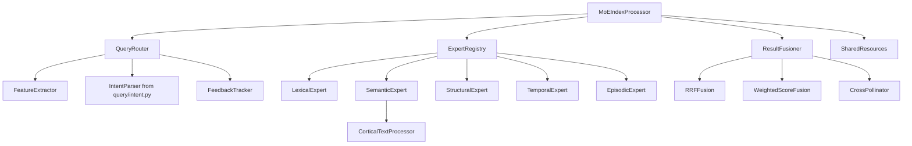

# Mixture of Expert Indexes: Technical Design Document

**Author:** Claude (AI Assistant)
**Date:** 2025-12-15
**Updated:** 2025-12-15 (integrated with BM25/GB-BM25 implementations, processor package refactoring)
**Status:** Design Proposal
**Version:** 1.1
**Prerequisites:** [moe-index-knowledge-transfer.md](moe-index-knowledge-transfer.md), [knowledge-transfer-bm25-optimization.md](knowledge-transfer-bm25-optimization.md)

---

## Table of Contents

1. [Overview](#1-overview)
2. [System Architecture](#2-system-architecture)
3. [Expert Index Specifications](#3-expert-index-specifications)
4. [Gating Network Design](#4-gating-network-design)
5. [Result Fusion](#5-result-fusion)
6. [Cross-Index Communication](#6-cross-index-communication)
7. [Data Structures](#7-data-structures)
8. [API Design](#8-api-design)
9. [Integration with Existing System](#9-integration-with-existing-system)
10. [Persistence and Synchronization](#10-persistence-and-synchronization)
11. [Configuration](#11-configuration)
12. [Testing Strategy](#12-testing-strategy)

---

## 1. Overview

### 1.1 Design Goals

1. **Improved query latency** for simple queries (target: <50ms for exact match)
2. **Better relevance** through specialized handling
3. **Extensibility** to add new expert indexes
4. **Backward compatibility** with existing API
5. **Zero external dependencies** (per project philosophy)

### 1.2 Building on Existing Implementations

> **Important:** This design builds on recent additions to the codebase:
> - **BM25 scoring** (`cortical/analysis.py`) - Already implemented as default
> - **GB-BM25** (`cortical/query/search.py:graph_boosted_search()`) - Proto-MoE combining BM25 + PageRank + Proximity
> - **Document length tracking** (`processor.doc_lengths`, `processor.avg_doc_length`)
> - **Performance optimizations** - 34.5% faster `compute_all()`
> - **Processor package refactoring** - Mixin-based composition provides architectural template
>
> The MoE architecture generalizes GB-BM25's signal fusion into separate experts with intelligent routing.

### 1.3 Non-Goals

1. ~~ML-based routing~~ (use rule-based/statistical instead)
2. ~~Real-time expert retraining~~ (static specialization)
3. ~~Distributed indexes~~ (single-machine focus for now)

### 1.4 Key Design Decisions

| Decision | Choice | Rationale |
|----------|--------|-----------|
| Routing approach | Feature + intent based | No ML dependencies |
| Expert count | 5 initial | Cover primary use cases |
| Default activation | Top-2 | Balance speed vs coverage |
| Fusion strategy | Weighted RRF | Robust to score differences |
| Storage | Shared + expert-specific | Minimize redundancy |

---

## 2. System Architecture

### 2.1 High-Level Architecture

```
┌──────────────────────────────────────────────────────────────────────────┐
│                           MoEIndexProcessor                               │
│  (Extends/wraps CorticalTextProcessor)                                   │
├──────────────────────────────────────────────────────────────────────────┤
│                                                                          │
│  ┌────────────────────────────────────────────────────────────────────┐ │
│  │                         Query Router                                │ │
│  │  ┌─────────────┐  ┌─────────────┐  ┌─────────────────────────────┐│ │
│  │  │   Feature   │  │   Intent    │  │     Feedback Tracker        ││ │
│  │  │  Extractor  │  │   Parser    │  │  (query patterns → weights) ││ │
│  │  └──────┬──────┘  └──────┬──────┘  └─────────────┬───────────────┘│ │
│  │         └────────────────┼───────────────────────┘                 │ │
│  │                          ▼                                          │ │
│  │                  ┌───────────────┐                                  │ │
│  │                  │ Weight Combiner│                                 │ │
│  │                  └───────┬───────┘                                  │ │
│  └──────────────────────────┼──────────────────────────────────────────┘ │
│                             │                                            │
│                   expert_weights: Dict[str, float]                       │
│                             │                                            │
│  ┌──────────────────────────┼──────────────────────────────────────────┐ │
│  │                    Expert Registry                                   │ │
│  │                          │                                           │ │
│  │    ┌─────────────────────┼─────────────────────────────────┐        │ │
│  │    │           │         │         │           │           │        │ │
│  │    ▼           ▼         ▼         ▼           ▼           │        │ │
│  │ ┌──────┐  ┌──────┐  ┌──────┐  ┌──────┐  ┌──────────┐       │        │ │
│  │ │Lexical│  │Semantic│ │Struct│  │Temporal│ │Episodic │      │        │ │
│  │ │Expert │  │Expert │  │Expert│  │Expert │  │Expert   │      │        │ │
│  │ └───┬──┘  └───┬───┘  └───┬──┘  └───┬───┘  └────┬────┘      │        │ │
│  │     │         │          │         │           │            │        │ │
│  └─────┼─────────┼──────────┼─────────┼───────────┼────────────┘        │ │
│        │         │          │         │           │                      │
│        └─────────┴──────────┴─────────┴───────────┘                      │
│                             │                                            │
│                    expert_results: Dict[str, ExpertResult]               │
│                             │                                            │
│  ┌──────────────────────────┼──────────────────────────────────────────┐ │
│  │                    Result Fusioner                                   │ │
│  │  ┌─────────────────────────────────────────────────────────────────┐│ │
│  │  │  Cross-Pollination  →  Score Normalization  →  Rank Fusion      ││ │
│  │  └─────────────────────────────────────────────────────────────────┘│ │
│  └──────────────────────────┬──────────────────────────────────────────┘ │
│                             │                                            │
│                      MoEResult                                           │
│                             │                                            │
└─────────────────────────────┼────────────────────────────────────────────┘
                              ▼
                         User Response
```

### 2.2 Module Organization

```
cortical/
├── moe/                           # NEW: MoE index package
│   ├── __init__.py               # Public exports
│   ├── router.py                 # Query routing logic (~300 lines)
│   ├── experts/                  # Expert index implementations
│   │   ├── __init__.py
│   │   ├── base.py              # Abstract ExpertIndex base (~150 lines)
│   │   ├── lexical.py           # Lexical expert (~400 lines)
│   │   ├── semantic.py          # Semantic expert (wraps current) (~200 lines)
│   │   ├── structural.py        # Structural expert (~500 lines)
│   │   ├── temporal.py          # Temporal expert (~350 lines)
│   │   └── episodic.py          # Episodic expert (~250 lines)
│   ├── fusion.py                 # Result combination (~200 lines)
│   ├── feedback.py               # Feedback tracking (~150 lines)
│   └── types.py                  # Shared types (~100 lines)
├── processor/                     # Existing (minimal changes)
│   └── ...
└── ...
```

**Estimated new code:** ~2,100 lines

### 2.3 Component Responsibilities

| Component | Responsibility | Dependencies |
|-----------|----------------|--------------|
| `MoEIndexProcessor` | Top-level orchestrator | All components |
| `QueryRouter` | Compute expert weights | Feature extractor, intent parser |
| `ExpertRegistry` | Manage expert lifecycle | Expert implementations |
| `ResultFusioner` | Combine expert results | Fusion strategies |
| `FeedbackTracker` | Learn from interactions | Persistence layer |
| `ExpertIndex` (base) | Interface for experts | None |

---

## 3. Expert Index Specifications

### 3.1 Abstract Base Class

```python
# cortical/moe/experts/base.py

from abc import ABC, abstractmethod
from typing import List, Dict, Optional, Set
from dataclasses import dataclass

@dataclass
class ExpertResult:
    """Result from a single expert."""
    documents: List[str]           # Ranked doc_ids
    scores: Dict[str, float]       # doc_id → relevance score
    metadata: Dict[str, any]       # Expert-specific metadata
    latency_ms: float              # Query latency
    confidence: float              # Self-reported confidence [0, 1]

class ExpertIndex(ABC):
    """Abstract base class for expert indexes."""

    @property
    @abstractmethod
    def name(self) -> str:
        """Unique expert identifier."""
        pass

    @property
    @abstractmethod
    def description(self) -> str:
        """Human-readable description."""
        pass

    @property
    @abstractmethod
    def capabilities(self) -> Set[str]:
        """Set of capability tags: {'exact_match', 'semantic', 'structural', ...}"""
        pass

    @abstractmethod
    def query(
        self,
        query_text: str,
        top_n: int = 10,
        context: Optional[Dict] = None
    ) -> ExpertResult:
        """Execute query and return results."""
        pass

    @abstractmethod
    def add_document(self, doc_id: str, content: str, metadata: Dict) -> None:
        """Index a document."""
        pass

    @abstractmethod
    def remove_document(self, doc_id: str) -> None:
        """Remove a document from index."""
        pass

    @abstractmethod
    def is_stale(self) -> bool:
        """Check if index needs recomputation."""
        pass

    @abstractmethod
    def recompute(self) -> None:
        """Recompute derived structures."""
        pass

    @abstractmethod
    def save(self, path: str) -> None:
        """Persist index to disk."""
        pass

    @classmethod
    @abstractmethod
    def load(cls, path: str) -> 'ExpertIndex':
        """Load index from disk."""
        pass

    def get_stats(self) -> Dict[str, any]:
        """Return index statistics."""
        return {
            'name': self.name,
            'capabilities': list(self.capabilities),
        }
```

### 3.2 Lexical Expert

**Purpose:** Fast exact and near-exact matching.

> **Builds on existing:** The codebase already has BM25 implemented in `cortical/analysis.py:_bm25_core()` and document length tracking in `processor.doc_lengths`. The Lexical Expert wraps this with a fast inverted index for O(1) term lookups.

**Data Structures:**

```python
# cortical/moe/experts/lexical.py

class LexicalExpert(ExpertIndex):
    """Fast lexical search using existing BM25 + inverted index."""

    def __init__(self, config: LexicalConfig, processor: CorticalTextProcessor):
        # Reuse processor's BM25 scores (already computed)
        self._processor = processor

        # Additional inverted index for fast lookups
        # term → [(doc_id, positions)] - positions enable phrase queries
        self._term_positions: Dict[str, Dict[str, List[int]]] = {}

        # Optional: prefix trie for autocomplete
        self._prefix_trie: Optional[PrefixTrie] = None

        # Reuse processor's document length stats
        # self._processor.doc_lengths (already tracked)
        # self._processor.avg_doc_length (already tracked)

        # BM25 parameters from processor config
        # self._processor.config.bm25_k1 (default 1.2)
        # self._processor.config.bm25_b (default 0.75)

@dataclass
class TermPositions:
    """Term positions within a document (for phrase queries)."""
    doc_id: str
    positions: List[int]  # Word positions
```

**Scoring Algorithm:** Delegates to existing BM25

```python
def query(self, query_text: str, top_n: int = 10, **kwargs) -> ExpertResult:
    """Fast search using existing BM25 scores."""
    # Use fast_find_documents which already uses BM25/TF-IDF
    results = fast_find_documents(
        query_text,
        self._processor.layers,
        self._processor.tokenizer,
        top_n=top_n,
        use_code_concepts=False  # Pure lexical, no expansion
    )
    return ExpertResult(
        documents=[doc for doc, _ in results],
        scores={doc: score for doc, score in results},
        confidence=0.9  # High confidence for exact matches
    )
```

**Key insight:** We don't need to reimplement BM25—it's already in `analysis.py:_bm25_core()`. The Lexical Expert adds:
1. Positional index for phrase queries
2. Prefix trie for autocomplete
3. No query expansion (pure lexical matching)

**Capabilities:** `{'exact_match', 'phrase_match', 'autocomplete', 'fast'}`

### 3.3 Semantic Expert

**Purpose:** Meaning-based retrieval using existing system.

> **Builds on existing:** The codebase has `graph_boosted_search()` which combines BM25 + PageRank + Proximity. The Semantic Expert uses this or similar logic, focusing on the PageRank and query expansion signals.

**Implementation:** Wraps `CorticalTextProcessor` with minimal changes.

```python
# cortical/moe/experts/semantic.py

class SemanticExpert(ExpertIndex):
    """Semantic search using existing Cortical Text Processor."""

    def __init__(self, processor: CorticalTextProcessor):
        self._processor = processor

    def query(
        self,
        query_text: str,
        top_n: int = 10,
        context: Optional[Dict] = None
    ) -> ExpertResult:
        """Delegate to processor with expansion."""
        start = time.perf_counter()

        # Use existing query expansion
        results = self._processor.find_documents_for_query(
            query_text,
            top_n=top_n,
            use_expansion=True
        )

        latency = (time.perf_counter() - start) * 1000

        return ExpertResult(
            documents=[doc_id for doc_id, _ in results],
            scores={doc_id: score for doc_id, score in results},
            metadata={'expansion_used': True},
            latency_ms=latency,
            confidence=0.8  # Base confidence
        )
```

**Capabilities:** `{'semantic', 'query_expansion', 'concept_clusters'}`

### 3.4 Structural Expert

**Purpose:** Code-aware structural search.

**Data Structures:**

```python
# cortical/moe/experts/structural.py

class StructuralExpert(ExpertIndex):
    """Code structure-aware search."""

    def __init__(self, config: StructuralConfig):
        # Symbol table: symbol_name → [(doc_id, line, kind)]
        self._symbols: Dict[str, List[SymbolDef]] = {}

        # Call graph: caller → [callees]
        self._calls: Dict[str, Set[str]] = defaultdict(set)

        # Reverse call graph: callee → [callers]
        self._called_by: Dict[str, Set[str]] = defaultdict(set)

        # Import graph: importer → [imported]
        self._imports: Dict[str, Set[str]] = defaultdict(set)

        # Document → symbols mapping
        self._doc_symbols: Dict[str, Set[str]] = defaultdict(set)

@dataclass
class SymbolDef:
    """Symbol definition."""
    doc_id: str
    line: int
    kind: str  # 'function', 'class', 'method', 'variable'
    scope: str  # Fully qualified scope
```

**Query Types:**

```python
def query(self, query_text: str, top_n: int = 10, context: Optional[Dict] = None) -> ExpertResult:
    """Handle structural queries."""
    # Parse query intent
    if 'calls' in query_text.lower():
        return self._find_callees(query_text, top_n)
    elif 'called by' in query_text.lower() or 'callers' in query_text.lower():
        return self._find_callers(query_text, top_n)
    elif 'imports' in query_text.lower():
        return self._find_imports(query_text, top_n)
    else:
        return self._symbol_search(query_text, top_n)
```

**Capabilities:** `{'structural', 'call_graph', 'symbol_search', 'imports'}`

### 3.5 Temporal Expert

**Purpose:** Change-aware retrieval.

**Data Structures:**

```python
# cortical/moe/experts/temporal.py

class TemporalExpert(ExpertIndex):
    """Time-aware search over document history."""

    def __init__(self, config: TemporalConfig):
        # Document timeline: doc_id → [ChangeEvent]
        self._history: Dict[str, List[ChangeEvent]] = defaultdict(list)

        # Time index: timestamp → [doc_ids changed]
        self._time_index: SortedDict[datetime, Set[str]] = SortedDict()

        # Co-change matrix: doc_id → {doc_id: count}
        self._cochange: Dict[str, Counter] = defaultdict(Counter)

        # Change frequency: doc_id → changes per period
        self._frequency: Dict[str, float] = {}

@dataclass
class ChangeEvent:
    """Document change event."""
    timestamp: datetime
    change_type: str  # 'create', 'modify', 'delete'
    change_size: int  # Lines changed
    commit_id: Optional[str]
```

**Query Types:**

```python
def query(self, query_text: str, top_n: int = 10, context: Optional[Dict] = None) -> ExpertResult:
    """Handle temporal queries."""
    # Parse time expressions
    time_range = self._parse_time_range(query_text)

    if time_range:
        return self._find_in_range(time_range, top_n)
    elif 'frequently' in query_text.lower():
        return self._find_frequently_changed(top_n)
    elif 'together' in query_text.lower() or 'related' in query_text.lower():
        return self._find_cochanged(query_text, top_n)
    else:
        # Default: recency-weighted search
        return self._recency_search(query_text, top_n)
```

**Capabilities:** `{'temporal', 'recency', 'cochange', 'history'}`

### 3.6 Episodic Expert

**Purpose:** Session-aware personalization.

**Data Structures:**

```python
# cortical/moe/experts/episodic.py

class EpisodicExpert(ExpertIndex):
    """Session-aware contextual search."""

    def __init__(self, config: EpisodicConfig):
        # Query history (ring buffer)
        self._query_history: Deque[QueryEvent] = deque(maxlen=config.history_size)

        # Document interactions
        self._clicks: Dict[str, int] = Counter()  # doc_id → click count
        self._views: Dict[str, float] = {}        # doc_id → view duration

        # Session context vector
        self._context_terms: Counter = Counter()  # Accumulated query terms

        # Continuation patterns: query → [follow-up queries]
        self._continuations: Dict[str, List[str]] = defaultdict(list)

@dataclass
class QueryEvent:
    """Query event in session history."""
    query: str
    timestamp: datetime
    results_clicked: List[str]
    dwell_time_ms: int
```

**Capabilities:** `{'episodic', 'session', 'personalization', 'continuation'}`

---

## 4. Gating Network Design

### 4.1 Overview

The gating network computes expert weights without ML dependencies.

```
Query → Feature Extraction → Intent Parsing → Weight Combination → Expert Weights
```

### 4.2 Feature Extraction

```python
# cortical/moe/router.py

@dataclass
class QueryFeatures:
    """Extracted query features."""
    length: int                    # Word count
    has_quotes: bool              # Contains quoted phrase
    has_identifiers: bool         # Contains code identifiers
    has_question_word: bool       # Starts with who/what/where/etc
    has_time_expression: bool     # Contains time references
    code_pattern_score: float     # 0-1 code likelihood
    semantic_density: float       # 0-1 conceptual complexity
    specificity: float           # 0-1 how specific/narrow

class FeatureExtractor:
    """Extract query features for routing."""

    # Patterns
    IDENTIFIER_PATTERN = re.compile(r'[a-z]+[A-Z][a-zA-Z]*|[a-z]+_[a-z]+')
    TIME_PATTERNS = [
        r'\b(today|yesterday|last\s+week|recently|latest)\b',
        r'\b\d{4}-\d{2}-\d{2}\b',
        r'\b(before|after|since)\s+\w+\b',
    ]
    QUESTION_WORDS = {'what', 'where', 'how', 'why', 'when', 'who', 'which'}

    def extract(self, query: str) -> QueryFeatures:
        """Extract features from query."""
        tokens = query.lower().split()

        return QueryFeatures(
            length=len(tokens),
            has_quotes='"' in query or "'" in query,
            has_identifiers=bool(self.IDENTIFIER_PATTERN.search(query)),
            has_question_word=tokens[0] in self.QUESTION_WORDS if tokens else False,
            has_time_expression=any(
                re.search(p, query, re.I) for p in self.TIME_PATTERNS
            ),
            code_pattern_score=self._compute_code_score(query),
            semantic_density=self._compute_semantic_density(tokens),
            specificity=self._compute_specificity(tokens),
        )
```

### 4.3 Feature-Based Weight Computation

```python
class FeatureBasedGate:
    """Compute expert weights from features."""

    # Feature → Expert weight contributions
    FEATURE_WEIGHTS = {
        'lexical': {
            'short_query': 0.3,      # length < 4
            'has_quotes': 0.4,
            'has_identifiers': 0.2,
            'high_specificity': 0.3,
        },
        'semantic': {
            'has_question_word': 0.4,
            'long_query': 0.2,       # length >= 4
            'high_semantic_density': 0.3,
            'low_specificity': 0.2,
        },
        'structural': {
            'has_identifiers': 0.4,
            'code_pattern': 0.4,
            'structural_keywords': 0.3,  # calls, imports, etc
        },
        'temporal': {
            'has_time_expression': 0.6,
            'temporal_keywords': 0.3,    # changed, modified, etc
        },
        'episodic': {
            'continuation_pattern': 0.4,
            'session_context_match': 0.3,
        },
    }

    def compute_weights(self, features: QueryFeatures) -> Dict[str, float]:
        """Compute expert weights from features."""
        weights = {}

        for expert, feature_weights in self.FEATURE_WEIGHTS.items():
            weight = 0.0

            # Short vs long query
            if expert == 'lexical' and features.length < 4:
                weight += feature_weights.get('short_query', 0)
            if expert == 'semantic' and features.length >= 4:
                weight += feature_weights.get('long_query', 0)

            # Boolean features
            if features.has_quotes:
                weight += feature_weights.get('has_quotes', 0)
            if features.has_identifiers:
                weight += feature_weights.get('has_identifiers', 0)
            if features.has_question_word:
                weight += feature_weights.get('has_question_word', 0)
            if features.has_time_expression:
                weight += feature_weights.get('has_time_expression', 0)

            # Continuous features
            weight += features.code_pattern_score * feature_weights.get('code_pattern', 0)
            weight += features.semantic_density * feature_weights.get('high_semantic_density', 0)
            weight += features.specificity * feature_weights.get('high_specificity', 0)
            weight += (1 - features.specificity) * feature_weights.get('low_specificity', 0)

            weights[expert] = weight

        return self._normalize(weights)
```

### 4.4 Intent-Based Routing

```python
class IntentBasedGate:
    """Route based on parsed query intent."""

    INTENT_ROUTING = {
        'definition': {
            'lexical': 0.4,
            'semantic': 0.5,
            'structural': 0.1,
        },
        'location': {
            'lexical': 0.3,
            'structural': 0.5,
            'semantic': 0.2,
        },
        'implementation': {
            'semantic': 0.4,
            'structural': 0.4,
            'lexical': 0.2,
        },
        'explanation': {
            'semantic': 0.7,
            'lexical': 0.2,
            'episodic': 0.1,
        },
        'history': {
            'temporal': 0.6,
            'lexical': 0.2,
            'structural': 0.2,
        },
        'continuation': {
            'episodic': 0.5,
            'semantic': 0.3,
            'lexical': 0.2,
        },
    }

    def compute_weights(self, query: str, intent_parser) -> Dict[str, float]:
        """Compute weights based on parsed intent."""
        parsed = intent_parser.parse_intent_query(query)
        intent_type = parsed.get('intent', 'definition')

        return self.INTENT_ROUTING.get(
            intent_type,
            {'semantic': 0.5, 'lexical': 0.5}  # Default
        )
```

### 4.5 Feedback-Adaptive Routing

```python
class FeedbackAdaptiveGate:
    """Adapt routing based on historical success."""

    def __init__(self, decay_rate: float = 0.95):
        # Pattern → Expert → (successes, total)
        self._success_counts: Dict[str, Dict[str, Tuple[float, float]]] = defaultdict(
            lambda: defaultdict(lambda: (1.0, 2.0))  # Laplace smoothing
        )
        self._decay_rate = decay_rate

    def compute_weights(self, query: str) -> Dict[str, float]:
        """Compute weights from historical success rates."""
        pattern = self._query_to_pattern(query)

        weights = {}
        for expert in EXPERT_NAMES:
            successes, total = self._success_counts[pattern][expert]
            weights[expert] = successes / total

        return self._normalize(weights)

    def record_feedback(
        self,
        query: str,
        expert: str,
        was_helpful: bool
    ) -> None:
        """Record interaction feedback."""
        pattern = self._query_to_pattern(query)

        # Decay old counts
        for exp in EXPERT_NAMES:
            s, t = self._success_counts[pattern][exp]
            self._success_counts[pattern][exp] = (
                s * self._decay_rate,
                t * self._decay_rate
            )

        # Update current
        s, t = self._success_counts[pattern][expert]
        self._success_counts[pattern][expert] = (
            s + (1.0 if was_helpful else 0.0),
            t + 1.0
        )

    def _query_to_pattern(self, query: str) -> str:
        """Convert query to pattern for grouping."""
        # Normalize: "where is X" → "where_is_NOUN"
        tokens = query.lower().split()[:3]
        pattern_tokens = []
        for token in tokens:
            if token in QUESTION_WORDS:
                pattern_tokens.append(token)
            elif self._is_identifier(token):
                pattern_tokens.append('IDENT')
            elif token.isdigit():
                pattern_tokens.append('NUM')
            else:
                pattern_tokens.append('WORD')
        return '_'.join(pattern_tokens)
```

### 4.6 Combined Gating

```python
class QueryRouter:
    """Combined routing using all gating strategies."""

    def __init__(self, config: RouterConfig):
        self._feature_gate = FeatureBasedGate()
        self._intent_gate = IntentBasedGate()
        self._feedback_gate = FeedbackAdaptiveGate()

        # Combination weights
        self._feature_weight = config.feature_weight  # 0.4
        self._intent_weight = config.intent_weight    # 0.4
        self._feedback_weight = config.feedback_weight  # 0.2

    def route(
        self,
        query: str,
        top_k: int = 2,
        intent_parser = None
    ) -> List[Tuple[str, float]]:
        """Compute final routing weights."""
        features = self._feature_extractor.extract(query)

        # Get weights from each strategy
        feature_weights = self._feature_gate.compute_weights(features)
        intent_weights = (
            self._intent_gate.compute_weights(query, intent_parser)
            if intent_parser else {}
        )
        feedback_weights = self._feedback_gate.compute_weights(query)

        # Combine
        combined = {}
        for expert in EXPERT_NAMES:
            combined[expert] = (
                self._feature_weight * feature_weights.get(expert, 0) +
                self._intent_weight * intent_weights.get(expert, 0) +
                self._feedback_weight * feedback_weights.get(expert, 0)
            )

        # Normalize and select top-K
        normalized = self._normalize(combined)
        sorted_experts = sorted(normalized.items(), key=lambda x: -x[1])

        return sorted_experts[:top_k]
```

---

## 5. Result Fusion

### 5.1 Score Normalization

Different experts return scores on different scales. Normalize before fusion.

```python
# cortical/moe/fusion.py

class ScoreNormalizer:
    """Normalize scores across experts."""

    @staticmethod
    def min_max_normalize(scores: Dict[str, float]) -> Dict[str, float]:
        """Scale to [0, 1] range."""
        if not scores:
            return {}

        min_score = min(scores.values())
        max_score = max(scores.values())
        range_score = max_score - min_score

        if range_score == 0:
            return {k: 1.0 for k in scores}

        return {
            k: (v - min_score) / range_score
            for k, v in scores.items()
        }

    @staticmethod
    def z_score_normalize(scores: Dict[str, float]) -> Dict[str, float]:
        """Standardize to mean=0, std=1."""
        if not scores:
            return {}

        values = list(scores.values())
        mean = sum(values) / len(values)
        std = (sum((v - mean) ** 2 for v in values) / len(values)) ** 0.5

        if std == 0:
            return {k: 0.0 for k in scores}

        return {k: (v - mean) / std for k, v in scores.items()}
```

### 5.2 Reciprocal Rank Fusion

```python
class RRFFusion:
    """Reciprocal Rank Fusion for combining ranked lists."""

    def __init__(self, k: int = 60):
        self._k = k  # Smoothing constant

    def fuse(
        self,
        expert_results: Dict[str, ExpertResult],
        expert_weights: Dict[str, float]
    ) -> List[Tuple[str, float]]:
        """Fuse ranked lists using weighted RRF."""
        doc_scores: Dict[str, float] = defaultdict(float)

        for expert, result in expert_results.items():
            weight = expert_weights.get(expert, 1.0)

            for rank, doc_id in enumerate(result.documents):
                # RRF score: 1 / (k + rank)
                rrf_score = 1.0 / (self._k + rank + 1)
                doc_scores[doc_id] += weight * rrf_score

        # Sort by fused score
        return sorted(doc_scores.items(), key=lambda x: -x[1])
```

### 5.3 Weighted Score Fusion

```python
class WeightedScoreFusion:
    """Combine normalized scores with weights."""

    def __init__(self, normalizer: ScoreNormalizer):
        self._normalizer = normalizer

    def fuse(
        self,
        expert_results: Dict[str, ExpertResult],
        expert_weights: Dict[str, float]
    ) -> List[Tuple[str, float]]:
        """Fuse using weighted score combination."""
        doc_scores: Dict[str, float] = defaultdict(float)

        for expert, result in expert_results.items():
            weight = expert_weights.get(expert, 1.0)
            normalized = self._normalizer.min_max_normalize(result.scores)

            for doc_id, score in normalized.items():
                doc_scores[doc_id] += weight * score

        return sorted(doc_scores.items(), key=lambda x: -x[1])
```

### 5.4 Result Fusioner

```python
class ResultFusioner:
    """Main fusion orchestrator."""

    def __init__(self, config: FusionConfig):
        self._strategy = config.strategy  # 'rrf', 'weighted', 'hybrid'
        self._rrf = RRFFusion(k=config.rrf_k)
        self._weighted = WeightedScoreFusion(ScoreNormalizer())

    def fuse(
        self,
        expert_results: Dict[str, ExpertResult],
        expert_weights: Dict[str, float],
        top_n: int = 10
    ) -> MoEResult:
        """Fuse expert results into final ranking."""

        if self._strategy == 'rrf':
            fused = self._rrf.fuse(expert_results, expert_weights)
        elif self._strategy == 'weighted':
            fused = self._weighted.fuse(expert_results, expert_weights)
        else:  # hybrid
            rrf_results = self._rrf.fuse(expert_results, expert_weights)
            weighted_results = self._weighted.fuse(expert_results, expert_weights)
            fused = self._combine_rankings(rrf_results, weighted_results)

        return MoEResult(
            documents=[doc for doc, _ in fused[:top_n]],
            scores={doc: score for doc, score in fused[:top_n]},
            expert_weights=expert_weights,
            expert_contributions=self._compute_contributions(expert_results, fused[:top_n]),
        )
```

---

## 6. Cross-Index Communication

### 6.1 Cross-Pollination Interface

```python
# cortical/moe/cross_pollination.py

class CrossPollinator:
    """Enable experts to inform each other."""

    def pollinate(
        self,
        query: str,
        partial_results: Dict[str, ExpertResult],
        experts: Dict[str, ExpertIndex]
    ) -> Dict[str, ExpertResult]:
        """Let experts refine each other's results."""
        refined = dict(partial_results)

        # Semantic expansion can help lexical
        if 'semantic' in partial_results and 'lexical' in experts:
            semantic_terms = self._extract_expansion_terms(
                partial_results['semantic']
            )
            refined['lexical'] = experts['lexical'].query(
                query,
                expansion_terms=semantic_terms
            )

        # Structural relations can boost semantic
        if 'structural' in partial_results and 'semantic' in refined:
            structural_docs = set(partial_results['structural'].documents[:5])
            refined['semantic'] = self._boost_documents(
                refined['semantic'],
                structural_docs,
                boost_factor=1.2
            )

        # Temporal recency can re-rank all
        if 'temporal' in partial_results:
            recency_scores = {
                doc: score
                for doc, score in partial_results['temporal'].scores.items()
            }
            for expert, result in refined.items():
                if expert != 'temporal':
                    refined[expert] = self._apply_recency(
                        result, recency_scores, weight=0.1
                    )

        return refined
```

### 6.2 Expert Coordination Protocol

```python
class ExpertCoordinator:
    """Coordinate expert interactions."""

    async def query_with_coordination(
        self,
        query: str,
        active_experts: List[Tuple[str, float]],
        experts: Dict[str, ExpertIndex]
    ) -> Dict[str, ExpertResult]:
        """Query experts with cross-pollination."""

        # Phase 1: Initial parallel queries
        initial_results = await self._parallel_query(
            query, active_experts, experts
        )

        # Phase 2: Cross-pollination (if enabled)
        if self._config.enable_cross_pollination:
            refined_results = self._cross_pollinator.pollinate(
                query, initial_results, experts
            )
        else:
            refined_results = initial_results

        return refined_results
```

---

## 7. Data Structures

### 7.1 Core Types

```python
# cortical/moe/types.py

from dataclasses import dataclass, field
from typing import Dict, List, Optional, Set
from enum import Enum

class ExpertType(Enum):
    """Expert index types."""
    LEXICAL = 'lexical'
    SEMANTIC = 'semantic'
    STRUCTURAL = 'structural'
    TEMPORAL = 'temporal'
    EPISODIC = 'episodic'

@dataclass
class ExpertResult:
    """Result from a single expert query."""
    documents: List[str]
    scores: Dict[str, float]
    metadata: Dict[str, any] = field(default_factory=dict)
    latency_ms: float = 0.0
    confidence: float = 1.0

@dataclass
class MoEResult:
    """Combined result from MoE query."""
    documents: List[str]
    scores: Dict[str, float]
    expert_weights: Dict[str, float]
    expert_contributions: Dict[str, Set[str]]  # expert → docs it contributed
    routing_latency_ms: float = 0.0
    total_latency_ms: float = 0.0

    def get_explanation(self) -> str:
        """Human-readable explanation of routing."""
        lines = ["Query routing:"]
        for expert, weight in sorted(self.expert_weights.items(), key=lambda x: -x[1]):
            contributed = len(self.expert_contributions.get(expert, set()))
            lines.append(f"  {expert}: {weight:.2f} weight, {contributed} docs")
        return '\n'.join(lines)

@dataclass
class QueryContext:
    """Context passed to experts."""
    session_id: Optional[str] = None
    previous_queries: List[str] = field(default_factory=list)
    clicked_docs: Set[str] = field(default_factory=set)
    user_preferences: Dict[str, any] = field(default_factory=dict)
```

### 7.2 Configuration Types

```python
@dataclass
class RouterConfig:
    """Query router configuration."""
    feature_weight: float = 0.4
    intent_weight: float = 0.4
    feedback_weight: float = 0.2
    default_top_k: int = 2
    min_expert_weight: float = 0.05  # Skip experts below this

@dataclass
class FusionConfig:
    """Result fusion configuration."""
    strategy: str = 'rrf'  # 'rrf', 'weighted', 'hybrid'
    rrf_k: int = 60
    score_normalization: str = 'min_max'  # 'min_max', 'z_score'

@dataclass
class MoEConfig:
    """Top-level MoE configuration."""
    router: RouterConfig = field(default_factory=RouterConfig)
    fusion: FusionConfig = field(default_factory=FusionConfig)
    enable_cross_pollination: bool = True
    enable_feedback_learning: bool = True
    expert_configs: Dict[str, Dict] = field(default_factory=dict)
```

---

## 8. API Design

### 8.1 Public API

```python
# cortical/moe/__init__.py

class MoEIndexProcessor:
    """Mixture of Expert Index processor."""

    def __init__(
        self,
        config: Optional[MoEConfig] = None,
        base_processor: Optional[CorticalTextProcessor] = None
    ):
        """
        Initialize MoE processor.

        Args:
            config: MoE configuration. Uses defaults if None.
            base_processor: Existing processor to wrap. Creates new if None.
        """
        pass

    # Document Management
    def add_document(self, doc_id: str, content: str, metadata: Optional[Dict] = None) -> None:
        """Add document to all expert indexes."""
        pass

    def remove_document(self, doc_id: str) -> None:
        """Remove document from all expert indexes."""
        pass

    def add_documents_batch(self, documents: List[Tuple[str, str, Dict]]) -> None:
        """Batch add documents."""
        pass

    # Querying
    def query(
        self,
        query_text: str,
        top_n: int = 10,
        context: Optional[QueryContext] = None,
        force_experts: Optional[List[str]] = None,  # Override routing
        explain: bool = False
    ) -> MoEResult:
        """
        Query with automatic expert routing.

        Args:
            query_text: The search query
            top_n: Number of results to return
            context: Optional session context
            force_experts: Force specific experts (bypass routing)
            explain: Include routing explanation

        Returns:
            MoEResult with documents, scores, and expert contributions
        """
        pass

    def query_expert(
        self,
        expert_name: str,
        query_text: str,
        top_n: int = 10
    ) -> ExpertResult:
        """Query a specific expert directly."""
        pass

    # Feedback
    def record_click(self, query: str, doc_id: str, session_id: Optional[str] = None) -> None:
        """Record user click for feedback learning."""
        pass

    def record_relevance(self, query: str, doc_id: str, is_relevant: bool) -> None:
        """Record explicit relevance feedback."""
        pass

    # Expert Management
    def get_expert(self, name: str) -> ExpertIndex:
        """Get expert by name."""
        pass

    def list_experts(self) -> List[str]:
        """List available experts."""
        pass

    def get_expert_stats(self, name: str) -> Dict:
        """Get expert statistics."""
        pass

    # Computation
    def compute_all(self) -> None:
        """Recompute all stale indexes."""
        pass

    def is_stale(self) -> bool:
        """Check if any expert is stale."""
        pass

    # Persistence
    def save(self, path: str) -> None:
        """Save all expert indexes."""
        pass

    @classmethod
    def load(cls, path: str) -> 'MoEIndexProcessor':
        """Load processor from disk."""
        pass

    # Metrics
    def get_routing_stats(self) -> Dict:
        """Get routing statistics."""
        pass

    def get_expert_utilization(self) -> Dict[str, float]:
        """Get expert utilization percentages."""
        pass
```

### 8.2 Backward Compatibility

The `MoEIndexProcessor` maintains compatibility with `CorticalTextProcessor`:

```python
class MoEIndexProcessor:
    """Maintains backward compatibility."""

    def find_documents_for_query(self, query: str, top_n: int = 5) -> List[Tuple[str, float]]:
        """Backward-compatible query method."""
        result = self.query(query, top_n=top_n)
        return [(doc, result.scores[doc]) for doc in result.documents]

    def find_passages_for_query(self, query: str, top_n: int = 5, **kwargs) -> List[Tuple[str, str, float]]:
        """Backward-compatible passage retrieval."""
        # Delegate to semantic expert's processor
        return self._semantic_expert._processor.find_passages_for_query(
            query, top_n=top_n, **kwargs
        )

    def process_document(self, doc_id: str, content: str) -> None:
        """Backward-compatible document addition."""
        self.add_document(doc_id, content)
```

---

## 9. Integration with Existing System

### 9.1 Semantic Expert Integration

The semantic expert wraps the existing `CorticalTextProcessor`:

```python
class SemanticExpert(ExpertIndex):
    """Wraps existing processor as an expert."""

    def __init__(self, processor: Optional[CorticalTextProcessor] = None):
        if processor is None:
            processor = CorticalTextProcessor()
        self._processor = processor

    def add_document(self, doc_id: str, content: str, metadata: Dict) -> None:
        self._processor.process_document(doc_id, content)

    def recompute(self) -> None:
        self._processor.compute_all()

    def query(self, query_text: str, top_n: int = 10, **kwargs) -> ExpertResult:
        results = self._processor.find_documents_for_query(query_text, top_n=top_n)
        return ExpertResult(
            documents=[doc for doc, _ in results],
            scores={doc: score for doc, score in results},
            confidence=0.8
        )
```

### 9.2 Shared Resources

Experts share common resources to avoid duplication:

```python
class SharedResources:
    """Resources shared across experts."""

    def __init__(self):
        self.tokenizer = Tokenizer()
        self.document_store: Dict[str, str] = {}  # doc_id → content
        self.document_metadata: Dict[str, Dict] = {}  # doc_id → metadata

class MoEIndexProcessor:
    def __init__(self, ...):
        self._shared = SharedResources()

        # Pass shared resources to experts
        self._experts = {
            'lexical': LexicalExpert(shared=self._shared),
            'semantic': SemanticExpert(shared=self._shared),
            # ...
        }
```

### 9.3 Staleness Coordination

```python
class MoEIndexProcessor:
    """Coordinate staleness across experts."""

    def add_document(self, doc_id: str, content: str, metadata: Optional[Dict] = None):
        """Add document and mark experts stale."""
        metadata = metadata or {}

        # Store in shared resources
        self._shared.document_store[doc_id] = content
        self._shared.document_metadata[doc_id] = metadata

        # Add to each expert
        for expert in self._experts.values():
            expert.add_document(doc_id, content, metadata)

    def compute_all(self) -> None:
        """Recompute all stale experts."""
        for name, expert in self._experts.items():
            if expert.is_stale():
                expert.recompute()

    def is_stale(self) -> bool:
        """Check if any expert is stale."""
        return any(e.is_stale() for e in self._experts.values())
```

---

## 10. Persistence and Synchronization

### 10.1 Save/Load Strategy

```python
class MoEIndexProcessor:
    """Persistence methods."""

    def save(self, path: str) -> None:
        """Save all experts to directory."""
        import os
        os.makedirs(path, exist_ok=True)

        # Save each expert
        for name, expert in self._experts.items():
            expert_path = os.path.join(path, f"{name}.pkl")
            expert.save(expert_path)

        # Save shared resources
        shared_path = os.path.join(path, "shared.pkl")
        with open(shared_path, 'wb') as f:
            pickle.dump(self._shared, f)

        # Save router state (feedback history)
        router_path = os.path.join(path, "router.pkl")
        self._router.save(router_path)

        # Save config
        config_path = os.path.join(path, "config.json")
        with open(config_path, 'w') as f:
            json.dump(asdict(self._config), f)

    @classmethod
    def load(cls, path: str) -> 'MoEIndexProcessor':
        """Load processor from directory."""
        # Load config
        config_path = os.path.join(path, "config.json")
        with open(config_path) as f:
            config = MoEConfig(**json.load(f))

        processor = cls(config=config)

        # Load shared resources
        shared_path = os.path.join(path, "shared.pkl")
        with open(shared_path, 'rb') as f:
            processor._shared = pickle.load(f)

        # Load each expert
        for name in processor._experts:
            expert_path = os.path.join(path, f"{name}.pkl")
            if os.path.exists(expert_path):
                processor._experts[name] = type(processor._experts[name]).load(expert_path)

        # Load router state
        router_path = os.path.join(path, "router.pkl")
        if os.path.exists(router_path):
            processor._router.load(router_path)

        return processor
```

### 10.2 Incremental Updates

```python
class MoEIndexProcessor:
    """Support incremental updates."""

    def add_document_incremental(
        self,
        doc_id: str,
        content: str,
        metadata: Optional[Dict] = None,
        recompute: str = 'minimal'  # 'none', 'minimal', 'full'
    ) -> None:
        """Add document with controlled recomputation."""
        metadata = metadata or {}

        # Add to shared
        self._shared.document_store[doc_id] = content
        self._shared.document_metadata[doc_id] = metadata

        # Add to experts
        for expert in self._experts.values():
            expert.add_document(doc_id, content, metadata)

        # Recompute based on strategy
        if recompute == 'minimal':
            # Only recompute fast indexes
            self._experts['lexical'].recompute()
        elif recompute == 'full':
            self.compute_all()
        # 'none' skips recomputation
```

---

## 11. Configuration

### 11.1 Default Configuration

```python
DEFAULT_MOE_CONFIG = MoEConfig(
    router=RouterConfig(
        feature_weight=0.4,
        intent_weight=0.4,
        feedback_weight=0.2,
        default_top_k=2,
        min_expert_weight=0.05,
    ),
    fusion=FusionConfig(
        strategy='rrf',
        rrf_k=60,
        score_normalization='min_max',
    ),
    enable_cross_pollination=True,
    enable_feedback_learning=True,
    expert_configs={
        'lexical': {
            'bm25_k1': 1.2,
            'bm25_b': 0.75,
            'enable_autocomplete': True,
        },
        'semantic': {
            'use_expansion': True,
            'max_expansions': 10,
        },
        'structural': {
            'max_call_depth': 3,
            'include_imports': True,
        },
        'temporal': {
            'decay_days': 30,
            'cochange_threshold': 3,
        },
        'episodic': {
            'history_size': 50,
            'session_timeout_minutes': 30,
        },
    },
)
```

### 11.2 Configuration File Format

```yaml
# moe_config.yaml
router:
  feature_weight: 0.4
  intent_weight: 0.4
  feedback_weight: 0.2
  default_top_k: 2

fusion:
  strategy: rrf
  rrf_k: 60

enable_cross_pollination: true
enable_feedback_learning: true

experts:
  lexical:
    bm25_k1: 1.2
    bm25_b: 0.75

  semantic:
    use_expansion: true
    max_expansions: 10

  structural:
    enabled: true
    max_call_depth: 3

  temporal:
    enabled: true
    decay_days: 30

  episodic:
    enabled: false  # Optional
```

---

## 12. Testing Strategy

### 12.1 Unit Tests

```python
# tests/unit/test_moe_router.py

class TestQueryRouter:
    """Test routing logic."""

    def test_short_query_routes_to_lexical(self):
        router = QueryRouter(RouterConfig())
        weights = router.route("authenticate")
        assert weights[0][0] == 'lexical'  # Highest weight

    def test_question_routes_to_semantic(self):
        router = QueryRouter(RouterConfig())
        weights = router.route("how does authentication work?")
        assert 'semantic' in [w[0] for w in weights[:2]]

    def test_identifier_routes_to_structural(self):
        router = QueryRouter(RouterConfig())
        weights = router.route("getUserCredentials")
        assert 'structural' in [w[0] for w in weights[:2]]

# tests/unit/test_moe_fusion.py

class TestResultFusion:
    """Test result fusion strategies."""

    def test_rrf_combines_rankings(self):
        fusioner = RRFFusion(k=60)
        results = {
            'expert1': ExpertResult(documents=['a', 'b', 'c'], scores=...),
            'expert2': ExpertResult(documents=['b', 'a', 'd'], scores=...),
        }
        fused = fusioner.fuse(results, {'expert1': 0.5, 'expert2': 0.5})
        # 'b' should rank high (appears high in both)
        assert fused[0][0] in ['a', 'b']
```

### 12.2 Integration Tests

```python
# tests/integration/test_moe_integration.py

class TestMoEIntegration:
    """Test full MoE pipeline."""

    @pytest.fixture
    def moe_processor(self, small_corpus_docs):
        processor = MoEIndexProcessor()
        for doc_id, content in small_corpus_docs.items():
            processor.add_document(doc_id, content)
        processor.compute_all()
        return processor

    def test_query_returns_results(self, moe_processor):
        result = moe_processor.query("neural networks")
        assert len(result.documents) > 0
        assert result.expert_weights  # Routing occurred

    def test_expert_contributions_tracked(self, moe_processor):
        result = moe_processor.query("neural networks", explain=True)
        total_contributed = sum(
            len(docs) for docs in result.expert_contributions.values()
        )
        assert total_contributed >= len(result.documents)
```

### 12.3 Performance Tests

```python
# tests/performance/test_moe_performance.py

class TestMoEPerformance:
    """Performance regression tests."""

    def test_simple_query_under_50ms(self, moe_processor):
        start = time.perf_counter()
        moe_processor.query("authenticate", top_n=10)
        elapsed_ms = (time.perf_counter() - start) * 1000
        assert elapsed_ms < 50, f"Simple query took {elapsed_ms}ms"

    def test_complex_query_under_300ms(self, moe_processor):
        start = time.perf_counter()
        moe_processor.query("how does user authentication flow work?", top_n=10)
        elapsed_ms = (time.perf_counter() - start) * 1000
        assert elapsed_ms < 300, f"Complex query took {elapsed_ms}ms"

    def test_routing_overhead_under_10ms(self, moe_processor):
        # Measure routing only
        start = time.perf_counter()
        moe_processor._router.route("test query")
        elapsed_ms = (time.perf_counter() - start) * 1000
        assert elapsed_ms < 10, f"Routing took {elapsed_ms}ms"
```

---

## Appendix A: File-to-Component Mapping

| File | Component | Lines (est.) |
|------|-----------|--------------|
| `moe/__init__.py` | Public exports | 50 |
| `moe/types.py` | Type definitions | 100 |
| `moe/router.py` | Query routing | 300 |
| `moe/fusion.py` | Result fusion | 200 |
| `moe/feedback.py` | Feedback tracking | 150 |
| `moe/cross_pollination.py` | Expert coordination | 150 |
| `moe/experts/base.py` | Base class | 150 |
| `moe/experts/lexical.py` | Lexical expert | 400 |
| `moe/experts/semantic.py` | Semantic expert | 200 |
| `moe/experts/structural.py` | Structural expert | 500 |
| `moe/experts/temporal.py` | Temporal expert | 350 |
| `moe/experts/episodic.py` | Episodic expert | 250 |
| **Total** | | **~2,800** |

## Appendix B: Dependency Graph



---

*This design document provides the technical specification for implementing MoE indexes. See [moe-index-implementation-plan.md](moe-index-implementation-plan.md) for the phased implementation approach.*
