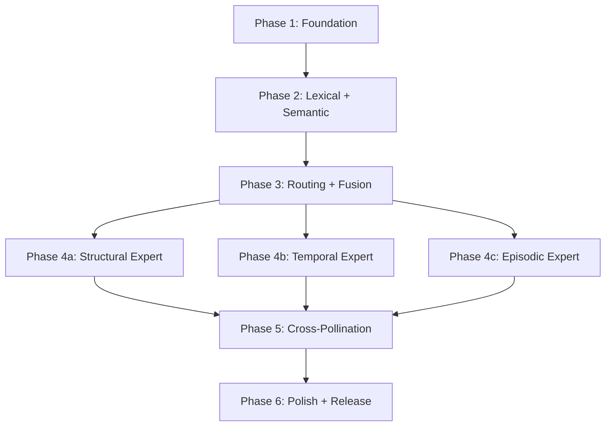

# Mixture of Expert Indexes: Implementation Plan

**Author:** Claude (AI Assistant)
**Date:** 2025-12-15
**Updated:** 2025-12-15 (reduced scope: BM25 and GB-BM25 already implemented, processor package refactoring)
**Status:** Proposed
**Prerequisites:**
- [moe-index-knowledge-transfer.md](moe-index-knowledge-transfer.md)
- [moe-index-design.md](moe-index-design.md)
- [knowledge-transfer-bm25-optimization.md](knowledge-transfer-bm25-optimization.md)

---

## Executive Summary

This document outlines a **6-phase implementation plan** for the Mixture of Expert (MoE) index architecture. The plan prioritizes incremental value delivery, maintaining backward compatibility, and thorough testing at each phase.

> **Scope Reduction (2025-12-15):** The recent BM25 and GB-BM25 implementations significantly reduce the work needed:
> - BM25 scoring already implemented (`analysis.py:_bm25_core()`)
> - Document length tracking already exists (`processor.doc_lengths`)
> - GB-BM25 provides a working proto-MoE (`query/search.py:graph_boosted_search()`)
> - 34.5% performance improvement in `compute_all()` already achieved
>
> **Remaining work focuses on:**
> - Expert abstraction layer and routing
> - Structural, temporal, and episodic experts (new capabilities)
> - Cross-pollination framework (generalized from GB-BM25)

> **Architecture Note:** The processor has been refactored from a monolithic `processor.py` (3,234 lines) into a modular `cortical/processor/` package using mixin-based composition (CoreMixin, DocumentsMixin, ComputeMixin, QueryAPIMixin, etc.). This pattern provides a template for the MoE package structure and demonstrates backward-compatible refactoring.

**Total Estimated Effort (Revised):**
- New code: ~2,100 lines (down from ~2,800 - BM25 already done)
- Test code: ~1,200 lines (down from ~1,500)
- Documentation: ~300 lines (down from ~500)

---

## Phase Overview

```
Phase 1: Foundation        ████░░░░░░░░░░░░░░░░ 20%
Phase 2: Lexical Expert    ████████░░░░░░░░░░░░ 40%
Phase 3: Routing & Fusion  ████████████░░░░░░░░ 60%
Phase 4: Additional Experts████████████████░░░░ 80%
Phase 5: Cross-Pollination ██████████████████░░ 90%
Phase 6: Polish & Release  ████████████████████ 100%
```

| Phase | Description | Dependencies | Key Deliverable |
|-------|-------------|--------------|-----------------|
| 1 | Foundation | None | Base types, interfaces, test fixtures |
| 2 | Lexical Expert | Phase 1 | Fast exact-match search working |
| 3 | Routing & Fusion | Phase 2 | Two-expert MoE system functional |
| 4 | Additional Experts | Phase 3 | Structural, temporal, episodic experts |
| 5 | Cross-Pollination | Phase 4 | Expert coordination enabled |
| 6 | Polish & Release | Phase 5 | Production-ready with docs |

---

## Phase 1: Foundation

**Goal:** Establish core types, interfaces, and testing infrastructure.

### Tasks

#### 1.1 Create Package Structure
```
cortical/moe/
├── __init__.py           # Public exports
├── types.py              # Core type definitions
├── experts/
│   ├── __init__.py
│   └── base.py           # Abstract ExpertIndex
└── config.py             # Configuration dataclasses
```

**Deliverables:**
- [ ] Create `cortical/moe/` directory structure
- [ ] Implement `ExpertResult` dataclass
- [ ] Implement `MoEResult` dataclass
- [ ] Implement `QueryContext` dataclass
- [ ] Implement `MoEConfig` and sub-configs
- [ ] Implement abstract `ExpertIndex` base class

**Acceptance Criteria:**
- All types are importable from `cortical.moe`
- Types have proper `__slots__` for memory efficiency
- Base class has `@abstractmethod` decorators
- Unit tests pass for type construction

#### 1.2 Test Infrastructure
```
tests/
├── unit/
│   └── moe/
│       ├── __init__.py
│       ├── test_types.py
│       └── test_base_expert.py
├── integration/
│   └── moe/
│       └── test_moe_integration.py
└── fixtures/
    └── moe_fixtures.py      # Shared test data
```

**Deliverables:**
- [ ] Create test directory structure
- [ ] Implement `moe_fixtures.py` with test documents
- [ ] Implement mock expert for testing
- [ ] Add MoE tests to CI pipeline

**Acceptance Criteria:**
- `pytest tests/unit/moe/ -v` runs successfully
- Fixtures provide reproducible test data
- Coverage infrastructure set up

#### 1.3 Shared Resources

**Deliverables:**
- [ ] Implement `SharedResources` class
- [ ] Integrate existing `Tokenizer`
- [ ] Implement document store interface

**Acceptance Criteria:**
- Resources can be shared across multiple experts
- Document store supports add/remove/get operations

### Phase 1 Exit Criteria

- [ ] All foundation types implemented and tested
- [ ] Abstract `ExpertIndex` defines complete interface
- [ ] Test fixtures provide adequate coverage data
- [ ] `python -m pytest tests/unit/moe/ -v` passes
- [ ] Code review completed

---

## Phase 2: Lexical Expert + Semantic Wrapper

**Goal:** Implement first two experts with basic querying.

> **Scope Reduction:** BM25 is already implemented in `analysis.py:_bm25_core()`. The Lexical Expert wraps existing functionality + adds phrase matching.

### Tasks

#### 2.1 Lexical Expert Implementation (Simplified)

**Already Available (reuse):**
- [x] BM25 scoring algorithm (`analysis.py:_bm25_core()`)
- [x] Document length tracking (`processor.doc_lengths`)
- [x] Fast search infrastructure (`fast_find_documents()`)

**New Deliverables:**
- [ ] Implement `LexicalExpert` class wrapping existing BM25
- [ ] Implement `TermPositions` dataclass for phrase queries
- [ ] Build positional index during document processing
- [ ] Implement phrase matching using positions
- [ ] Implement prefix trie for autocomplete (optional)

**Acceptance Criteria:**
- Lexical expert delegates to existing BM25 scores
- Simple queries return in <10ms (using `fast_find_documents`)
- Phrase queries work correctly
- No BM25 reimplementation needed

**Test Cases:**
```python
def test_lexical_exact_match():
    expert = LexicalExpert(processor)  # Wraps processor
    result = expert.query("neural")
    assert "doc1" in result.documents

def test_lexical_uses_existing_bm25():
    # Verify we're using processor's BM25, not reimplementing
    expert = LexicalExpert(processor)
    result = expert.query("neural")
    fast_result = fast_find_documents("neural", processor.layers, processor.tokenizer)
    assert result.documents == [d for d, _ in fast_result]

def test_lexical_phrase_query():
    expert = LexicalExpert(processor)
    result = expert.query('"machine learning"')  # Phrase
    # Uses positional index, not just term matching
    assert "doc1" in result.documents
```

#### 2.2 Semantic Expert Wrapper

> **Builds on:** `graph_boosted_search()` already combines BM25 + PageRank + Proximity. The Semantic Expert wraps this with the expert interface.

**Deliverables:**
- [ ] Implement `SemanticExpert` wrapping `CorticalTextProcessor`
- [ ] Delegate to `graph_boosted_search()` for rich queries
- [ ] Delegate to `find_documents_for_query()` for standard queries
- [ ] Implement staleness pass-through
- [ ] Implement persistence (reuse processor's)

**Acceptance Criteria:**
- Semantic expert uses existing `graph_boosted_search()`
- No regression in existing functionality
- Wrapper adds <5ms overhead

**Test Cases:**
```python
def test_semantic_matches_processor():
    processor = CorticalTextProcessor()
    processor.process_document("doc1", "neural networks")
    processor.compute_all()

    expert = SemanticExpert(processor)
    result = expert.query("neural")

    # Should match processor output
    processor_result = processor.find_documents_for_query("neural")
    assert result.documents == [d for d, _ in processor_result]
```

#### 2.3 Expert Registry

**Deliverables:**
- [ ] Implement `ExpertRegistry` class
- [ ] Support expert registration/lookup
- [ ] Support expert lifecycle management

**Acceptance Criteria:**
- Experts can be registered by name
- Registry validates expert interface compliance
- Registry supports iteration

### Phase 2 Exit Criteria

- [ ] Lexical expert passes all unit tests
- [ ] Semantic wrapper passes all unit tests
- [ ] Both experts can be queried independently
- [ ] Performance benchmarks established
- [ ] Code coverage >85% for new code

---

## Phase 3: Routing and Fusion

**Goal:** Implement query routing and result fusion for two-expert system.

### Tasks

#### 3.1 Feature Extraction

**Deliverables:**
- [ ] Implement `QueryFeatures` dataclass
- [ ] Implement `FeatureExtractor` class
- [ ] Extract: length, quotes, identifiers, question words
- [ ] Extract: time expressions, code patterns
- [ ] Extract: semantic density, specificity

**Test Cases:**
```python
def test_feature_extraction():
    extractor = FeatureExtractor()

    # Short exact query
    f1 = extractor.extract("authenticate")
    assert f1.length == 1
    assert not f1.has_question_word

    # Question query
    f2 = extractor.extract("how does authentication work?")
    assert f2.has_question_word

    # Code query
    f3 = extractor.extract("getUserCredentials")
    assert f3.has_identifiers
```

#### 3.2 Feature-Based Gating

**Deliverables:**
- [ ] Implement `FeatureBasedGate` class
- [ ] Define feature→expert weight mappings
- [ ] Implement weight computation
- [ ] Implement normalization

**Acceptance Criteria:**
- Gate produces valid probability distribution
- Short queries favor lexical expert
- Question queries favor semantic expert

#### 3.3 Intent-Based Gating

**Deliverables:**
- [ ] Implement `IntentBasedGate` class
- [ ] Integrate with existing intent parser
- [ ] Define intent→expert mappings
- [ ] Handle unknown intents gracefully

**Acceptance Criteria:**
- All known intents have mappings
- Unknown intents fall back to reasonable defaults

#### 3.4 Query Router

**Deliverables:**
- [ ] Implement `QueryRouter` class
- [ ] Combine feature and intent gating
- [ ] Implement top-K selection
- [ ] Add routing metrics collection

**Test Cases:**
```python
def test_router_selects_topk():
    router = QueryRouter(RouterConfig(default_top_k=2))
    weights = router.route("test query")
    assert len(weights) == 2
    assert all(w > 0 for _, w in weights)

def test_router_normalizes():
    router = QueryRouter()
    weights = router.route("test query")
    total = sum(w for _, w in weights)
    assert abs(total - 1.0) < 0.01
```

#### 3.5 Result Fusion

**Deliverables:**
- [ ] Implement `ScoreNormalizer` (min-max, z-score)
- [ ] Implement `RRFFusion` class
- [ ] Implement `WeightedScoreFusion` class
- [ ] Implement `ResultFusioner` orchestrator

**Test Cases:**
```python
def test_rrf_fusion():
    fusioner = RRFFusion(k=60)
    results = {
        'lexical': ExpertResult(documents=['a', 'b', 'c'], ...),
        'semantic': ExpertResult(documents=['b', 'c', 'd'], ...),
    }
    fused = fusioner.fuse(results, {'lexical': 0.5, 'semantic': 0.5})

    # 'b' and 'c' appear in both, should rank high
    top_docs = [d for d, _ in fused[:2]]
    assert 'b' in top_docs or 'c' in top_docs
```

#### 3.6 MoEIndexProcessor (Basic)

**Deliverables:**
- [ ] Implement `MoEIndexProcessor` class
- [ ] Wire together router, experts, fusioner
- [ ] Implement `add_document()` (multi-expert)
- [ ] Implement `query()` method
- [ ] Implement backward-compatible methods

**Test Cases:**
```python
def test_moe_basic_query():
    processor = MoEIndexProcessor()
    processor.add_document("doc1", "neural networks")
    processor.compute_all()

    result = processor.query("neural")
    assert "doc1" in result.documents

def test_moe_backward_compat():
    processor = MoEIndexProcessor()
    processor.add_document("doc1", "neural networks")
    processor.compute_all()

    # Old API should still work
    results = processor.find_documents_for_query("neural")
    assert len(results) > 0
```

### Phase 3 Exit Criteria

- [ ] Router correctly distributes queries to experts
- [ ] Fusion produces coherent rankings
- [ ] Two-expert MoE system fully functional
- [ ] Backward compatibility tests pass
- [ ] Integration tests pass
- [ ] Performance: simple query <50ms, complex <300ms

---

## Phase 4: Additional Experts

**Goal:** Implement structural, temporal, and episodic experts.

### Tasks

#### 4.1 Structural Expert

**Deliverables:**
- [ ] Implement `SymbolDef` dataclass
- [ ] Implement symbol table structure
- [ ] Implement basic code parsing (regex-based)
- [ ] Implement call graph construction
- [ ] Implement import graph construction
- [ ] Implement `query()` for symbol search
- [ ] Implement `query()` for "calls X" patterns
- [ ] Implement `query()` for "called by X" patterns

**Acceptance Criteria:**
- Correctly identifies function/class definitions
- Call graph captures direct calls
- Import graph captures module dependencies
- Symbol queries return relevant files

**Test Cases:**
```python
def test_structural_symbol_search():
    expert = StructuralExpert()
    expert.add_document("auth.py", "def authenticate(user): ...")
    result = expert.query("authenticate")
    assert "auth.py" in result.documents

def test_structural_calls():
    expert = StructuralExpert()
    expert.add_document("main.py", "def main(): authenticate(user)")
    expert.add_document("auth.py", "def authenticate(user): ...")
    result = expert.query("what calls authenticate")
    assert "main.py" in result.documents
```

#### 4.2 Temporal Expert

**Deliverables:**
- [ ] Implement `ChangeEvent` dataclass
- [ ] Implement document history tracking
- [ ] Implement time-based index
- [ ] Implement co-change matrix
- [ ] Implement time expression parsing
- [ ] Implement recency-weighted scoring
- [ ] Implement "changed recently" queries
- [ ] Implement "changed together" queries

**Acceptance Criteria:**
- Tracks document modifications over time
- Correctly identifies recently changed documents
- Co-change correlations are accurate

**Test Cases:**
```python
def test_temporal_recency():
    expert = TemporalExpert()
    expert.add_document("old.py", "...", timestamp=datetime(2024, 1, 1))
    expert.add_document("new.py", "...", timestamp=datetime(2025, 1, 1))
    result = expert.query("recently changed")
    assert result.documents[0] == "new.py"

def test_temporal_cochange():
    expert = TemporalExpert()
    # Simulate files changed together
    expert.record_change("a.py", commit="c1")
    expert.record_change("b.py", commit="c1")
    expert.record_change("c.py", commit="c2")

    result = expert.query("files changed with a.py")
    assert "b.py" in result.documents
```

#### 4.3 Episodic Expert

**Deliverables:**
- [ ] Implement `QueryEvent` dataclass
- [ ] Implement query history (ring buffer)
- [ ] Implement click tracking
- [ ] Implement session context vector
- [ ] Implement continuation pattern detection
- [ ] Implement context-boosted scoring

**Acceptance Criteria:**
- Session history is maintained correctly
- Recent queries influence results
- Click patterns affect ranking

**Test Cases:**
```python
def test_episodic_session_context():
    expert = EpisodicExpert()

    # Simulate session
    expert.record_query("authentication", results=["auth.py"])
    expert.record_click("auth.py")

    # Related query should be influenced
    result = expert.query("security")
    # auth.py should get session boost
```

#### 4.4 Integration with Router

**Deliverables:**
- [ ] Update router for 5-expert system
- [ ] Add structural routing rules
- [ ] Add temporal routing rules
- [ ] Add episodic routing rules
- [ ] Update fusion for variable expert counts

**Acceptance Criteria:**
- All 5 experts can be routed to
- Router handles partial expert availability
- Fusion scales to 5 experts

### Phase 4 Exit Criteria

- [ ] All 5 experts implemented and tested
- [ ] Router correctly routes to all experts
- [ ] Fusion handles all combinations
- [ ] Performance within targets
- [ ] Code coverage >80% for all experts

---

## Phase 5: Cross-Pollination

**Goal:** Enable experts to inform and enhance each other.

### Tasks

#### 5.1 Cross-Pollination Interface

**Deliverables:**
- [ ] Define `CrossPollinationContext` interface
- [ ] Implement `CrossPollinator` class
- [ ] Implement semantic→lexical expansion sharing
- [ ] Implement structural→semantic boosting
- [ ] Implement temporal→all recency weighting

**Acceptance Criteria:**
- Cross-pollination improves result quality
- No significant latency increase (<20ms)
- Cross-pollination can be disabled via config

**Test Cases:**
```python
def test_cross_pollination_improves_results():
    processor = MoEIndexProcessor(
        config=MoEConfig(enable_cross_pollination=True)
    )
    # Add documents...
    processor.compute_all()

    # Query with cross-pollination
    result_with = processor.query("authentication")

    # Query without
    processor._config.enable_cross_pollination = False
    result_without = processor.query("authentication")

    # Should have different rankings
    assert result_with.documents != result_without.documents
```

#### 5.2 Feedback Learning

**Deliverables:**
- [ ] Implement `FeedbackTracker` class
- [ ] Implement query pattern extraction
- [ ] Implement success rate tracking
- [ ] Implement `FeedbackAdaptiveGate`
- [ ] Integrate feedback into router

**Acceptance Criteria:**
- Feedback is recorded correctly
- Routing adapts based on feedback
- Learning rate is appropriate (not too fast/slow)

**Test Cases:**
```python
def test_feedback_learning():
    router = QueryRouter(RouterConfig(feedback_weight=0.2))

    # Initial routing
    initial = router.route("test query")

    # Record positive feedback for lexical
    router.record_feedback("test query", "lexical", was_helpful=True)
    router.record_feedback("test query", "lexical", was_helpful=True)

    # Routing should shift toward lexical
    after = router.route("test query")
    lexical_initial = dict(initial).get('lexical', 0)
    lexical_after = dict(after).get('lexical', 0)
    assert lexical_after > lexical_initial
```

#### 5.3 Coordination Protocol

**Deliverables:**
- [ ] Implement parallel expert querying
- [ ] Implement result merging protocol
- [ ] Handle expert failures gracefully
- [ ] Add coordination metrics

**Acceptance Criteria:**
- Experts can be queried in parallel
- Single expert failure doesn't crash system
- Coordination overhead <10ms

### Phase 5 Exit Criteria

- [ ] Cross-pollination implemented and tested
- [ ] Feedback learning working
- [ ] Coordination handles failures gracefully
- [ ] Quality metrics show improvement
- [ ] Performance within targets

---

## Phase 6: Polish and Release

**Goal:** Production-ready system with documentation and optimizations.

### Tasks

#### 6.1 Performance Optimization

**Deliverables:**
- [ ] Profile query path
- [ ] Optimize hot paths
- [ ] Add caching where beneficial
- [ ] Lazy loading for unused experts

**Acceptance Criteria:**
- P50 latency <100ms
- P95 latency <300ms
- Memory footprint <2x baseline

#### 6.2 Persistence Improvements

**Deliverables:**
- [ ] Implement atomic multi-expert save
- [ ] Implement incremental update support
- [ ] Implement chunk-based expert storage
- [ ] Version compatibility handling

**Acceptance Criteria:**
- Save/load round-trips correctly
- Incremental updates work
- Backward compatible with old saves

#### 6.3 Observability

**Deliverables:**
- [ ] Add routing metrics
- [ ] Add expert utilization metrics
- [ ] Add latency breakdowns
- [ ] Integrate with existing observability

**Acceptance Criteria:**
- All metrics accessible via `get_metrics()`
- Metrics integrate with existing system
- Can identify performance bottlenecks

#### 6.4 Documentation

**Deliverables:**
- [ ] Update CLAUDE.md with MoE section
- [ ] Write user guide in docs/
- [ ] Add docstrings to all public APIs
- [ ] Add examples to examples/
- [ ] Update architecture.md

**Acceptance Criteria:**
- All public APIs documented
- Examples are runnable
- Documentation review completed

#### 6.5 Final Testing

**Deliverables:**
- [ ] Comprehensive integration tests
- [ ] Performance regression tests
- [ ] Stress tests
- [ ] Backward compatibility tests
- [ ] Dog-fooding on codebase search

**Acceptance Criteria:**
- All tests pass
- No performance regressions
- Dog-fooding validates real-world usage

### Phase 6 Exit Criteria

- [ ] All optimizations complete
- [ ] Documentation complete
- [ ] All tests pass
- [ ] Performance targets met
- [ ] Ready for release

---

## Risk Mitigation

### High-Priority Risks

| Risk | Likelihood | Impact | Mitigation |
|------|------------|--------|------------|
| Router becomes bottleneck | Medium | High | Keep routing simple, cache patterns |
| Expert quality diverges | Medium | Medium | Regular quality monitoring, diversity loss |
| Storage explosion | Low | Medium | Share resources, lazy loading |
| Integration breaks existing | Low | High | Extensive backward compat tests |

### Contingency Plans

1. **If router is too slow:** Fall back to simpler feature-only routing
2. **If experts diverge:** Add diversity regularization or manual tuning
3. **If storage too large:** Implement selective expert loading
4. **If tests fail:** Prioritize backward compatibility over new features

---

## Success Metrics

### Phase Gates

| Phase | Key Metric | Target |
|-------|------------|--------|
| 1 | Foundation tests pass | 100% |
| 2 | Lexical query latency | <10ms |
| 3 | Two-expert MRR@10 | >0.5 |
| 4 | All experts functional | 5/5 |
| 5 | Cross-poll quality gain | >5% MRR |
| 6 | Production readiness | Checklist complete |

### Final Success Criteria

- [ ] Simple query latency <50ms (P95)
- [ ] Complex query latency <300ms (P95)
- [ ] MRR@10 improvement >10% over baseline
- [ ] Expert utilization balanced (20-80% each)
- [ ] Zero breaking changes to public API
- [ ] Code coverage >85%
- [ ] Documentation complete

---

## Task Dependencies



---

## Quick Reference: File Creation Order

```
# Phase 1
cortical/moe/__init__.py
cortical/moe/types.py
cortical/moe/config.py
cortical/moe/experts/__init__.py
cortical/moe/experts/base.py
tests/unit/moe/__init__.py
tests/unit/moe/test_types.py
tests/fixtures/moe_fixtures.py

# Phase 2
cortical/moe/experts/lexical.py
cortical/moe/experts/semantic.py
cortical/moe/registry.py
tests/unit/moe/test_lexical_expert.py
tests/unit/moe/test_semantic_expert.py

# Phase 3
cortical/moe/features.py
cortical/moe/router.py
cortical/moe/fusion.py
cortical/moe/processor.py
tests/unit/moe/test_router.py
tests/unit/moe/test_fusion.py
tests/integration/moe/test_moe_basic.py

# Phase 4
cortical/moe/experts/structural.py
cortical/moe/experts/temporal.py
cortical/moe/experts/episodic.py
tests/unit/moe/test_structural_expert.py
tests/unit/moe/test_temporal_expert.py
tests/unit/moe/test_episodic_expert.py

# Phase 5
cortical/moe/cross_pollination.py
cortical/moe/feedback.py
tests/unit/moe/test_cross_pollination.py
tests/unit/moe/test_feedback.py
tests/integration/moe/test_moe_full.py

# Phase 6
docs/moe-user-guide.md
examples/moe_demo.py
tests/performance/test_moe_performance.py
```

---

## Appendix: Task Checklist Format

For tracking during implementation, use the merge-friendly task system:

```bash
# Create implementation tasks
python scripts/new_task.py "MoE Phase 1: Implement core types" --priority high --category arch
python scripts/new_task.py "MoE Phase 1: Create test infrastructure" --priority high --category test
python scripts/new_task.py "MoE Phase 2: Implement LexicalExpert" --priority high --category feature
# ... etc
```

---

*This implementation plan provides a structured approach to building the MoE index architecture. Each phase builds on the previous, ensuring incremental progress and continuous testing.*
