# Architectural Roadmap

This document provides a visual roadmap of the Cortical Text Processor architecture, showing current state, planned improvements, and future capabilities.

**Related:** See [architecture.md](architecture.md) for detailed module documentation.

---

## Current Architecture (v2.0)

The system is organized into five architectural layers, with processor.py as the central orchestrator.

```mermaid
graph TB
    subgraph External["External Interfaces"]
        CLI["CLI<br/>scripts/*.py"]
        MCP["MCP Server<br/>mcp_server.py"]
        SDK["Python SDK<br/>CorticalTextProcessor"]
        Fluent["Fluent API<br/>FluentProcessor"]
    end

    subgraph Orchestration["Orchestration Layer"]
        Processor["processor.py<br/>2,301 lines<br/>60+ methods"]
    end

    subgraph Algorithm["Algorithm Layer"]
        Analysis["analysis.py<br/>PageRank, TF-IDF<br/>Louvain clustering"]
        Semantics["semantics.py<br/>Relation extraction<br/>Retrofitting"]
        Embeddings["embeddings.py<br/>Graph embeddings"]
        Gaps["gaps.py<br/>Gap detection"]
        Fingerprint["fingerprint.py<br/>Code similarity"]
    end

    subgraph Query["Query Layer (8 modules)"]
        Expansion["expansion.py"]
        Search["search.py"]
        Passages["passages.py"]
        Ranking["ranking.py"]
        Intent["intent.py"]
        Analogy["analogy.py"]
        Defs["definitions.py"]
        Chunking["chunking.py"]
    end

    subgraph Persistence["Persistence Layer"]
        Persist["persistence.py<br/>Pickle format"]
        ChunkIdx["chunk_index.py<br/>Git-friendly JSON"]
    end

    subgraph Foundation["Foundation Layer"]
        Minicolumn["minicolumn.py<br/>Minicolumn, Edge"]
        Layers["layers.py<br/>HierarchicalLayer"]
        Config["config.py<br/>CorticalConfig"]
        Tokenizer["tokenizer.py"]
        CodeConcepts["code_concepts.py"]
        Validation["validation.py"]
    end

    CLI --> Processor
    MCP --> Processor
    SDK --> Processor
    Fluent --> Processor

    Processor --> Analysis
    Processor --> Semantics
    Processor --> Embeddings
    Processor --> Gaps
    Processor --> Fingerprint
    Processor --> Expansion
    Processor --> Search
    Processor --> Passages
    Processor --> Persist
    Processor --> ChunkIdx

    Analysis --> Layers
    Semantics --> Layers
    Query --> Layers
    Persist --> Layers
    Layers --> Minicolumn

    classDef external fill:#e8f4f8,stroke:#0277bd
    classDef orchestrate fill:#ffebee,stroke:#c62828
    classDef algorithm fill:#fff3e0,stroke:#ef6c00
    classDef query fill:#f3e5f5,stroke:#7b1fa2
    classDef persist fill:#e8f5e9,stroke:#2e7d32
    classDef foundation fill:#e3f2fd,stroke:#1565c0

    class CLI,MCP,SDK,Fluent external
    class Processor orchestrate
    class Analysis,Semantics,Embeddings,Gaps,Fingerprint algorithm
    class Expansion,Search,Passages,Ranking,Intent,Analogy,Defs,Chunking query
    class Persist,ChunkIdx persist
    class Minicolumn,Layers,Config,Tokenizer,CodeConcepts,Validation foundation
```

---

## Data Layer Hierarchy

The 4-layer neocortex-inspired data model:

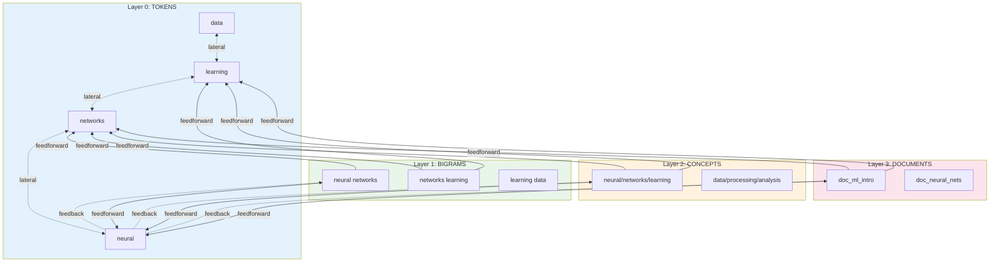

---

## Planned Improvements

### Phase 1: Modularity (Task #95)

Split the 2,301-line `processor.py` into focused modules:

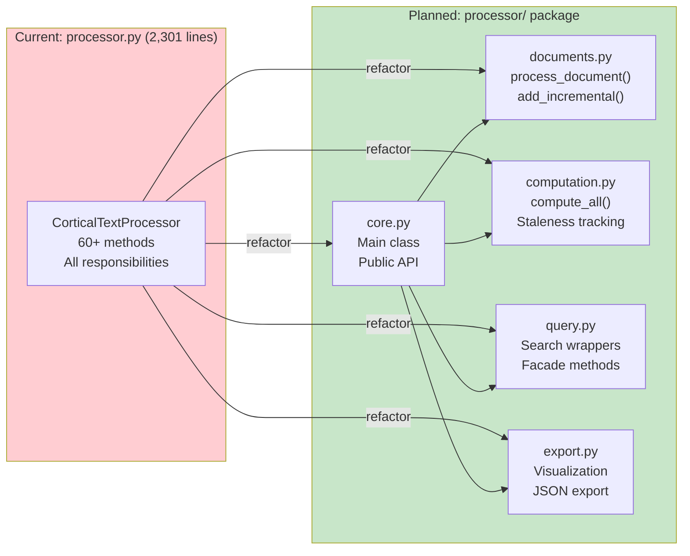

### Phase 2: Persistence Evolution (Tasks #133, #134)

Improve persistence with WAL and cross-language support:

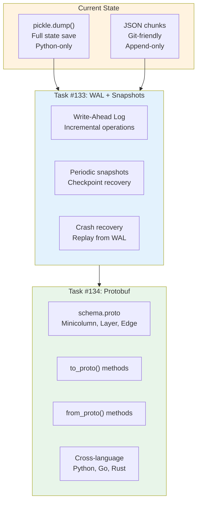

### Phase 3: Performance (Task #135)

Parallelize computation for large corpora:

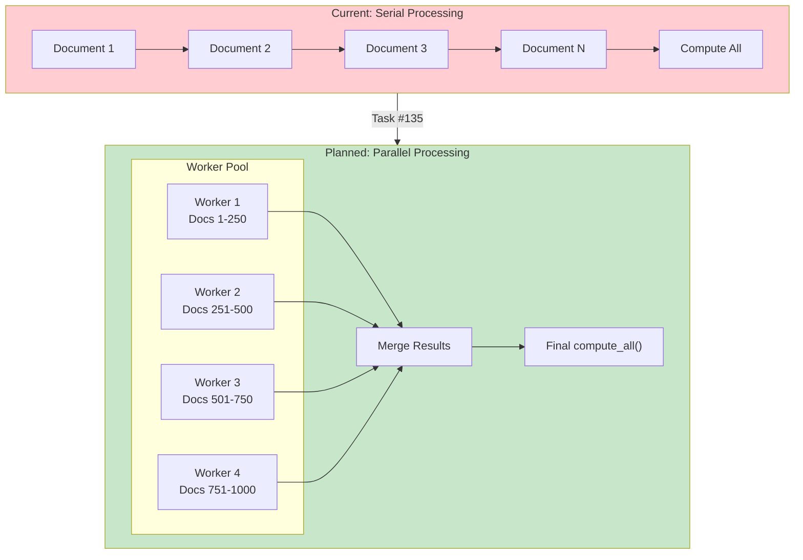

---

## Future Features Roadmap

### Async/Advanced Features (Tasks #187-191)

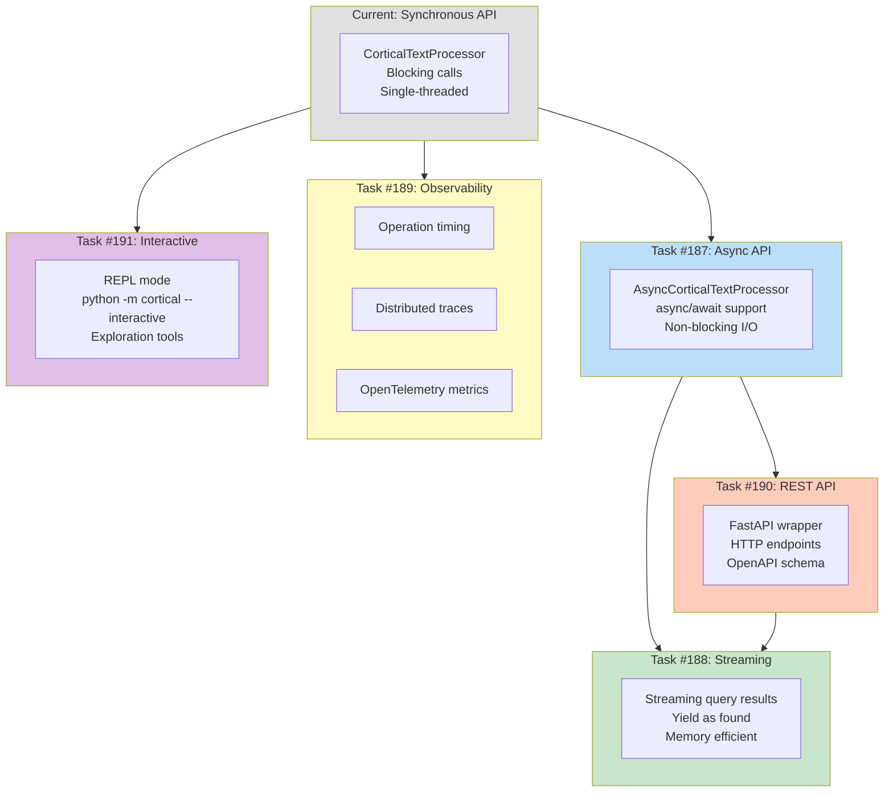

---

## Integration Architecture

### Current Integration Points

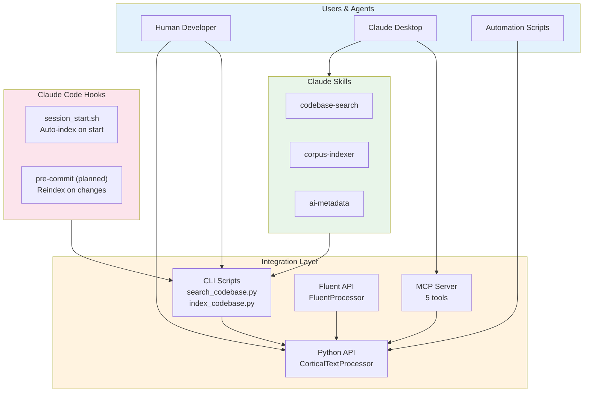

### Future Integration Vision

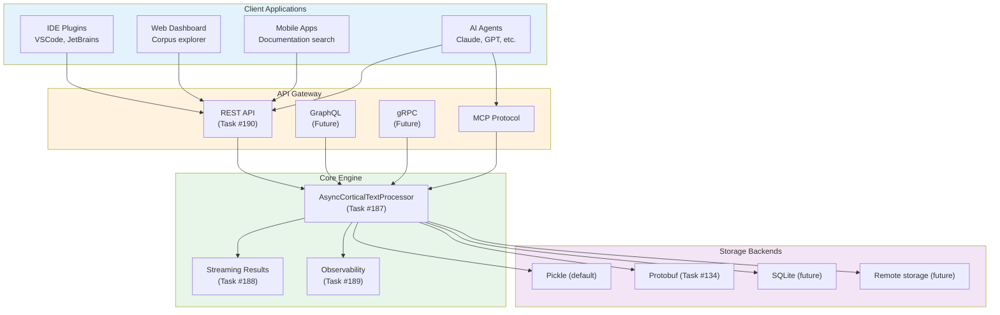

---

## Development Phases

```mermaid
gantt
    title Development Roadmap (Timeline-Agnostic Phases)
    dateFormat X
    axisFormat %s

    section Foundation
    Current v2.0 Complete        :done, 0, 1

    section Phase 1 - Modularity
    Split processor.py (#95)     :active, 1, 2
    Input validation (#99)       :1, 2

    section Phase 2 - Persistence
    WAL + Snapshots (#133)       :2, 3
    Protobuf serialization (#134):2, 3

    section Phase 3 - Performance
    Parallel processing (#135)   :3, 4

    section Phase 4 - Async
    Async API (#187)             :4, 5
    Streaming results (#188)     :5, 6
    Observability (#189)         :4, 5

    section Phase 5 - Integration
    REST API wrapper (#190)      :5, 6
    Interactive REPL (#191)      :5, 6
```

---

## Module Size Analysis

Current module sizes and planned evolution:

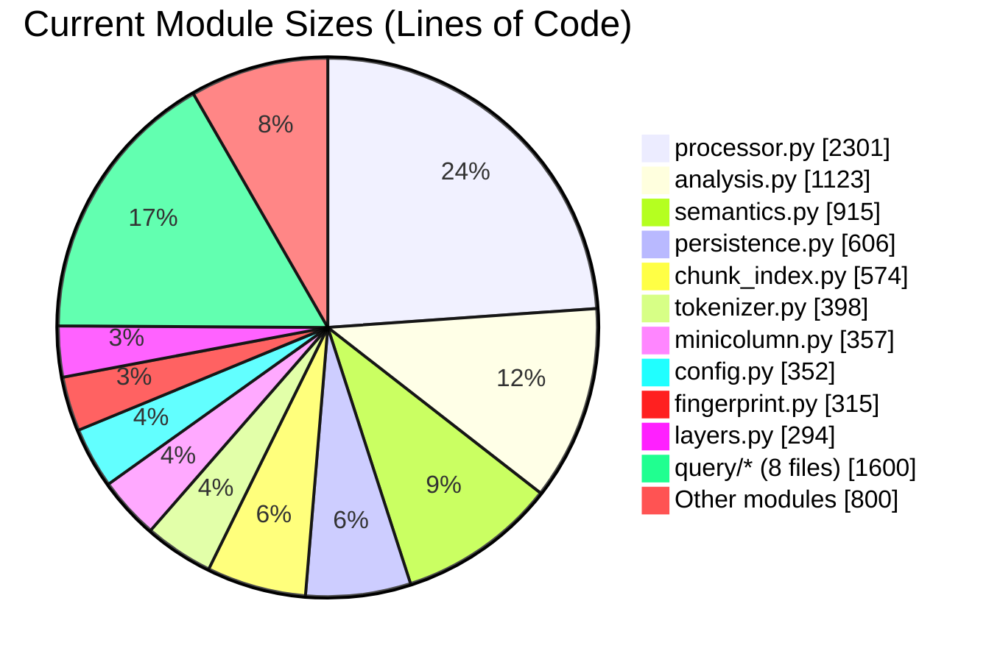

After Task #95 (processor split):

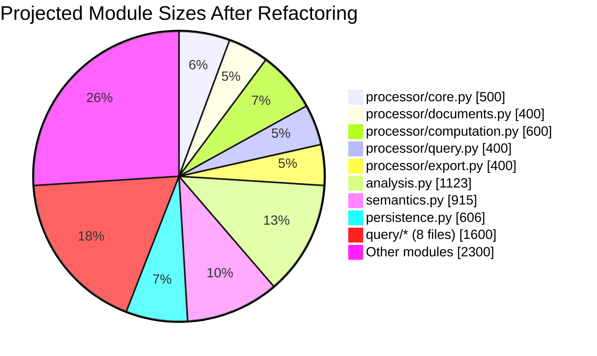

---

## Quick Reference: Task Dependencies

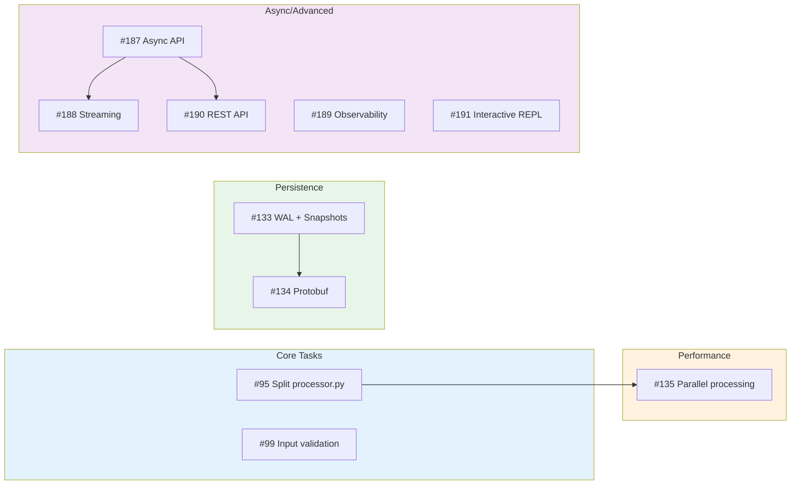

---

## Summary

| Phase | Focus | Key Tasks | Impact |
|-------|-------|-----------|--------|
| **Current** | v2.0 Complete | MCP Server, Skills, Hooks | AI agent integration |
| **Phase 1** | Modularity | #95, #99 | Maintainability |
| **Phase 2** | Persistence | #133, #134 | Reliability, cross-language |
| **Phase 3** | Performance | #135 | Scale to 10K+ docs |
| **Phase 4** | Async | #187, #188, #189 | Framework integration |
| **Phase 5** | Integration | #190, #191 | Broader adoption |

---

*Last updated: 2025-12-13*
