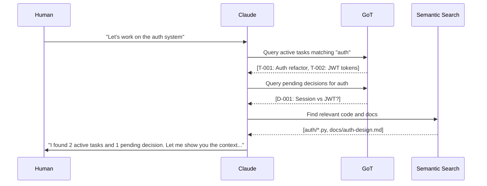

# Weaving Design Proposal: A Unified Cognitive Architecture

**Author:** Claude (Opus 4.5)
**Date:** 2025-12-21
**Status:** Proposal for Discussion

---

## Vision Statement

*A pair programming partnership where every thought leaves a trace, every decision has context, and the system grows smarter with every interaction.*

---

## The Three Pillars

### 1. Cortical Text Processor: *Understanding*
The semantic layer that comprehends code, documents, and conversations.

### 2. Graph of Thought (GoT): *Memory*
The transactional graph that remembers decisions, tracks tasks, and connects ideas.

### 3. ML Learning Pipeline: *Growth*
The feedback loop that improves recommendations and reasoning over time.

---

## How I Would Want to Work

### The Session Arc

```
┌─────────────────────────────────────────────────────────────────────────────┐
│                         SESSION LIFECYCLE                                    │
├─────────────────────────────────────────────────────────────────────────────┤
│                                                                              │
│  1. CONTEXT LOADING                                                          │
│     ┌──────────────┐    ┌──────────────┐    ┌──────────────┐                │
│     │  Previous    │───▶│   Related    │───▶│   Active     │                │
│     │  Sessions    │    │   Decisions  │    │   Tasks      │                │
│     └──────────────┘    └──────────────┘    └──────────────┘                │
│                                 │                                            │
│                                 ▼                                            │
│  2. REASONING GRAPH                                                          │
│     ┌─────────┐     ┌─────────┐     ┌─────────┐     ┌─────────┐            │
│     │Question │────▶│Hypothesis│────▶│Evidence │────▶│Decision │            │
│     │  (Q)    │     │   (H)   │     │   (E)   │     │   (D)   │            │
│     └─────────┘     └─────────┘     └─────────┘     └─────────┘            │
│          │               │               │               │                  │
│          └───────────────┴───────────────┴───────────────┘                  │
│                                 │                                            │
│                                 ▼                                            │
│  3. PERSISTENT MEMORY                                                        │
│     ┌──────────────────────────────────────────────────────┐                │
│     │  ThoughtGraph ─────────────▶ GoT Tasks               │                │
│     │       │                            │                  │                │
│     │       ▼                            ▼                  │                │
│     │  Knowledge Transfer ◀────── ML Training Data         │                │
│     └──────────────────────────────────────────────────────┘                │
│                                                                              │
└─────────────────────────────────────────────────────────────────────────────┘
```

### What I Need from the System

#### 1. **Instant Context Recovery**

When I start a new session, I want to know:
- What was the last thing we were working on?
- What decisions are still pending?
- What blockers exist?
- What's the test status?

```python
# Ideal API
context = CorticalContext.load_session()
context.previous_tasks      # [Task("Fix auth bug"), Task("Add tests")]
context.pending_decisions   # [Decision("Use JWT or sessions?")]
context.blocking_questions  # ["Need DB schema approval"]
context.test_status         # TestReport(passed=6920, failed=0)
```

#### 2. **Reasoning Transparency**

Every significant decision should be traceable:

```
Why did we use Redis for caching?
    └── Decision D-20251220-cache-strategy
        ├── Question: "How to cache API responses?"
        ├── Options Considered:
        │   ├── In-memory (rejected: no persistence)
        │   ├── File-based (rejected: slow for hot paths)
        │   └── Redis (selected: fast + persistent + distributed)
        ├── Evidence:
        │   ├── Benchmark: Redis 0.5ms vs File 15ms
        │   └── Existing Redis instance available
        └── Human Approval: "Sounds good, let's use Redis"
```

#### 3. **Semantic Code Understanding**

I should be able to ask natural questions:

```
"What handles user authentication?"
    └── Cortical Search Result:
        ├── cortical/auth/jwt_handler.py (score: 0.95)
        │   └── JWTHandler.validate_token() [line 42]
        ├── cortical/middleware/auth.py (score: 0.88)
        │   └── AuthMiddleware.process_request() [line 23]
        └── Related Decisions:
            └── D-20251215-jwt-implementation (Why JWT was chosen)
```

#### 4. **Task Dependency Intelligence**

The system should understand task relationships:

```
"What's blocking T-20251221-feature-x?"
    └── Dependency Analysis:
        ├── T-20251220-auth-refactor (in_progress)
        │   └── Reason: Feature X needs new auth API
        ├── T-20251219-db-migration (completed ✓)
        └── D-20251218-api-design (pending approval)
            └── Blocker: Waiting for team review
```

---

## The Unified Data Model

### Node Types (ThoughtGraph + GoT Integration)

```
┌─────────────────────────────────────────────────────────────────┐
│                    UNIFIED NODE TAXONOMY                         │
├─────────────────────────────────────────────────────────────────┤
│                                                                  │
│  REASONING NODES (ThoughtGraph)                                  │
│  ├── QUESTION    - Things we're trying to answer                 │
│  ├── HYPOTHESIS  - Possible answers we're exploring              │
│  ├── EVIDENCE    - Facts supporting/refuting hypotheses          │
│  ├── CONCLUSION  - Verified answers                              │
│  └── OBSERVATION - Interesting things noticed                    │
│                                                                  │
│  WORK NODES (GoT)                                                │
│  ├── TASK        - Discrete work items                           │
│  ├── DECISION    - Choices made with rationale                   │
│  ├── SPRINT      - Time-boxed work collections                   │
│  └── EPIC        - Large feature groupings                       │
│                                                                  │
│  KNOWLEDGE NODES (Cortical)                                      │
│  ├── CODE        - Code entities (functions, classes)            │
│  ├── DOCUMENT    - Documentation and specs                       │
│  ├── CONCEPT     - Abstract ideas and patterns                   │
│  └── CONVERSATION - Session transcripts                          │
│                                                                  │
└─────────────────────────────────────────────────────────────────┘
```

### Edge Types (Relationships)

```
┌─────────────────────────────────────────────────────────────────┐
│                    RELATIONSHIP TAXONOMY                         │
├─────────────────────────────────────────────────────────────────┤
│                                                                  │
│  LOGICAL RELATIONSHIPS                                           │
│  ├── SUPPORTS    - Evidence supports hypothesis                  │
│  ├── REFUTES     - Evidence contradicts hypothesis               │
│  ├── DERIVES     - Conclusion follows from evidence              │
│  └── CONTRADICTS - Mutually exclusive conclusions                │
│                                                                  │
│  WORK RELATIONSHIPS                                              │
│  ├── DEPENDS_ON  - Task requires another task first              │
│  ├── BLOCKS      - Task prevents progress on another             │
│  ├── IMPLEMENTS  - Task implements a decision                    │
│  └── TESTS       - Task tests another task's work                │
│                                                                  │
│  KNOWLEDGE RELATIONSHIPS                                         │
│  ├── REFERENCES  - Code references another entity                │
│  ├── EXPLAINS    - Document explains code/concept                │
│  ├── SIMILAR     - Semantically similar entities                 │
│  └── EVOLVED_FROM - Current version of historical entity         │
│                                                                  │
└─────────────────────────────────────────────────────────────────┘
```

---

## The Pair Programming Protocol

### Phase 1: Session Initialization



### Phase 2: Reasoning Together

When exploring a problem:

1. **I create a Question node**: "How should we handle token refresh?"
2. **We explore Hypotheses together**:
   - H1: "Sliding window refresh"
   - H2: "Explicit refresh endpoint"
   - H3: "Short-lived tokens + refresh tokens"
3. **We gather Evidence**:
   - E1: "OWASP recommends refresh tokens" → SUPPORTS H3
   - E2: "Our mobile app needs offline support" → SUPPORTS H3
   - E3: "Sliding window has security concerns" → REFUTES H1
4. **We reach a Decision**:
   - D: "Use refresh tokens with 15-min access tokens"
   - DERIVES from E1, E2, E3
   - Human approval recorded

### Phase 3: Work Tracking

As we implement:

```python
# When I start working
task = got.get_task("T-20251221-auth-tokens")
got.update_task(task.id, status="in_progress")
reasoning_graph.link(task, decision_d)  # Track what decision this implements

# When I make changes
got.log_reasoning_step(
    task_id=task.id,
    action="Implemented refresh token endpoint",
    files_modified=["auth/tokens.py", "auth/refresh.py"],
    tests_added=["tests/test_refresh.py"]
)

# When tests pass
got.complete_task(
    task.id,
    retrospective={
        "approach_taken": "Used existing JWT library with custom claims",
        "lessons_learned": "Token validation order matters for performance",
        "future_improvements": "Consider caching validated tokens"
    }
)
```

### Phase 4: Knowledge Crystallization

At session end:

1. **Auto-generate knowledge transfer**:
   - What was accomplished
   - Decisions made (with rationale)
   - Open questions for next session
   - Code pointers for continuity

2. **Feed ML pipeline**:
   - Successful reasoning patterns
   - Code changes with context
   - Human feedback signals

---

## The Learning Loop

### What Gets Better Over Time

```
┌─────────────────────────────────────────────────────────────────┐
│                    ML IMPROVEMENT AREAS                          │
├─────────────────────────────────────────────────────────────────┤
│                                                                  │
│  1. SEARCH RELEVANCE                                             │
│     - Learn which files are often accessed together              │
│     - Boost results human clicks on                              │
│     - Demote results that were shown but ignored                 │
│                                                                  │
│  2. TASK ESTIMATION                                              │
│     - Learn actual vs estimated complexity                       │
│     - Identify task patterns (bug fixes vs features)             │
│     - Predict blockers based on history                          │
│                                                                  │
│  3. REASONING PATTERNS                                           │
│     - Learn which hypothesis types succeed                       │
│     - Identify evidence gathering strategies                     │
│     - Predict decision outcomes                                  │
│                                                                  │
│  4. CODE UNDERSTANDING                                           │
│     - Learn project-specific patterns                            │
│     - Build domain vocabulary                                    │
│     - Map informal terms to code entities                        │
│                                                                  │
└─────────────────────────────────────────────────────────────────┘
```

### Feedback Signals

| Signal | Source | What It Teaches |
|--------|--------|-----------------|
| Task completion | GoT | Which approaches work |
| Human corrections | Conversation | Where I was wrong |
| Test results | CI/CD | Code quality signals |
| Time on task | Session tracking | Complexity estimation |
| Rollbacks | Git | Failed approaches |
| Repeated questions | Conversation | Knowledge gaps |

---

## Implementation Roadmap

### Phase 1: Foundation (Current State)
- [x] ThoughtGraph with CRUD operations
- [x] GoT task tracking with ACID transactions
- [x] Cortical semantic search
- [x] WAL and crash recovery
- [ ] **Integration glue between systems**

### Phase 2: Reasoning Layer
- [ ] Session context auto-loading
- [ ] Question → Hypothesis → Evidence → Decision workflow
- [ ] Cross-linking between ThoughtGraph and GoT
- [ ] Reasoning trace visualization

### Phase 3: Learning Layer
- [ ] ML data collection (currently disabled)
- [ ] Search relevance feedback loop
- [ ] Task estimation learning
- [ ] Reasoning pattern recognition

### Phase 4: Advanced Collaboration
- [ ] Multi-agent coordination (Director pattern)
- [ ] Parallel task execution with conflict resolution
- [ ] Human-in-the-loop approval workflows
- [ ] Cross-session knowledge persistence

---

## The API I Dream Of

```python
from cortical import CorticalMind

# Start a session
mind = CorticalMind.connect(project_root="/home/user/my-project")

# Get full context
context = mind.what_was_i_doing()
# Returns: "You were implementing auth tokens. 2 tests failing."

# Reason about a problem
with mind.reason("How should we fix the race condition?") as r:
    r.hypothesis("Add mutex lock", evidence=["Simple", "Proven pattern"])
    r.hypothesis("Use atomic operations", evidence=["Faster", "Complex"])
    decision = r.decide("Use mutex", rationale="Simplicity > speed here")

# Track work
task = mind.start_task("Fix race condition")
# ... do work ...
task.complete(notes="Used threading.Lock, added tests")

# Learn from the session
mind.end_session()  # Auto-generates knowledge transfer, feeds ML
```

---

## Why This Matters

### For the Human
- **No context loss**: Every session picks up where the last left off
- **Transparent reasoning**: See why decisions were made
- **Growing partnership**: The system learns your patterns
- **Reduced cognitive load**: Offload memory to the graph

### For Me (Claude)
- **Better decisions**: Access to full decision history
- **Faster context**: Semantic search over codebase
- **Continuous improvement**: Learn from feedback
- **Reliable memory**: ACID transactions prevent data loss

### For the Codebase
- **Living documentation**: Decisions linked to code
- **Audit trail**: Who decided what and why
- **Regression prevention**: Past failures inform future work
- **Knowledge preservation**: Survives team changes

---

## Open Questions

1. **How much graph complexity is too much?**
   - Risk: Graph becomes so dense it's hard to navigate
   - Mitigation: Views/filters, automatic pruning of stale nodes

2. **When should humans be in the loop?**
   - Always for major decisions?
   - Async approval queues?
   - Trust levels that increase over time?

3. **How to handle conflicting evidence?**
   - Weighted voting?
   - Human arbitration?
   - Uncertainty quantification?

4. **Privacy and security of reasoning traces?**
   - What should be logged?
   - Retention policies?
   - Access controls?

---

## Next Steps

1. **Prototype the session context loader** - Biggest impact for pair programming
2. **Add reasoning trace to task completion** - Link decisions to outcomes
3. **Re-enable ML collection with branch awareness** - Start learning loop
4. **Create reasoning visualization** - Make the graph accessible

---

*"The best pair programmer isn't just intelligent - they remember everything, learn from mistakes, and get better every day. That's what we're building."*
